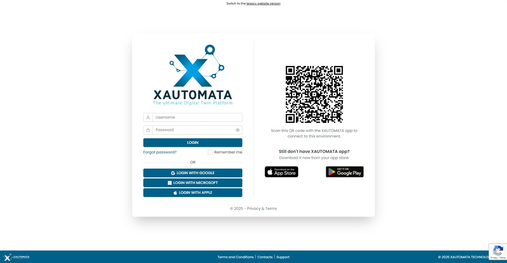

# Access

The login page for XAUTOMATA is illustrated in Fig. 1 below.  
This page is divided into two sections: the left side features a traditional login interface,  
while the right side displays a QR code and offers the option to download the app.

/// caption
Fig.1 - Login Page
///

## Log-IN

Login is allowed using a username and password. Alternatively, access can be granted  
through SSO with **Google**, **Microsoft**, and **Apple** accounts.  
  
In case of a forgotten password, the *Forgot password?* button can be used  
to initiate the password recovery process.

## QR Code

XAUTOMATA has several installations. When using the app to connect to XAUTOMATA, the  
login interface presents the main portal. If accessing a secondary XAUTOMATA portal through  
the app, you must scan the QR code generated by the portal from within the app.  
This way, the app will adjust the login interface to the desired new address.

[//]: # (## Sign-in)

[//]: # ()
[//]: # (pass)

