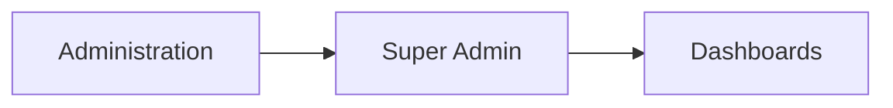
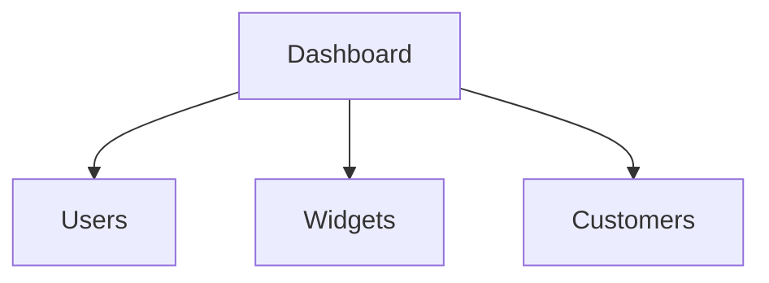
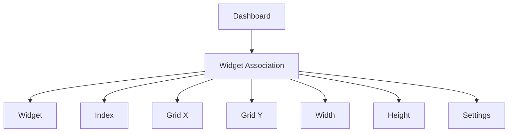

# Dashboards

The **Dashboards** section in **Super Admin** is used to manage dashboard definitions available in the platform.

A dashboard is a configurable visual container that organizes widgets into a grid layout and defines how monitoring information is presented to users.

From an administrative perspective, a dashboard includes:

- dashboard metadata
- ownership or user association
- scope and type
- refresh behavior
- visual layout
- relationships with widgets and customers

Only **Super Admin** users can manage dashboard definitions from this section.

---

## Accessing the Dashboards Section

Dashboards can be managed from:

---

## Dashboard Definition

Each dashboard record includes the following main fields:

| Field                     | Description                               |
| ------------------------- | ----------------------------------------- |
| **Name**                  | Human-readable name of the dashboard      |
| **Description**           | Optional description                      |
| **Type**                  | Dashboard type                            |
| **Scope**                 | Scope in which the dashboard is available |
| **User**                  | Optional associated user                  |
| **Order**                 | Priority used for ordering dashboards     |
| **Refresh Interval (ms)** | Automatic refresh interval                |
| **Thumbnail**             | Optional image or thumbnail reference     |

The available dashboard types are:

* **Global**
* **Personal**

The available scopes are:

* **Customers**
* **Virtual Domains**

These values are defined in the dashboard model used by the platform.

---

## Dashboard Types

Dashboards can be configured with different types.

### Global

A **Global** dashboard is intended to be reused beyond a single personal context.

Its exact visibility rules depend on the dashboard assignment and access model configured in the platform.

### Personal

A **Personal** dashboard is associated with a specific user.

In the administrative interface, personal dashboards may include a value in the **User** field, indicating the account that owns or uses the dashboard.

The detailed visibility rules for Global and Personal dashboards should be verified with platform experts.

---

## Dashboard Scope

Each dashboard also has a **scope**.

The scope determines the context in which the dashboard is applicable.

The two available scopes are:

* **Customers**
* **Virtual Domains**

This allows dashboards to be organized according to the operational context in which they are used.

The exact runtime effect of the scope should be interpreted together with user assignments and customer relationships.

---

## Dashboard Table

The table view typically displays dashboard records with columns such as:

* **Name**
* **Description**
* **Type**
* **Scope**
* **User**
* **Order**
* **Refresh Interval**

These columns allow administrators to identify the available dashboards and their configuration.

---

## Connections View

Dashboards provide a **Connections View** with three main relationship areas:

* **Users**
* **Widgets**
* **Customers**

These relationships define:

* who can access the dashboard
* which widgets are displayed in the dashboard
* which customers are associated with the dashboard

---

## Relationship with Users

The **Users** connection allows dashboards to be linked to platform users.

This relationship is part of the dashboard visibility and ownership model.

At the administrative level, a dashboard can therefore be associated with one or more users through:

* the **User** field in the main dashboard form
* the **Users** connection view

The exact functional distinction between these two mechanisms should be clarified with platform experts.

---

## Relationship with Customers

Dashboards can also be linked to **Customers**.

This indicates that dashboards may be made available in a customer-specific context.

This relationship is especially relevant because dashboards are part of the main operational experience shown after selecting a customer in the portal.

The exact interaction between **dashboard scope**, **customer assignment**, and **user visibility** should be confirmed.

---

## Relationship with Widgets

The most important relationship of a dashboard is its connection to **Widgets**.

A dashboard does not only contain widgets conceptually: it stores **widget placement and configuration information** for each widget associated with it.

The dashboard-widget relation includes the following properties:

| Property     | Description                             |
| ------------ | --------------------------------------- |
| **Index**    | Ordering of the widget in the dashboard |
| **Width**    | Width in the dashboard grid             |
| **Height**   | Height in the dashboard grid            |
| **Grid X**   | Horizontal grid position                |
| **Grid Y**   | Vertical grid position                  |
| **Settings** | Widget-specific configuration payload   |

This means the dashboard acts as a **grid container** for widgets.

These properties are the basis of the dashboard layout system and support visual composition of dashboards through a grid model.

---

## Refresh and Ordering

Dashboards include two additional behavior-related fields:

### Refresh Interval

The **Refresh Interval** defines how frequently the dashboard should refresh its content automatically.

The value is stored in milliseconds.

### Order

The **Order** field controls the dashboard priority and likely affects how dashboards are sorted in the user interface.

---

## Role of Dashboards in the Platform

Dashboards are the main visualization surfaces of XAUTOMATA.

They are used to:

* present monitoring information to end users
* organize widgets into visual layouts
* provide customer- or context-specific operational views
* support both shared and personal dashboard configurations

From the administrative point of view, dashboards define **what visual containers exist** and **how widgets are arranged inside them**.
