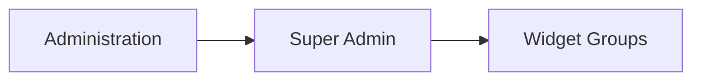
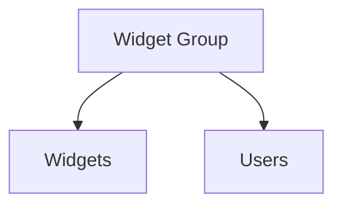

# Widget Groups

The **Widget Groups** section in **Super Admin** is used to manage logical collections of widgets.

A widget group acts as an organizational layer between the widget catalog and the users who can access those widgets.

Widget groups are used to:

- organize widgets into meaningful sets
- control which widgets are available to specific users
- simplify the assignment of multiple widgets through a single group

Only **Super Admin** users can manage widget groups.

---

## Accessing the Widget Groups Section

Widget groups can be managed from:

---

## Widget Group Definition

Each widget group is defined by the following fields:

| Field           | Description                             |
| --------------- | --------------------------------------- |
| **Name**        | Human-readable name of the group        |
| **Code**        | Unique identifier of the group          |
| **Status**      | Whether the group is active or disabled |
| **Description** | Optional description of the group       |

The **code** is the internal identifier used by the platform, while the **name** is the value typically shown in the user interface.

---

## Widget Groups Table

The table displays the configured widget groups.

Typical columns include:

* **Name**
* **Description**
* **Code**
* **Status**

Groups can be filtered by:

* name
* status

This makes it easier to locate active or inactive groups.

---

## Widget Group Actions

Opening a widget group record shows the standard CRUD dialog, where administrators can:

* edit the widget group
* update its status
* update its description
* delete the group

Unlike many other entities, the delete action is exposed as a dedicated **registry button** in the record view.

---

## Connections View

The **Connections View** for a widget group includes two main relationship areas:

* **Widgets**
* **Users**

This allows administrators to define:

* which widgets belong to the group
* which users are assigned to that group

---

## Relationship with Widgets

The **Widgets** tab shows the widget definitions linked to the selected group.

This relationship allows administrators to organize widgets into reusable sets.

For example, a widget group may collect:

* cost governance widgets
* infrastructure monitoring widgets
* development-only widgets
* customer-specific widgets

A widget can be linked or unlinked from the group using the connection tools.

This mechanism is especially useful during development, where new widgets are often temporarily assigned to a **Development** group before being distributed more broadly.

---

## Relationship with Users

The **Users** tab shows the users assigned to the selected widget group.

This relationship allows the platform to control which groups of widgets are available to each user.

Instead of assigning widgets one by one, administrators can assign a whole widget group to a user.

This simplifies widget availability management and supports consistent UI access across multiple users.

---

## Role of Widget Groups in the Platform

Widget groups provide the **distribution layer** for widgets.

In the overall model:

* **Widgets** define what visualization components exist
* **Widget Groups** organize those components into reusable sets
* **Users** receive access to widgets through group assignment

This makes widget groups an essential part of the dashboard configuration and access model of the platform.