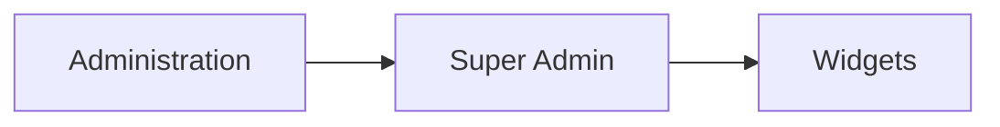
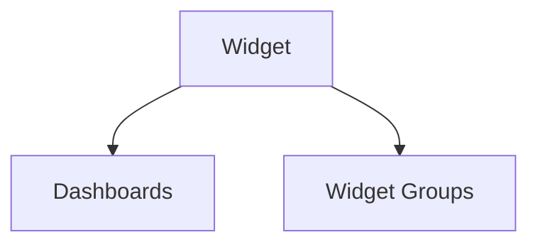

# Widgets

The **Widgets** section in **Super Admin** is used to manage the catalog of widget definitions available in the platform.

A widget represents a reusable visualization component that can later be assigned to:

- **Widget Groups**
- **Dashboards**

This section is intended for administrative and configuration activities, not for normal dashboard usage.

Only **Super Admin** users can manage widget definitions.

---

## Accessing the Widgets Section

Widgets can be managed from:

---

## Widget Definition

Each widget record defines the basic metadata of a widget.

The main fields are:

| Field           | Description                                                              |
| --------------- | ------------------------------------------------------------------------ |
| **Name**        | Human-readable name of the widget                                        |
| **Code**        | Unique technical identifier used by the frontend to recognize the widget |
| **Scope**       | Scope in which the widget can be used                                    |
| **Status**      | Whether the widget is active or disabled                                 |
| **Description** | Optional description of the widget                                       |

The **code** field is particularly important because it is the identifier used in the frontend implementation to map the widget definition to its visual component. 

---

## Widgets Table

The table displays the configured widget definitions.

Typical columns include:

* **Name**
* **Description**
* **Code**
* **Scope**
* **Status**

Widgets can be filtered by:

* scope
* status

This allows administrators to quickly identify the widget definitions available for different dashboard contexts. 

---

## Widget Scope

Each widget has a **scope**, which defines where it can be used.

The exact available values come from the dashboard scope configuration used by the platform. 

The scope is used to ensure that widgets are assigned only where they are compatible.

---

## Connections View

Widgets provide a **Connections View** with two main relationship areas:

* **Dashboards**
* **Widget Groups**

---

## Relationship with Dashboards

Widgets can be linked directly to dashboards.

This connection defines not only that a widget belongs to a dashboard, but also **how it is placed inside the dashboard grid**.

The dashboard relation includes additional layout properties such as:

* **Index**
* **Width**
* **Height**
* **Grid X**
* **Grid Y**
* **Settings**

These properties determine the widget position, size, ordering, and optional configuration inside the dashboard. 

So, in the platform model:

* the **widget definition** identifies the type of visualization
* the **dashboard relation** defines how that widget appears inside a specific dashboard

---

## Relationship with Widget Groups

Widgets can also be linked to **Widget Groups**.

Widget Groups are used to organize widgets into logical sets that can then be assigned to users or made available in specific contexts.

This relationship is important because a newly created widget usually needs to be associated with a widget group before it becomes useful in the UI.

In development environments, widgets are often temporarily linked to the **Development** widget group during implementation and testing.

---

## Widget Lifecycle in Development

From an implementation point of view, adding a new widget typically involves the following steps:

1. create the widget definition in **Super Admin → Widgets**
2. assign the widget to a **Widget Group**
3. add the widget configuration in the frontend settings
4. implement or update the widget component in the frontend code
5. register the widget in the widget wrapper so the frontend can resolve the component from the widget `code`

This means that the administrative widget record acts as the **configuration entry point** for the visual component rendered by the frontend.

---

## Role of Widgets in the Platform

Widgets are the building blocks of dashboards.

They provide reusable visualization components that can display:

* charts
* tables
* anomaly reports
* cost breakdowns
* service analytics

In the administrative model, the Widgets section defines **what widgets exist**.
Dashboards and widget groups then define **where and how they are used**.