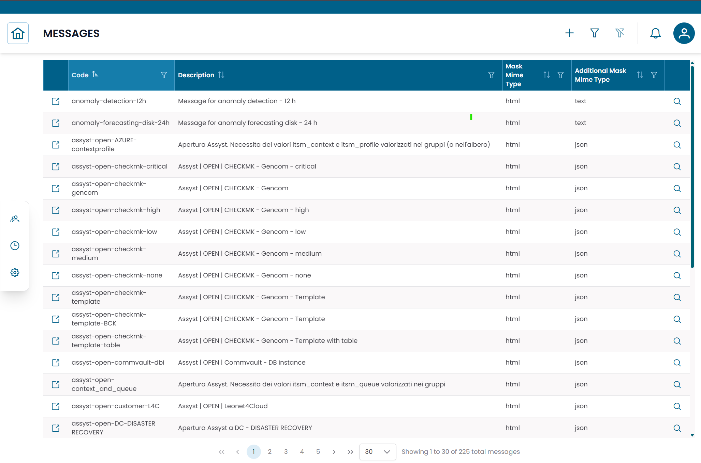
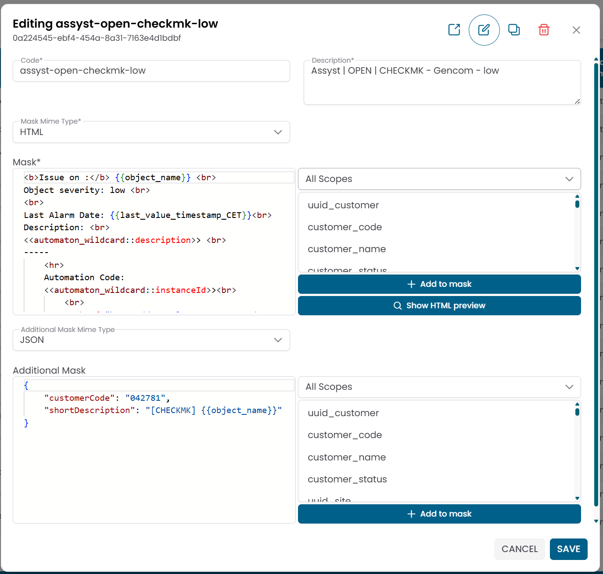

# Messages

The **Messages** section manages the notification templates used by XAUTOMATA to generate the content of alerts and external communication payloads.

!!! info
    Messages define *what* is sent — they do not send anything by themselves.
    A message is always triggered by a [Dispatcher](../data_manager/monitoring/dispatchers.md), which determines *when* and *where* it is delivered.

---

## Opening the Messages Section

From the main navigation menu, go to **Administration → Messages**.

The interface opens with a table listing all available message templates.


/// caption
Fig.1 - Messages table
///

---

## Message Details

Click the **search icon (🔍)** on any row to open the message record.

| Field | Description |
|---|---|
| Code | Unique identifier of the message template |
| Description | Human-readable description of the template's purpose |
| Mask Mime Type | Format of the main message body (HTML, JSON, or Text) |
| Mask | Main message template with dynamic placeholders |
| Additional Mask Mime Type | Format of the optional secondary payload |
| Additional Mask | Optional secondary payload (used for external system integrations) |

From this dialog you can:

- edit the message template
- duplicate the record
- delete the record


/// caption
Fig.2 - Message detail dialog
///

---

## Message Templates and Dynamic Variables

The **Mask** field is the main notification content. It can include dynamic placeholders that the platform replaces at runtime with values from the monitoring context.

Example of an HTML mask:

```html
<b>Issue on:</b> {{object_name}}
Last alarm: {{last_value_timestamp_CET}}
Description: <<automaton_wildcard::description>>
```

The **Additional Mask** is an optional secondary payload used when integrating with external systems such as ticketing platforms. It is typically formatted as JSON:

```json
{
  "customerCode": "042781",
  "shortDescription": "[CHECKMK] {{object_name}}"
}
```

### Available variable scopes

When editing a mask, dynamic variables can be drawn from the following scopes:

| Scope | Description |
|---|---|
| Customer | Customer-level information |
| Site | Site-level information |
| Group | Group-level information |
| Virtual Domain | Virtual domain information |
| Object | Object-level information |

!!! note
    The specific variable names available depend on the scope and the platform configuration.
    Contact the XAUTOMATA delivery team for the complete list of available placeholders.

---

## How Messages Fit in the Notification Flow

```
Monitoring event → Dispatcher triggered → Message generated → Notification Provider delivers
```

1. A monitoring condition occurs.
2. The platform's automation engine triggers a **Dispatcher**.
3. The dispatcher uses this **Message** template to generate the notification content.
4. The generated message is delivered through a **Notification Provider**.

The same message template can be reused across multiple dispatchers, enabling consistent notification content across different automation rules.

---

!!! note
    To configure the delivery channel, see [Notification Providers](notification_providers.md).
    To configure the automation rule that triggers this message, see [Dispatchers](../data_manager/monitoring/dispatchers.md).
