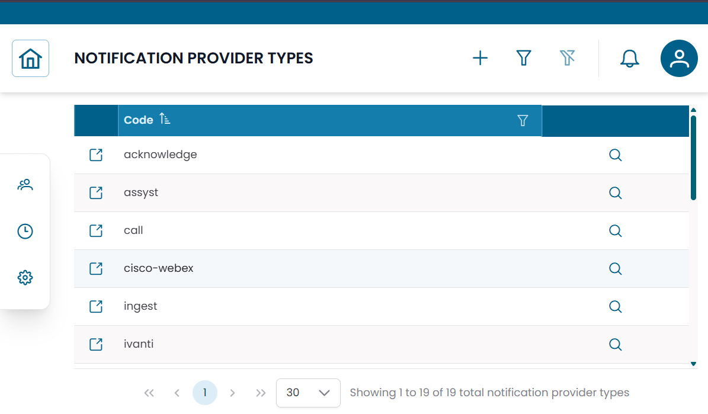

# Notification Provider Types

La sezione **Notification Provider Types** elenca i modelli di integrazione supportati da XAUTOMATA per la consegna di notifiche e azioni automatizzate.
Ogni tipo di provider definisce lo schema di configurazione che un notification provider di quel tipo deve seguire.

!!! info
    I notification provider type sono configurazioni di riferimento gestite dal team di delivery XAUTOMATA.
    Questa sezione è principalmente informativa — normalmente non creerai né eliminerai tipi di provider dall'interfaccia.

---

## Aprire la Sezione Notification Provider Types

Dal menu di navigazione principale, vai su **Administration → Notification Provider Types**.

L'interfaccia si apre con una tabella che elenca tutti i tipi di provider disponibili.

Esempi di notification provider type includono:

- email
- webhook
- sistemi di ticketing
- piattaforme di messaggistica
- integrazioni API personalizzate


/// caption
Fig.1 - Tabella Notification Provider Types
///

---

## Dettagli del Tipo di Provider

Clicca sull'**icona di ricerca (🔍)** su qualsiasi riga per aprire il record del tipo di provider.

| Campo | Descrizione |
|---|---|
| Code | Identificatore univoco del tipo di provider |
| JSON Schema | Definisce la struttura di configurazione richiesta per i provider di questo tipo |

Il campo **JSON Schema** descrive quali parametri sono necessari quando si crea un notification provider basato su questo tipo — ad esempio indirizzi server, endpoint API, credenziali di autenticazione o token.

---

## Relazione con i Notification Provider

I tipi di provider fungono da template. Quando crei un notification provider, selezioni un tipo di provider e compili i valori di configurazione definiti dal suo schema.

```
Notification Provider Type (schema) → Notification Provider (configurazione effettiva)
```

È possibile creare più provider dallo stesso tipo — ad esempio due gateway email diversi entrambi basati sullo stesso tipo di provider Email.

---

!!! note
    Per configurare i canali di comunicazione effettivi, consulta [Notification Providers](notification_providers.md).
