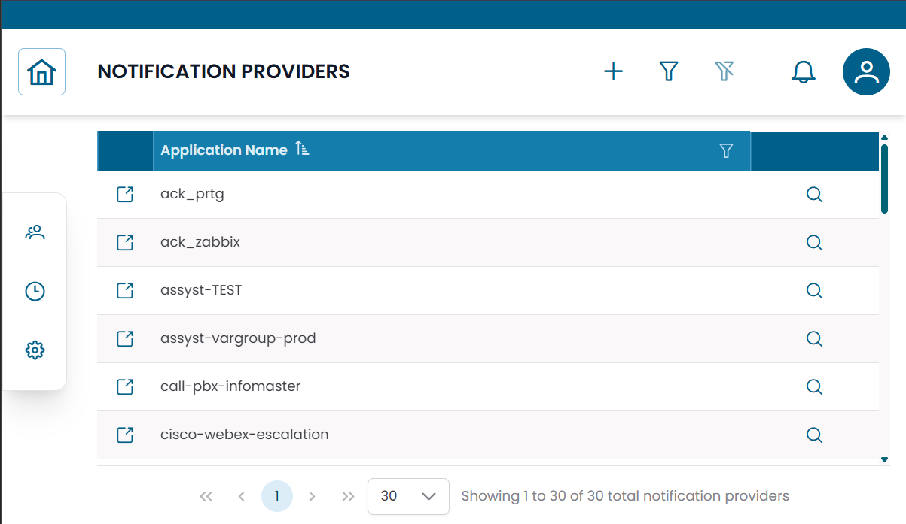
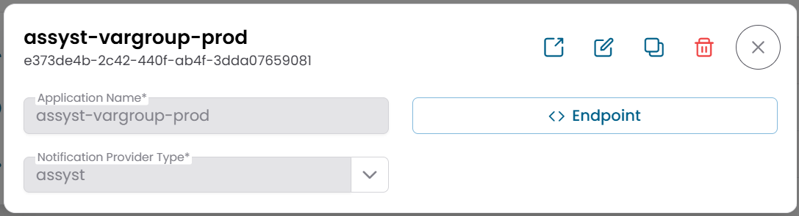

# Notification Providers

The **Notification Providers** section manages the external communication channels used by XAUTOMATA to deliver alerts and automated actions.
A notification provider stores the actual connection details for a specific integration — for example an email gateway, a webhook endpoint, or a ticketing platform.

---

## Opening the Notification Providers Section

From the main navigation menu, go to **Administration → Notification Providers**.

The interface opens with a table listing all configured notification providers.


/// caption
Fig.1 - Notification Providers table
///

---

## Notification Provider Details

Click the **search icon (🔍)** on any row to open the provider record.

| Field | Description |
|---|---|
| Application Name | Human-readable name of the provider |
| Notification Provider Type | The provider type used as configuration template |
| Endpoint | JSON configuration with the actual connection parameters |

The **Endpoint** field contains the connection details specific to the integration — server addresses, API URLs, authentication tokens, or other required parameters. Its exact structure depends on the selected provider type.

From this dialog you can:

- edit the provider configuration
- duplicate the record
- delete the record

!!! note
    The **Endpoint** configuration is typically set up by the XAUTOMATA delivery team during onboarding.
    Contact the delivery team before modifying connection parameters.


/// caption
Fig.2 - Notification Provider detail dialog
///

---

## Connections View

Click the **link icon (🔗)** on any row to open the **Connections View**.

| Tab | Description |
|---|---|
| Dispatchers | Automation rules that use this notification provider |

Use this view to see which dispatchers are currently using a provider before making changes to its configuration.

When creating a new dispatcher from this context, the provider reference is pre-filled automatically.

---

## How Notification Providers Fit in the Notification Flow

```
Dispatcher triggered → Message generated → Notification Provider delivers to External System
```

- The **Dispatcher** defines when to act and which message to use.
- The **Message** defines the content.
- The **Notification Provider** defines how and where the content is delivered.

Typical delivery targets include email systems, ticketing platforms, webhook endpoints, and external APIs.

---

!!! note
    Notification providers are based on **Notification Provider Types**, which define the configuration schema.
    See [Notification Provider Types](notification_provider_types.md) for details.
    To configure automation rules, see [Dispatchers](../data_manager/monitoring/dispatchers.md).
