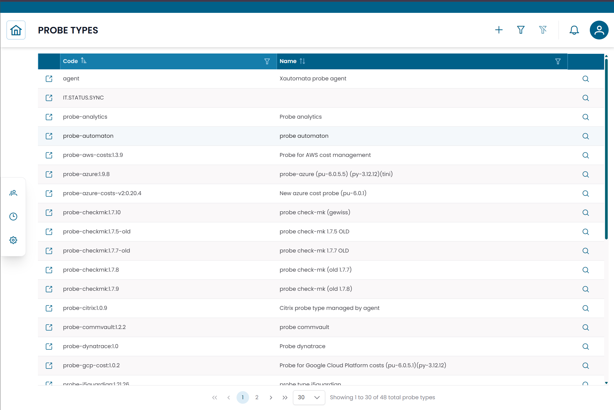

# Probe Types

The **Probe Types** section lists the monitoring integration technologies available in XAUTOMATA.
Each probe type defines how a monitoring agent collects data — for example a system monitoring agent, a network probe, or a cloud integration.

!!! info
    Probe types are reference configurations managed by the XAUTOMATA delivery team.
    This section is primarily informational — you will not normally create or delete probe types from the interface.

---

## Opening the Probe Types Section

From the main navigation menu, go to **Administration → Probe Types**.

The interface opens with a table listing all available probe types.

/// caption
Fig.1 - Probe Types table
///

---

## Probe Type Details

Click the **search icon (🔍)** on any row to open the probe type record.

| Field | Description |
|---|---|
| Code | Short identifier of the probe type |
| Name | Descriptive name of the monitoring integration |
| Endpoint | JSON configuration defining the communication parameters |

The **Endpoint** field contains the technical parameters used by the platform to interact with probes of this type. It is managed by the delivery team.

---

## Connections View

Click the **link icon (🔗)** on any row to open the **Connections View**.

This view shows all **Probes** that use the selected probe type — useful for understanding the scope of an integration before making changes.

---

!!! note
    To manage the monitoring agents based on a probe type, see [Probes](probes.md).
