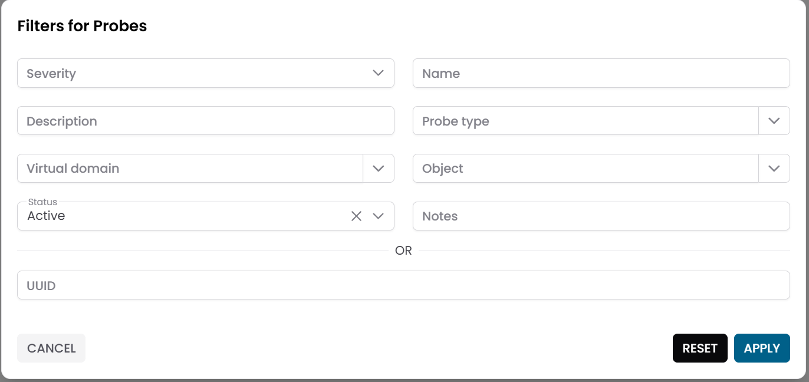
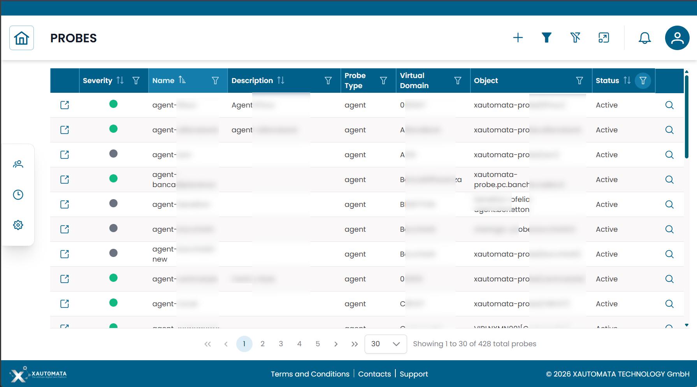
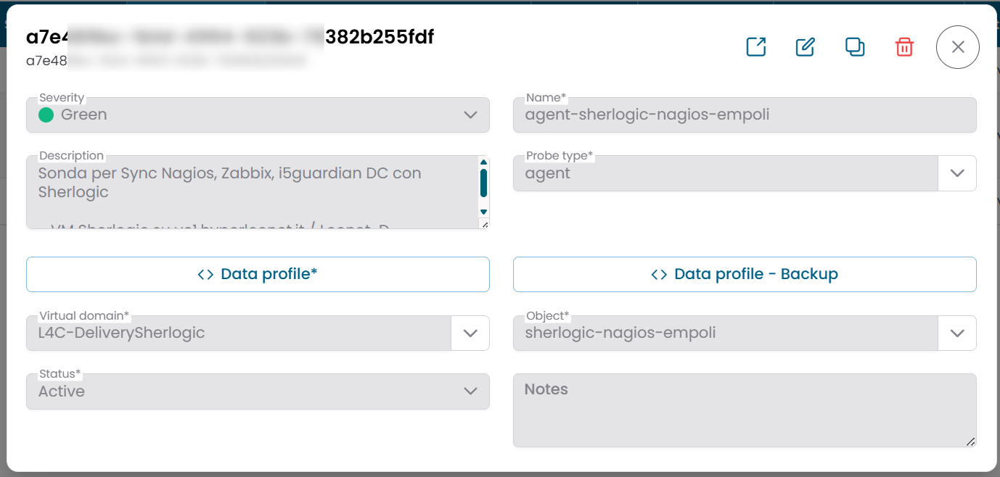
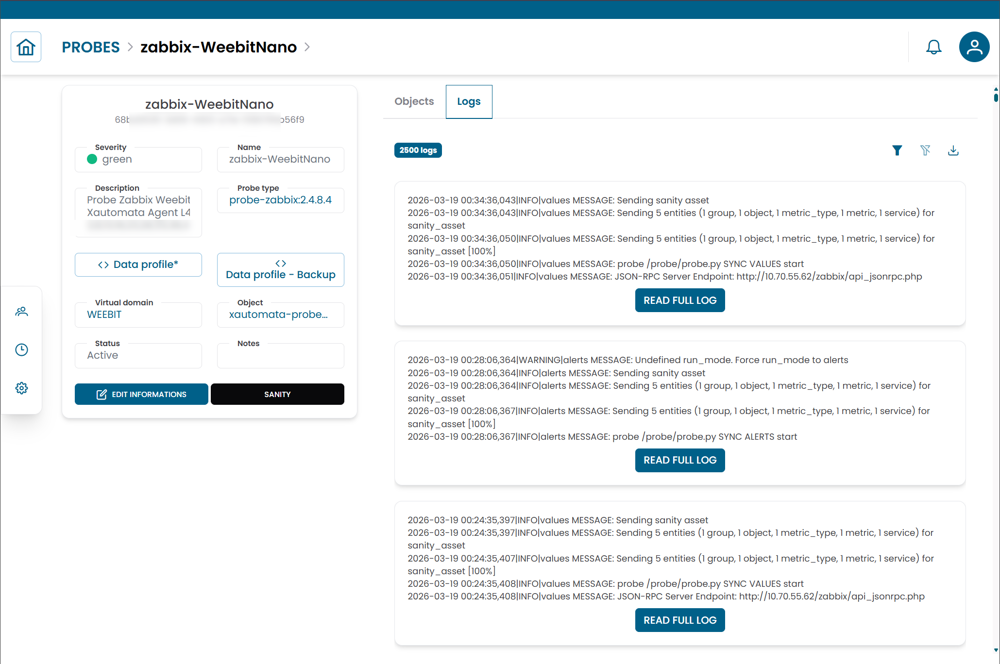

# Probes

The **Probes** section manages the monitoring agents that collect data from infrastructure resources and send it to XAUTOMATA.
Each probe is the operational bridge between a monitored resource and the platform — without probes, no metrics are collected.

---

## Opening the Probes Section

From the main navigation menu, go to **Administration → Probes**.

The interface opens with a **pre-filter dialog**. Fill in one or more fields to narrow the search, then click **APPLY**.

| Filter field | Description |
|---|---|
| Name | Name of the probe |
| Description | Optional description |
| Probe Type | Type of monitoring integration |
| Object | Infrastructure resource the probe monitors |
| Virtual Domain | Administrative domain the probe belongs to |
| Status | Active, Disabled, or Maintenance |

/// caption
Fig.1 - Probes pre-filter dialog
///

---

## Probes Table

After applying the filter, the results appear in a table where each row represents a probe.

In addition to the standard fields, the table displays key health indicators:

| Column | Description |
|---|---|
| Severity | Current operational condition of the probe |
| Last Seen | Timestamp of the last communication with the platform |
| Ingest Frequency | Expected interval between data updates |

Use **Severity** and **Last Seen** to quickly identify probes that may be offline or experiencing issues.

!!! warning
    If a probe's **Last Seen** timestamp is significantly older than its **Ingest Frequency**, the probe may have stopped collecting data.
    Investigate connectivity, configuration, or the status of the monitored resource.

/// caption
Fig.2 - Probes results table
///

---

## Probe Details

Click the **search icon (🔍)** on any row to open the probe record.

| Field | Description |
|---|---|
| Name | Name of the probe |
| Description | Optional description |
| Probe Type | Type of monitoring integration used |
| Object | Monitored infrastructure resource |
| Virtual Domain | Administrative domain |
| Data Profile | JSON configuration for the probe behavior |
| Status | Active, Disabled, or Maintenance |
| Notes | Optional notes |

From this dialog you can:

- edit the probe configuration
- duplicate the record
- delete the record

!!! note
    The **Data Profile** field contains the technical configuration required for the probe to operate. Do not edit it unless instructed by the XAUTOMATA delivery team.

/// caption
Fig.3 - Probe detail dialog
///

---

## Probe Logs

Each probe provides access to a **Logs** view that records operational events and messages generated by the probe.

To open the logs, click the **Logs** action button on the probe row.

Use the logs to diagnose issues such as:

- connectivity problems between the probe and the monitored resource
- configuration errors
- data ingestion failures

/// caption
Fig.4 - Probe logs view
///

---

## Connections View

Click the **link icon (🔗)** on any row to open the **Connections View** for that probe.

| Tab | Description |
|---|---|
| Objects | Infrastructure resources associated with this probe |

Use this view to link a probe to additional objects or to remove existing associations.

---

!!! note
    Probe types define the monitoring technology used by a probe. See [Probe Types](probe_types.md) for details.
    To understand how probes fit into the monitoring architecture, see [Objects](../data_manager/objects/objects.md).
