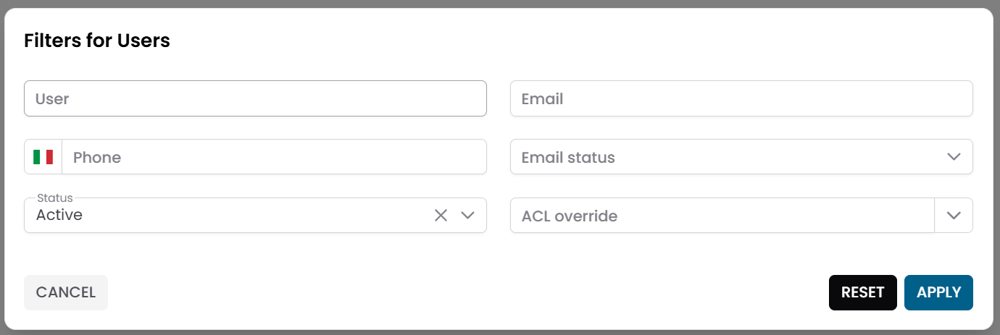
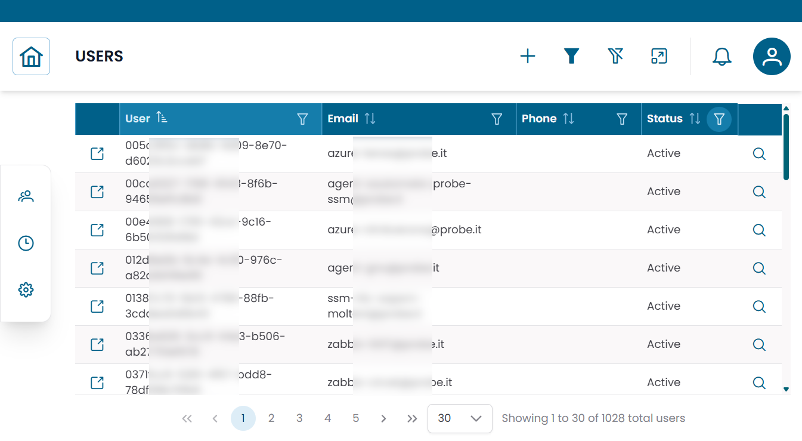
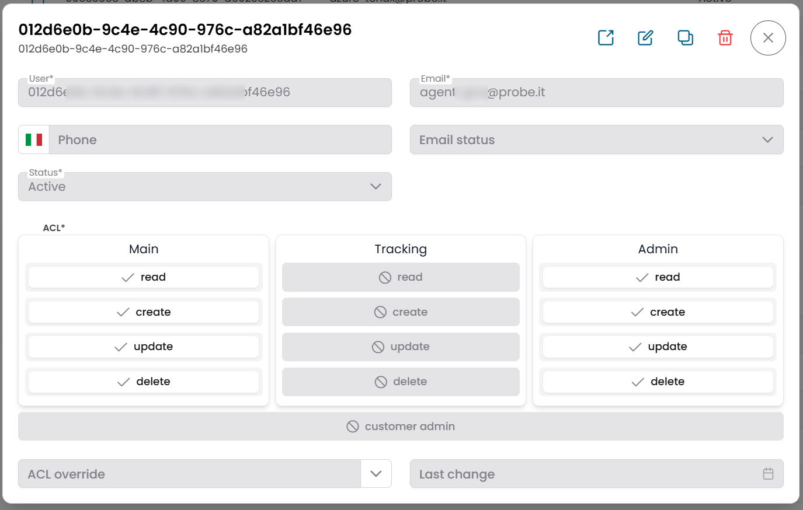
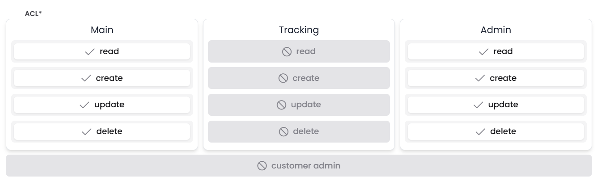
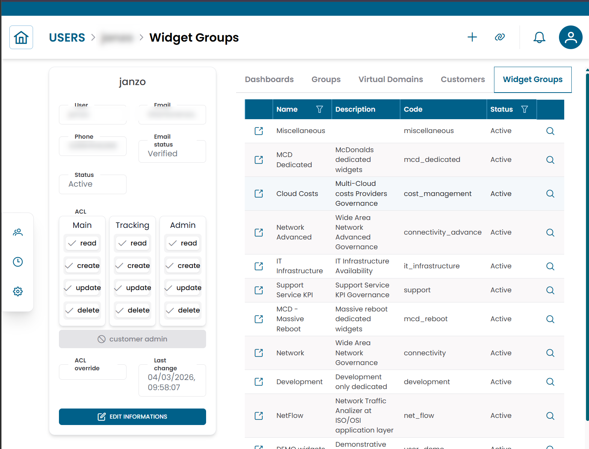

# Users

La sezione **Users** gestisce gli account che possono accedere alla piattaforma XAUTOMATA.
Ogni account utente definisce le credenziali di autenticazione, le informazioni di contatto, i permessi di accesso e le relazioni con dashboard ed entità infrastrutturali.

---

## Aprire la Sezione Users

Dal menu di navigazione principale, vai su **Administration → Users**.

L'interfaccia si apre con un **dialog di pre-filter**. Compila uno o più campi per restringere la ricerca, poi clicca **APPLY**.

| Campo filtro | Descrizione |
|---|---|
| User | Identificatore username |
| Email | Indirizzo email dell'utente |
| Phone | Numero di telefono di contatto |
| Email Status | Verified o Not verified |
| Status | Active o Disabled |
| ACL Override | Profilo override facoltativo applicato all'utente |

/// caption
Fig.1 - Dialog di pre-filter Users
///

---

## Tabella Users

Dopo aver applicato il filtro, i risultati appaiono in una tabella dove ogni riga rappresenta un account utente.

Le colonne tipiche includono:

- User
- Email
- Phone
- Status

/// caption
Fig.2 - Tabella dei risultati Users
///

---

## Creare un Utente

Clicca **NEW** per creare un nuovo account utente. Compila i campi nel dialog, poi clicca **SAVE CHANGES**.

| Campo | Descrizione |
|---|---|
| User | Username univoco per il login |
| Email | Indirizzo email dell'utente |
| Password | Password iniziale |
| Phone | Numero di telefono facoltativo |
| Email Status | Verified o Not verified |
| Status | Active o Disabled |

Dopo aver creato l'utente, configura i suoi **permessi ACL** (vedi di seguito) e assegna le connessioni rilevanti.

---

## Dettagli dell'Utente

Clicca sull'**icona di ricerca (🔍)** su qualsiasi riga per aprire il record utente.

Da questo dialog puoi:

- aggiornare le informazioni di contatto
- abilitare o disabilitare l'account
- modificare i permessi ACL
- cambiare la password abilitando l'opzione **Edit password**

Il dialog mostra anche **Last change** — il timestamp dell'ultima modifica della password.

/// caption
Fig.3 - Dialog dettaglio utente
///

---

## Controllo degli Accessi (ACL)

A ogni utente viene assegnata una **configurazione ACL** che determina quali azioni può eseguire nella piattaforma.

Il pannello ACL nel dialog utente mostra tre colonne — **Main**, **Tracking**, **Admin** — ciascuna con toggle per **read**, **create**, **update**, **delete**.

/// caption
Fig.3b - Pannello di configurazione ACL — tre domini con toggle per operazione
///

| Dominio | Descrizione |
|---|---|
| Main | Entità core della piattaforma e operazioni generali |
| Tracking | Calendars, downtimes e dispatchers |
| Admin | Sezione Administration — users, probes, notification providers e impostazioni della piattaforma |

All'interno di ogni dominio, possono essere concesse le seguenti operazioni: **read**, **create**, **update**, **delete**.

### Flag Customer Admin

In fondo al pannello ACL, il pulsante **CUSTOMER ADMIN** imposta un flag speciale che configura l'utente come **Tenant Admin** — un amministratore con scope limitato al cliente.

Un Tenant Admin può accedere a determinate funzioni amministrative (come la gestione degli utenti) per i clienti specifici collegati al suo account, senza avere accesso completo all'amministrazione della piattaforma. Non ha bisogno di Admin → Read abilitato.

Per configurare un Tenant Admin, abilita il flag Customer Admin e collega l'utente ai clienti rilevanti nella Connections View.

### ACL Override

Oltre ai permessi base, a un utente può essere assegnato un profilo **ACL Override**.
Un override può limitare operazioni specifiche, nascondere campi del form o applicare valori predefiniti — senza modificare la configurazione dei permessi base dell'utente.

Gli ACL Override vengono gestiti in **Super Admin → ACL Overrides**.
Per una descrizione completa del modello di permessi e di tutti i tipi di utente, consulta [Access Control](access_control.md).

---

## Connections View

Clicca sull'**icona link (🔗)** su qualsiasi riga per aprire la **Connections View** per quell'utente.

Questa vista mostra le entità collegate all'utente:

| Tab | Descrizione |
|---|---|
| Dashboards | Dashboard a cui questo utente può accedere |
| Groups | Gruppi infrastrutturali in scope per questo utente |
| Virtual Domains | Domini amministrativi a cui appartiene questo utente |
| Customers | Clienti a cui questo utente ha accesso |
| Widget Groups | Gruppi di widget disponibili per questo utente |

Usa questa vista per controllare quali dati e dashboard un utente può vedere dopo il login.

!!! warning
    Un utente **senza connessioni a clienti** non vede un'interfaccia vuota — al contrario acquisisce la visibilità **Super User** e può vedere **tutti i clienti** nella piattaforma. Questo comportamento è automatico e non configurabile tramite un toggle.
    Collega sempre gli utenti ai clienti appropriati a meno che tu non voglia intenzionalmente dargli visibilità completa su tutti i clienti.

!!! note
    Un utente senza connessioni di alcun tipo (nessuna dashboard, nessun gruppo, nessun cliente) vedrà un'interfaccia largamente vuota. Assegna sempre almeno una dashboard e i clienti rilevanti.

/// caption
Fig.4 - Connections view dell'utente
///

---

!!! note
    Per la descrizione completa del modello di permessi e la logica di valutazione ACL, consulta [Access Control](access_control.md).
