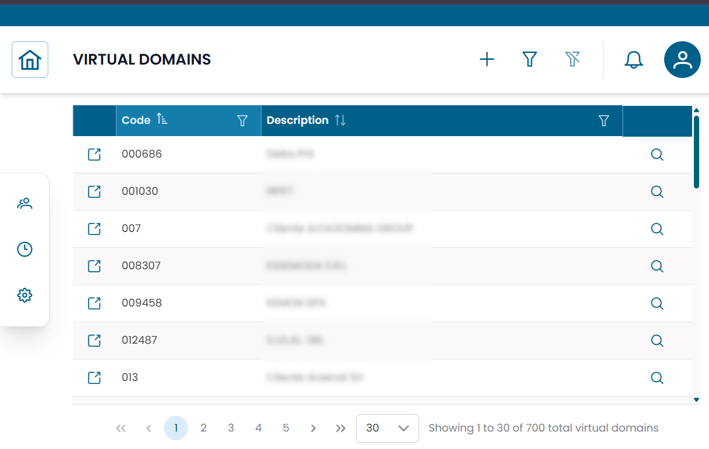
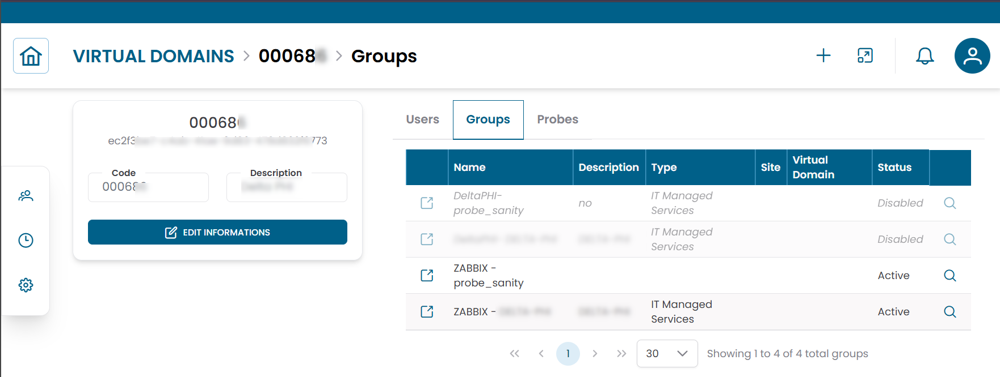

# Virtual Domains

The **Virtual Domains** section manages logical partitions used to organize users, groups, and probes within XAUTOMATA.
Virtual domains act as administrative boundaries — useful in multi-customer or multi-environment deployments where different scopes need to be clearly separated.

---

## Opening the Virtual Domains Section

From the main navigation menu, go to **Administration → Virtual Domains**.

Unlike most sections, Virtual Domains opens **directly in a table view** — there is no pre-filter dialog.
Use the search controls in the table header to filter records directly.

/// caption
Fig.1 - Virtual Domains table
///

---

## Virtual Domain Details

Click the **search icon (🔍)** on any row to open the virtual domain record.

| Field | Description |
|---|---|
| Code | Unique identifier of the virtual domain |
| Description | Descriptive name or label |

From this dialog you can:

- edit the virtual domain
- duplicate the record
- delete the record

---

## Connections View

Click the **link icon (🔗)** on any row to open the **Connections View**.

This is the main operational view for virtual domains. It shows the entities associated with the selected domain:

| Tab | Description |
|---|---|
| Users | User accounts belonging to this virtual domain |
| Groups | Infrastructure groups scoped to this virtual domain |
| Probes | Monitoring probes associated with this virtual domain |

### Users tab

Shows all users linked to the virtual domain. Columns include User, Email, Phone, Status.

### Groups tab

Shows the infrastructure groups associated with the virtual domain. Columns include Name, Description, Type, Site, Status.

### Probes tab

Shows the monitoring probes associated with the virtual domain. Columns include Severity, Name, Probe Type, Object, Status.

/// caption
Fig.2 - Virtual Domain connections view
///

---

!!! note
    Virtual domains are lightweight containers. Their value lies in the relationships they hold — the users, groups, and probes associated with them.
    To manage user accounts, see [Users](users.md). To manage monitoring agents, see [Probes](probes.md).
