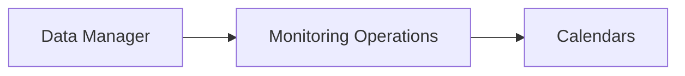
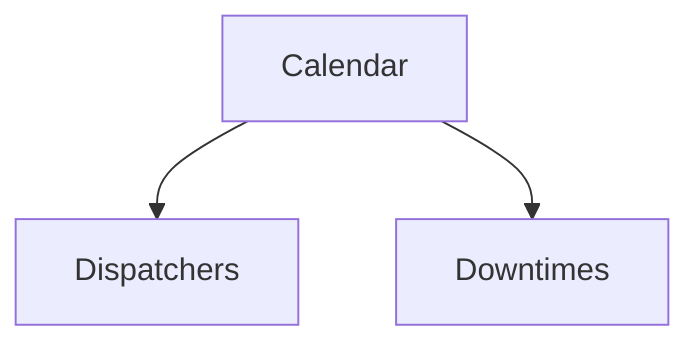

# Calendars

The **Calendars** entity defines time schedules used by the XAUTOMATA platform to control when monitoring operations and automation actions are active.

Calendars typically represent **business hours**, maintenance schedules, or other operational time windows.

They can be used by several monitoring components, such as **Dispatchers** and **Downtimes**, to determine when certain actions should be executed or suppressed.

---

## Accessing the Calendars Section

Calendars can be managed from:



---

## Calendar Types

Two types of calendars are supported.

### Legacy Calendars

Legacy calendars define schedules manually by specifying time intervals for each day of the week.

Each day can contain **two time intervals**, allowing the definition of working hours such as:

```
09:00 – 13:00
14:00 – 18:00
```

For each day, the following fields are available:

```
day_int1_start
day_int1_end
day_int2_start
day_int2_end
```

This structure allows defining complex weekly schedules.

---

### ICAL Calendars

ICAL calendars allow importing schedules using the **iCalendar format**.

This option is useful when calendars are already maintained in external systems and can be synchronized with the platform.

---

## Calendar Properties

A calendar includes several configuration parameters.

| Property                  | Description                                           |
| ------------------------- | ----------------------------------------------------- |
| **Name**                  | Unique identifier of the calendar                     |
| **Type**                  | Calendar definition method (`Legacy` or `Ical`)       |
| **Timezone**              | Timezone used to interpret calendar times             |
| **Local Public Holidays** | Indicates whether local holidays should be considered |
| **Time Intervals**        | Working intervals defined for each day of the week    |

---

## Role in Monitoring Operations

Calendars are used to define **when monitoring actions are active**.

Typical use cases include:

* defining **business hours** for monitoring operations
* controlling when **automated actions** can be triggered
* scheduling **maintenance windows**

The conceptual relationship can be represented as:



In this model, calendars act as **time constraints** for operational automation.

---

## Calendar Visualization

Unlike most entities in the Data Manager, calendars:

* do **not open a pre-filter view**
* do **not provide a connection page**

Instead, calendars are directly displayed in a table view where users can:

* create new calendars
* edit existing ones
* define weekly schedules or import ICAL calendars

---

Calendars play a key role in defining the **temporal logic of monitoring operations**, ensuring that automation and alerting mechanisms follow the operational schedule defined by the organization.