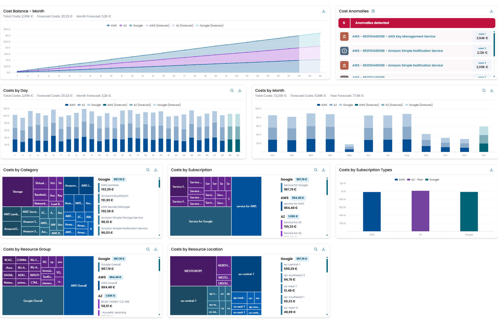

# Cloud Cost

The **Cloud Cost Dashboard** provides an overview of cloud spending across the main supported providers.

This dashboard is part of the **Cost Management** section of XAUTOMATA and displays cost data collected from registered cloud accounts.

Cloud billing data is imported from external providers and can be analyzed through different widgets showing trends, breakdowns, anomalies, and forecasts.

This page displays the content of the **Cloud Cost** dashboard.
Here, the user can view various widgets that allow them to monitor their spending across the major cloud providers (Azure, AWS, Google Cloud).
Additionally, the dashboard includes an anomaly detection system to identify any unexpected expenses and a forecasting tool to estimate future costs.

## Data Source

The data displayed in this dashboard originates from the **Cloud Cost Registration** configuration.

Cloud provider accounts (Azure, AWS, Google Cloud) must be registered in the Administration section so that billing data can be imported.

Once imported, the raw billing data can be analyzed directly through the Cloud Cost widgets displayed in this dashboard.

For structured cost analysis based on customer-defined accounting models, see the **Cost Views** section.

## Dashboard Filters

The dashboard provides filters that affect all widgets simultaneously.

Typical filters include:

- **Customer** – selects the customer whose cloud costs will be analyzed.
- **Reference Month** – selects the billing month used for the analysis.

Changing these filters updates all widgets displayed on the dashboard.

/// caption
Fig.1 - Cloud Cost Dashboard
///

The widgets available on this dashboard are as follows:

1. [costs balance month](widget_cloudcost.md#costs-balance-month)
2. [costs by day](widget_cloudcost.md#costs-by-day)
3. [costs by month](widget_cloudcost.md#costs-by-month)
4. [costs by category](widget_cloudcost.md#costs-by-category)
5. [costs by subscription](widget_cloudcost.md#costs-by-subscription)
6. [costs by type](widget_cloudcost.md#costs-by-subscription-type)
7. [costs by resource group](widget_cloudcost.md#costs-by-resource-group)
8. [costs by resource location](widget_cloudcost.md#costs-by-resource-location)
9. [costs anomaly](widget_cloudcost.md#cost-anomalies)
