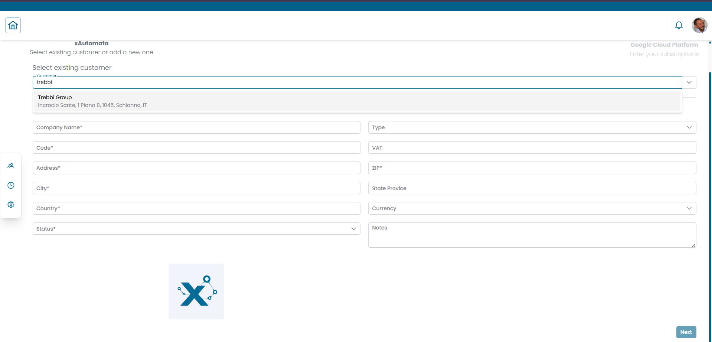
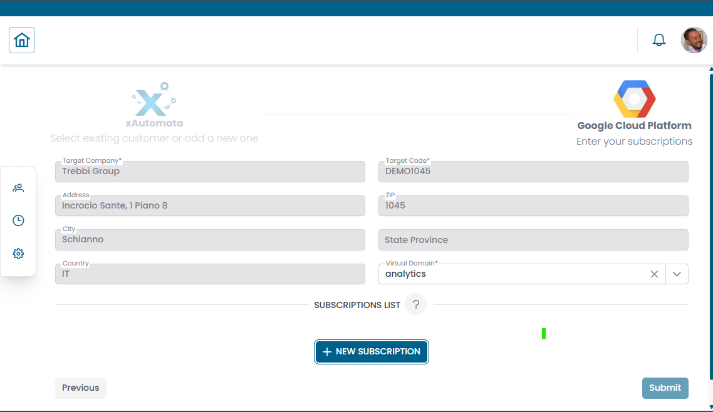
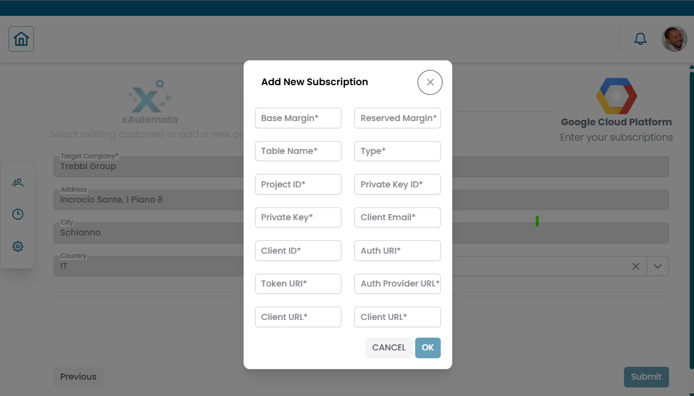
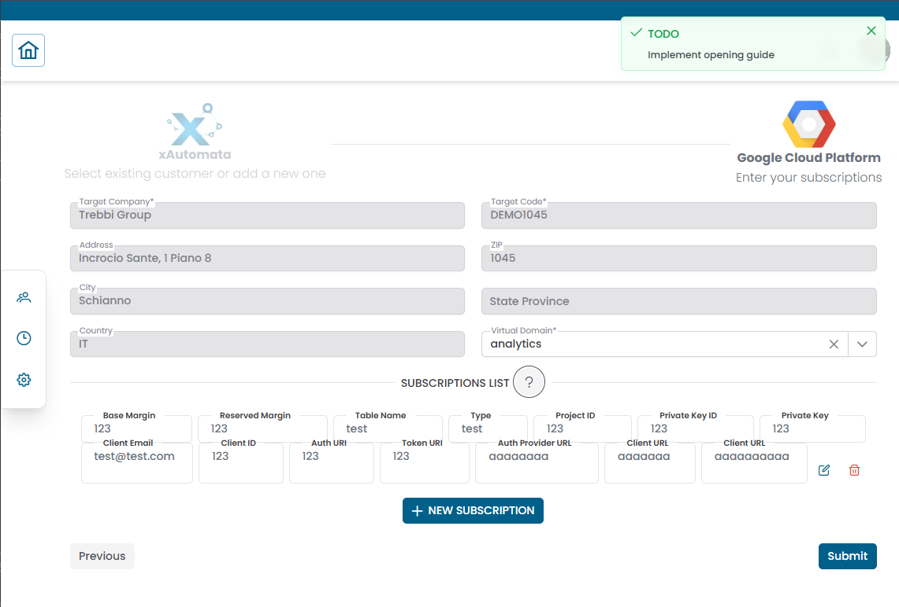

# Cloud Cost Registration

The **Cloud Cost Registration** section lets you connect XAUTOMATA to your cloud provider accounts so that billing data can be imported automatically.

Each registration links a cloud provider account to a specific customer. The process follows a **multi-step wizard** that guides you through customer selection and provider configuration.

!!! info
    Cloud Cost Registration is typically set up during onboarding by the XAUTOMATA delivery team.
    This section is primarily used to review existing registrations or add new provider accounts.

---

## Opening the section

From the main navigation menu, go to **Administration → Cloud Cost Registration**.

Select the provider you want to configure:

| Provider | Description |
|---|---|
| **Azure CSP** | Azure Cloud Solution Provider accounts |
| **Azure** | Standard Azure subscriptions |
| **AWS** | Amazon Web Services accounts |
| **Google Cloud** | Google Cloud Platform billing accounts |

Each provider opens the same wizard flow, adapted to the specific fields required by that provider.

---

## Step 1 — Select or create a customer

The first step associates the registration with a customer in XAUTOMATA.

/// caption
Fig.1 - Step 1 — select an existing customer or create a new one
///

You can either:

- **Select an existing customer** — use the dropdown to search and select a customer already present in the platform
- **Add a new customer** — fill in the customer details directly in the form

Fields for a new customer:

| Field | Description |
|---|---|
| Company Name | Full name of the organization |
| Code | Internal accounting code |
| VAT | VAT number |
| Address | Street address |
| ZIP | Postal code |
| City | City |
| State Province | State or province |
| Country | Country code (e.g. IT, GB) |
| Status | Active or Disabled |
| Currency | Billing currency |
| Notes | Optional notes |

Click **NEXT** to proceed.

---

## Step 2 — Configure the provider account

The second step collects the provider-specific configuration and credentials.

/// caption
Fig.2 - Step 2 — provider account configuration (Azure example)
///

For **Azure**, the fields include:

| Field | Description |
|---|---|
| Azure Customer Name | Name of the Azure customer account |
| Azure Customer Accounting Code | Internal accounting reference |
| Virtual Domain | Virtual domain to associate this registration with |
| Address, ZIP, City, State Province, Country | Location details |
| Base Margin | Base margin applied to billing data |
| Reserved Margin | Reserved margin applied to billing data |

For other providers (AWS, Google Cloud), the fields differ according to the credentials and configuration required by that provider's API.

---

## Step 3 — Add subscriptions

At the bottom of the provider configuration page, a **Subscriptions List** section allows you to add one or more subscriptions linked to the provider account.

Click **+ NEW SUBSCRIPTION** to open the Add New Subscription dialog.

/// caption
Fig.3 - Add New Subscription dialog (Azure example)
///

For **Azure**, the subscription fields are:

| Field | Description |
|---|---|
| Subscription ID | Azure subscription identifier |
| Password | Authentication credential |
| App ID | Azure application (service principal) ID |
| Tenant ID | Azure tenant identifier |
| Expiry Date | Credential expiry date |

After filling in the fields, click **OK** to add the subscription to the list.

You can add multiple subscriptions. Each row in the Subscriptions List shows the configured values and provides **edit** and **delete** icons on the right.

/// caption
Fig.4 - Provider configuration with a subscription added to the list
///

---

## Submitting the registration

Once the provider configuration and subscriptions are complete, click **SUBMIT** to save the registration.

XAUTOMATA will use the configured credentials to connect to the provider API and begin importing billing data.

!!! warning
    Subscription credentials (Subscription ID, Password, App ID, Tenant ID) are sensitive. Ensure they are kept up to date — expired credentials will stop billing data from being imported.
    Check the **Expiry Date** field regularly and update credentials before they expire.

---

## What happens after registration

Once a registration is active, XAUTOMATA periodically retrieves billing data from the provider and makes it available in:

- the **Cloud Cost dashboard** — direct analysis of raw billing data
- the **Cloud Cost widgets** — trends, breakdowns, forecasts, anomalies
- the **Analytical Accounting widgets** — when costs are organized through [Cost Views](cost_views.md)
