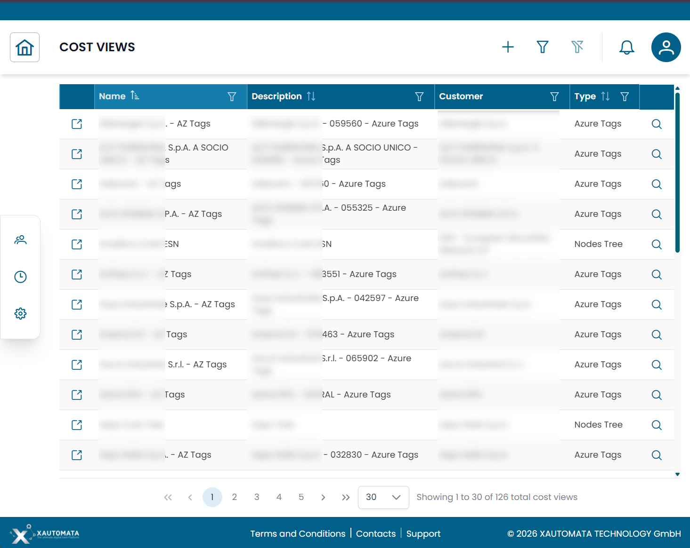
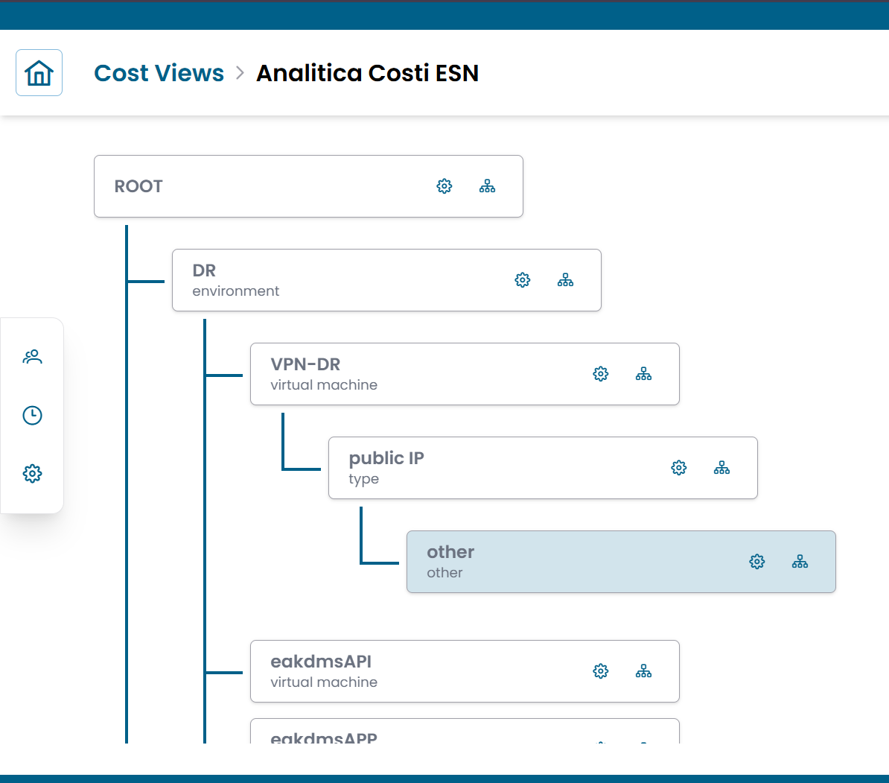
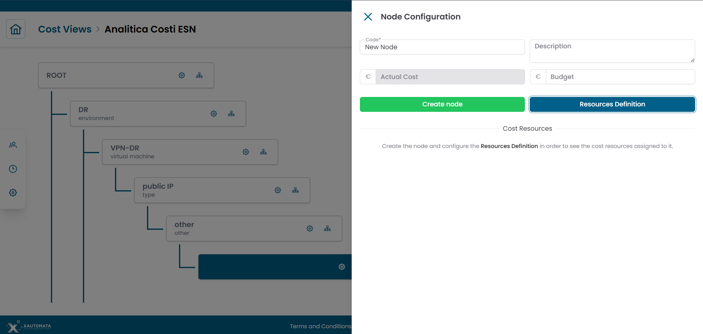
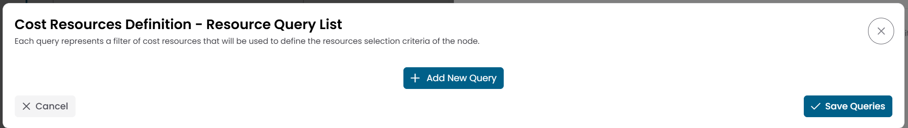
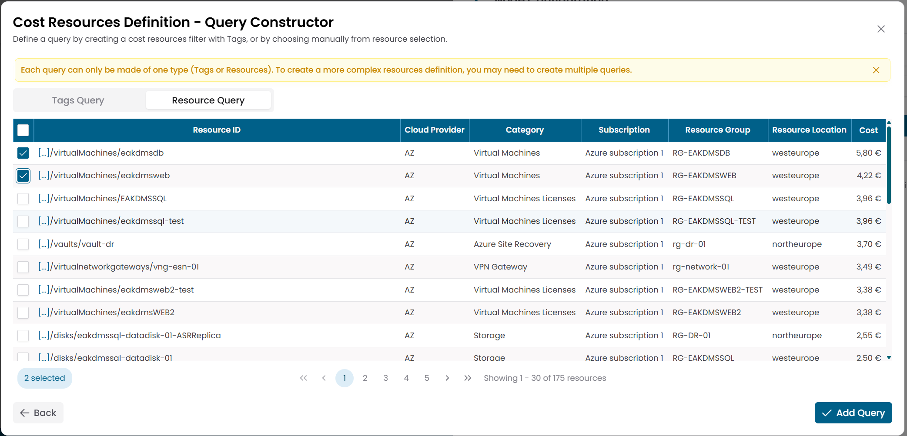

# Cost Views

The **Cost Views** section lets you build custom structures to organize cloud costs according to your organization's internal model — by environment, department, project, or any other grouping that reflects your accounting needs.

Cost Views are the bridge between raw provider billing data and the **Analytical Accounting widgets**, which display costs organized according to the structure you define here.

---

## Opening the section

From the main navigation menu, go to **Administration → Analytical Accounting → Cost Views**.

The interface opens directly in a table — no pre-filter. Each row represents one Cost View.

| Column | Description |
|---|---|
| Name | Name of the Cost View |
| Description | Optional description |
| Customer | Customer the Cost View belongs to |
| Type | `Nodes Tree` or `Azure Tags` |

/// caption
Fig.1 - Cost Views table
///

---

## Cost View types

XAUTOMATA supports two types of Cost Views:

| Type | Status | Description |
|---|---|---|
| **Nodes Tree** | Available | A fully configurable tree structure built manually. Nodes group cloud resources via query-based filters. |
| **Azure Tags** | Coming soon | A view based on Azure resource tags. The configuration interface is currently under development. |

The rest of this page covers the **Nodes Tree** type, which is the currently available interface.

---

## Nodes Tree — overview

A Nodes Tree Cost View is a visual hierarchy of **cost nodes**. Each node represents a grouping category in your accounting model (for example: an environment, a workload, a resource type).

Cloud billing resources are assigned to nodes through **queries** — filter rules that select which resources belong to each node. A node can have multiple queries, and each query can use either tags or resource identifiers as selection criteria.

Child nodes can further subdivide the resources of their parent node.

/// caption
Fig.2 - Nodes Tree editor — ROOT with child nodes and nested levels
///

---

## Opening a Cost View

Click the **link icon (↗)** on any row in the Cost Views table to open the tree editor for that Cost View.

The editor displays the full node hierarchy starting from the **ROOT** node. Each node shows:

- its **name** (bold) and a **label** underneath (for example: environment, virtual machine, type)
- a **⚙️ configure icon** — opens the Node Configuration panel
- a **🌿 add child icon** — adds a child node under this node

---

## Configuring a node

Click the **⚙️ icon** on any node to open the **Node Configuration** panel on the right.

/// caption
Fig.3 - Node Configuration panel with Cost Resources and Resources Definition button
///

| Field | Description |
|---|---|
| Code | Short identifier for the node |
| Description | Label shown under the node name in the tree |
| Actual Cost | Read-only — sum of costs from assigned resources |
| Budget | Optional budget target for this node |

The panel also shows a **Cost Resources** table listing the resources currently assigned to this node, with their individual costs. Click **Show All Resources** to see the full list.

Click **RESOURCES DEFINITION** to manage the query rules that determine which resources are assigned to this node.

---

## Defining resources with queries

Clicking **RESOURCES DEFINITION** opens the **Resource Query List** — a list of queries that together define which billing resources belong to the node.

Click **+ ADD NEW QUERY** to create a new query. This opens the **Query Constructor**.

/// caption
Fig.4 - Resource Query List — add and manage queries for the node
///

### Query Constructor

The Query Constructor offers two query modes:

| Mode | Description |
|---|---|
| **Tags Query** | Selects resources based on their cloud tags. Select a Tags View first, then define tag filters. |
| **Resource Query** | Selects resources by resource identifier — for explicit, manual selection. |

!!! note
    Each query can only be of one type — Tags or Resource. To create a more complex resource selection, add multiple queries to the same node.

/// caption
Fig.5 - Query Constructor — Tags Query and Resource Query modes
///

Once the query is defined, click **ADD QUERY** to save it and return to the Resource Query List. Click **SAVE QUERIES** when all queries for the node are complete.

---

## Adding child nodes

Click the **🌿 icon** on any node to add a child node under it.

Child nodes allow you to subdivide the resources of a parent node into more granular groupings. A child node can define its own queries to filter among the resources of its parent.

!!! warning
    The exact scoping rules for child node resources are pending verification — see [Q3 in the Q&A log](../qa.md).

---

## Relationship with Analytical Accounting widgets

Cost Views feed the **Analytical Accounting** widgets in dashboards:

- **Cost Nodes Tree** — displays the full node hierarchy with actual and budget costs per node
- **Cost Resources by Tag** — displays resources filtered by tag combinations

When configuring an Analytical Accounting widget, you select which Cost View it should reference. The widget then displays costs according to that view's structure.

!!! note
    The **Azure Tags** Cost View type is currently under development. Views of this type appear in the table but their configuration interface shows `Coming soon`.
    For questions about tag origins, see [Q2 in the Q&A log](../qa.md).
