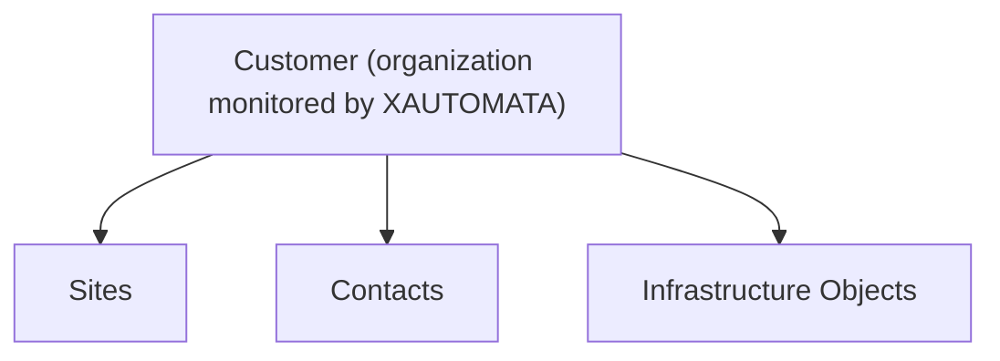

# Customers

The **Customers** entity represents the organizations monitored and managed through the XAUTOMATA platform.

Each customer defines the root of the operational structure used by the system to organize infrastructure objects, monitoring data, and service information.

Within the platform hierarchy, a customer may contain multiple **Sites**, **Contacts**, and infrastructure components.

## Customer Provisioning

Customers are not normally created through the user interface.

They are provisioned during the onboarding process by the **XAUTOMATA delivery team**, which configures the customer environment and the associated monitoring infrastructure.

This process includes:

* creation of the customer record
* configuration of the monitoring probes
* initialization of the infrastructure structure
* association of administrative users

Because of this provisioning workflow, the **Customers section is primarily informational** within the interface.

## Customer Structure

Each customer may include several organizational elements used by the platform:

* **Sites** – represent physical or logical locations of the infrastructure
* **Contacts** – store the people associated with the customer organization
* **Infrastructure objects** – servers, services, network devices, and monitored resources

These entities are used by XAUTOMATA to structure monitoring data and operational information.

## Customer Structure View

Opening a customer record displays the **Customer Structure View**.

The page is divided into two main areas:

- a **customer information panel** on the left
- a **hierarchical navigation area** on the right

The hierarchical area is organized into multiple tabs.

### Sites

This tab shows the infrastructure hierarchy associated with the customer through its sites.

Typical levels include:

- Sites
- Groups
- Objects
- Metric Types
- Metrics

### Service Profiles

This tab shows the hierarchy of service-related structures associated with the customer.

This view is used to navigate the logical organization of monitored services and service profiles.

More details are available in [Tree Hierarchy View](tree_hierarchy_view.md).

## Connections View

From the customer page, users can switch to the **Connections View** to explore lateral relationships.

Customers can be connected to:

- Contacts
- Users
- Dashboards
- Services
- Sites