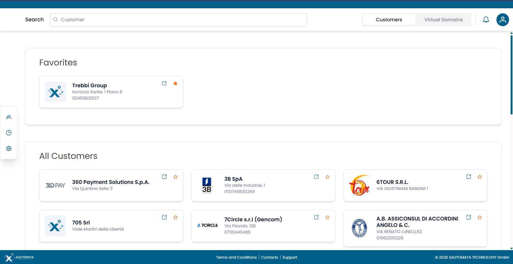
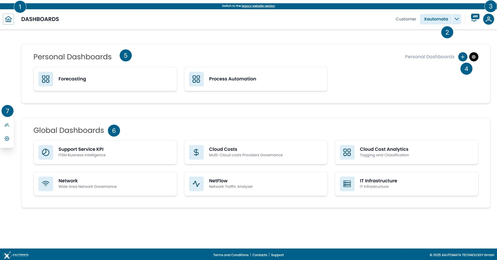
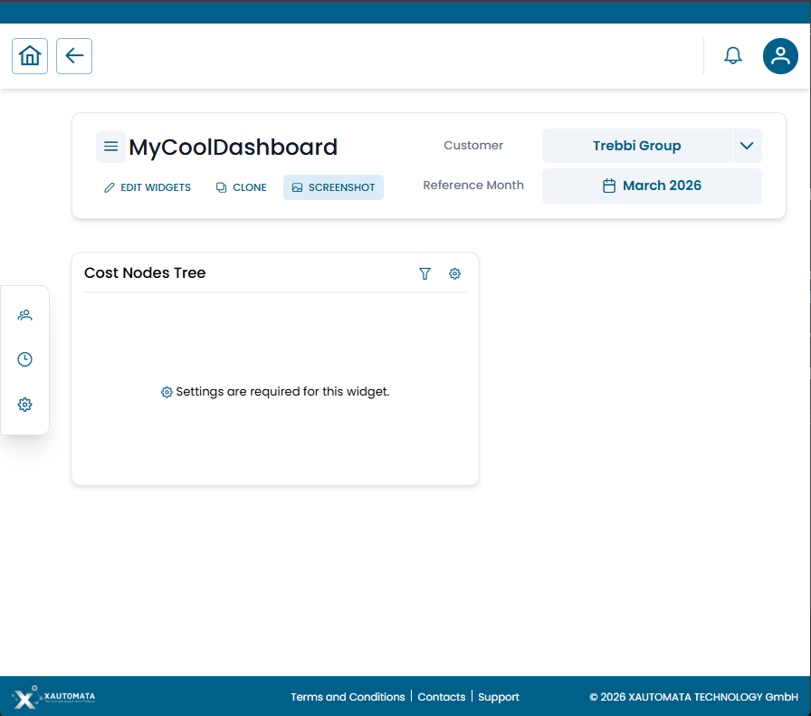

# Dashboards Overview

## Accessing the Platform

### Login

Open `portal.xautomata.com` in your browser. The login page offers three access methods:

- **Username / Password** — enter your credentials and click **LOGIN**
- **SSO** — use **LOGIN WITH GOOGLE**, **LOGIN WITH MICROSOFT**, or **LOGIN WITH APPLE**
- **Mobile app** — scan the QR code with the XAUTOMATA mobile app to connect to this environment

/// caption
Fig.1 - Login Page
///

### Customer Selection

After login, the platform shows the customer selection screen. All customers you have access to are listed here.

- Click the **★ star icon** on any customer card to add it to your **Favorites** — starred customers appear at the top for quick access
- Use the **Search** bar to filter by customer name
- Switch between **Customers** and **Virtual Domains** using the tabs in the top bar

/// caption
Fig.2 - Customer Selection
///

---

## Dashboard Home

Figure 3 shows the page that appears immediately after selecting a customer. This page features a series of menus for interaction:

1. Home menu to return to this screen while navigating the portal.
2. By clicking on the customer's name, you can access a view dedicated to the customer's assets and how they are logically organized within XAUTOMATA.
3. User profile.
4. Create new empty private dashboards to be filled with selected widgets.
5. List of **Personal Dashboards**. By clicking on one of the dashboards on this list you access the specific dashboard.
6. List of **Shared Dashboards**. Dashboards that other users have shared with you. This section only appears if at least one dashboard has been shared with your account.
7. List of **Global Dashboards**. By clicking on one of the global dashboards you access one of the dashboards among:

      1. **Support Service KPI**: Dashboard dedicated to the visualization and management of tickets for the various ITSM integrated into the service.
      2. **Cloud Costs**: Dashboard dedicated to visualizing cloud costs for the major cloud providers.
      3. **Cloud Cost Analytics**: Dashboard dedicated to analytical accounting, where it is possible to organize cloud costs according to their tags.
      4. **Network**: Dashboard dedicated to visualizing information about internet networks.
      5. **NetFlow**: Dashboard dedicated to visualizing NetFlow information of a network, with detailed traffic management data.
      6. **IT Infrastructure**: Dashboard dedicated to visualizing information about the IT infrastructure.

8. Customer/Administrator/Dispatcher menu.

/// caption
Fig.3 - Dashboard Home
///

!!! note

    Not all dashboards are always visible; it depends on whether the user logged into the portal has visibility of the
    widgets contained within a dashboard. If none of the widgets in a dashboard are visible to that user, 
    the dashboard itself will not be displayed on the interface. The visibility of widgets depends on the type 
    of data collected by XAUTOMATA to manage digitized processes and the type of contract in place.

---

## Dashboard Types

| Type | Visible to | Editable by |
|---|---|---|
| **Personal** | You only | You only |
| **Shared** | You + designated users | All users with access |
| **Global** | All users in the organization | Administrators only |

!!! warning

    Shared dashboards are **collaborative**: layout changes are visible to all users who have access to the same instance. Use **CLONE** to create your own personal copy if you want to work independently.

---

## Dashboard View Mode

When you open a dashboard, you are in **view mode**. The action bar shows:

| Button | Action |
|---|---|
| **EDIT WIDGETS** | Enter edit mode to add, move, resize or remove widgets |
| **CLONE** | Create a personal copy of this dashboard |
| **SCREENSHOT** | Download a snapshot image of the current dashboard view |

The **Customer** selector and **Reference Month** filter at the top right apply to all widgets simultaneously.

/// caption
Fig.4 — Dashboard in view mode — action bar with EDIT WIDGETS, CLONE, SCREENSHOT
///

---

## Available Dashboards

- [IT Infrastructure](it_infrastructure.md) — status and availability of IT systems
- [Network](network.md) — WAN connectivity and performance
- [Cloud Cost](cloud_cost.md) — multi-cloud spending (Azure, AWS, GCP)

For dashboard creation and configuration see [Dashboard Management](management.md).
