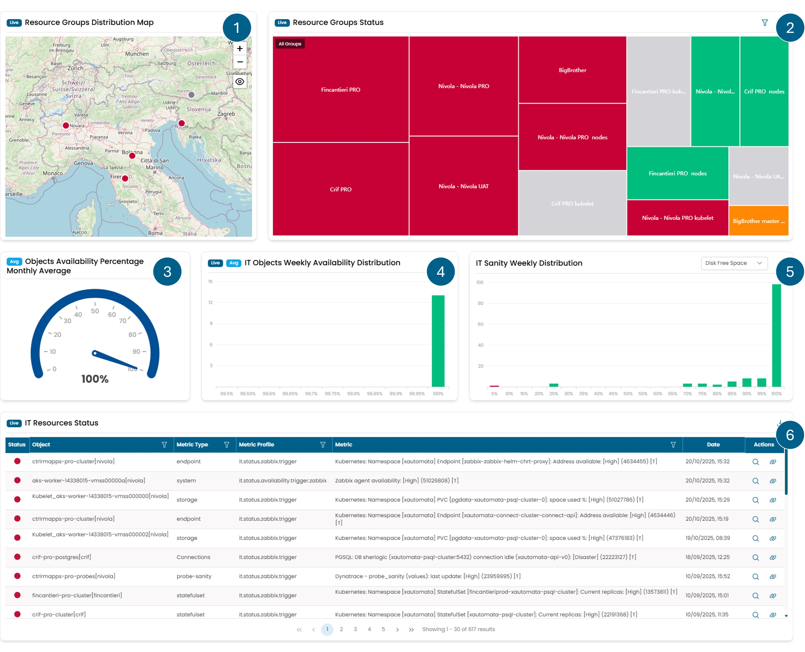

# IT Infrastructure

Questa pagina descrive il contenuto della dashboard **IT Infrastructure**.
Presenta vari widget che consentono di monitorare il funzionamento
dell'infrastruttura IT, dallo stato degli oggetti alla loro gestione
da parte dei sistemi automatizzati.

/// caption
Fig.1 - Dashboard IT Infrastructure
///

I widget disponibili in questa dashboard sono i seguenti:

1. [Resource Groups Distribution Map](../widgets/it_infrastructure.md#resource-groups-distribution-map)
2. [Resource Groups Status](../widgets/it_infrastructure.md#resource-groups-status)
3. [Objects Availability Percentage Monthly Average](../widgets/it_infrastructure.md#objects-availability-percentage-monthly-average)
4. [IT Objects Weekly Availability Distribution](../widgets/it_infrastructure.md#it-objects-weekly-availability-distribution)
5. [IT Sanity Weekly Distribution](../widgets/it_analytics.md#it-sanity-weekly-distribution)
6. [IT Resources Status](../widgets/it_infrastructure.md#it-resources-status)
