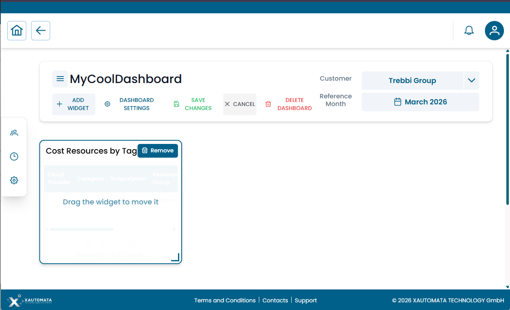
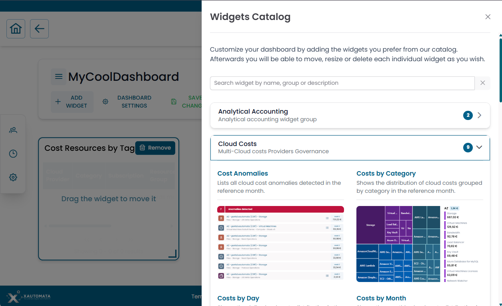
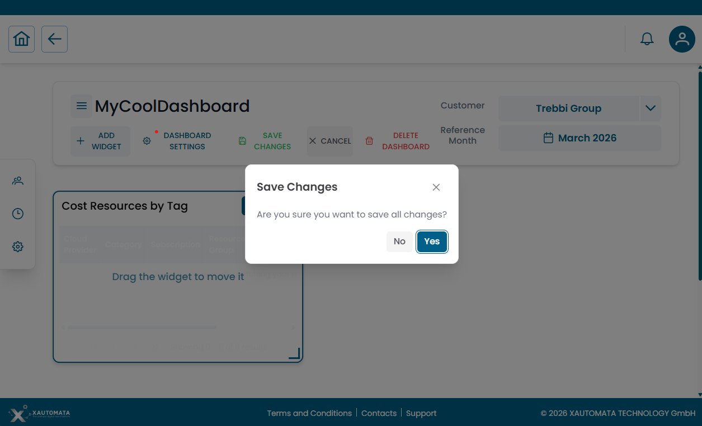
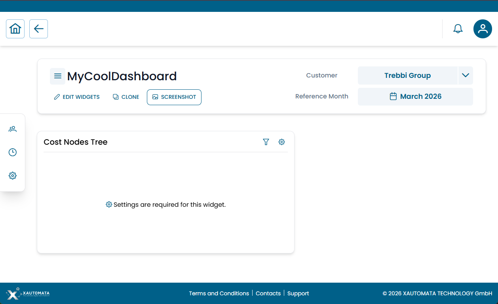
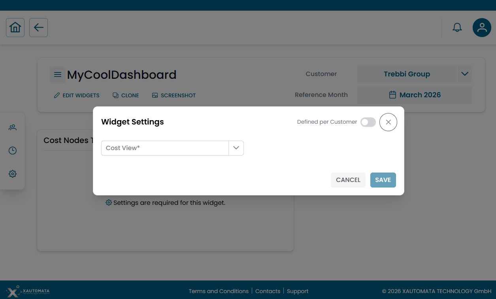

# Dashboard Management

This section covers how to create, configure, and manage dashboards. It is primarily intended for **advanced users and administrators**.

---

## Entering edit mode

From any dashboard in view mode, click **EDIT WIDGETS** in the action bar.

The action bar changes to show the full set of editing controls:

| Button | Action |
|---|---|
| **+ ADD WIDGET** | Open the Widgets Catalog to add a new widget |
| **DASHBOARD SETTINGS** | Edit dashboard metadata (name, description, refresh interval, etc.) |
| **SAVE CHANGES** | Persist all layout and widget changes |
| **CANCEL** | Exit edit mode discarding unsaved changes |
| **DELETE DASHBOARD** | Permanently delete this dashboard |

/// caption
Fig.1 — Dashboard in edit mode — full editing action bar
///

---

## Adding widgets

In edit mode, click **+ ADD WIDGET**. The **Widgets Catalog** opens as a full-panel overlay.

/// caption
Fig.2 — Widgets Catalog — searchable, grouped by functional domain, with visual preview of each widget
///

The catalog provides:

- A **search bar** to filter by widget name, group, or description
- Widgets organized by **functional group** (e.g. Analytical Accounting, Cloud Costs, IT Infrastructure, Network…)
- A **visual preview** and short description for each widget
- A **count badge** on each group showing how many widgets it contains — click the group header to expand or collapse it

Click a widget to add it to the dashboard grid. The catalog closes and the widget appears on the grid with a **"Drag the widget to move it"** prompt.

---

## Moving and resizing widgets

Once a widget is on the grid:

| Action | How |
|---|---|
| **Move** | Drag the widget by its title bar to any position on the grid |
| **Resize** | Drag the resize handle at the bottom-right corner of the widget |
| **Remove** | Click the **Remove** button that appears in the top-right corner of the widget in edit mode |

---

## Saving changes

When you are done editing, click **SAVE CHANGES** in the action bar. A confirmation dialog appears:

/// caption
Fig.3 — Save Changes confirmation dialog
///

Click **Yes** to persist all layout changes. Click **No** to return to editing without saving.

---

## Configuring widget settings

After adding a widget, it may display:

> *⚙ Settings are required for this widget.*

/// caption
Fig.4 — Widget requiring configuration before it can display data
///

This means the widget needs specific parameters to know what data to show. To configure it:

1. Click the **⚙ gear icon** in the widget's top-right corner
2. The **Widget Settings** dialog opens

/// caption
Fig.5 — Widget Settings dialog — select the required parameters and optionally enable "Defined per Customer"
///

3. Fill in the required fields (e.g. a **Cost View** selector, a metric, a date range)
4. Optionally toggle **Defined per Customer** (see below)
5. Click **SAVE**

### Defined per Customer

When this toggle is enabled:

- The dashboard layout stays the same for all customers
- Each customer can have different widget parameters (e.g. a different cost view or data source)
- Useful for global or shared dashboards reused across multiple customers

!!! info

    This feature is particularly useful in multi-tenant environments where the same dashboard template is deployed for several customers, each needing to see their own data.

---

## Cloning a dashboard

In view mode, click **CLONE** to create a personal copy of any dashboard — including global and shared ones.

The clone is added to your **Personal Dashboards** and can be freely edited without affecting the original.

!!! info

    Cloning is the recommended approach when you want to customize a Global or Shared dashboard without impacting other users.

---

## Creating a new personal dashboard

1. On the dashboard home page, click the **+** button next to the **Personal Dashboards** section title
2. Fill in: **Name**, **Description** (optional), **Refresh interval**
3. Confirm — the new empty dashboard opens in **edit mode**, ready to receive widgets

---

## Editing dashboard properties

In edit mode, click **DASHBOARD SETTINGS** to modify:

- Name and description
- Type (personal / global)
- Owner user
- Refresh interval
- Ordering priority in the list
- Thumbnail image

---

## Deleting a dashboard

In edit mode, click **DELETE DASHBOARD** (shown in red in the action bar).

!!! warning

    - You can only delete dashboards you **own**
    - Deleting a dashboard removes it for **all users** who had access to it
    - If you have access to a shared dashboard you do not own, the delete button is not available — you can only remove it from your personal list without affecting the original

---

## Permissions reference

| Role | Capabilities |
|---|---|
| **Standard user** | Create / edit / delete personal dashboards; edit shared dashboards; clone any dashboard |
| **Administrator** | All of the above + manage global dashboards and other users' dashboards |

For permission configuration see [Access Control](../administration/access_control.md).
