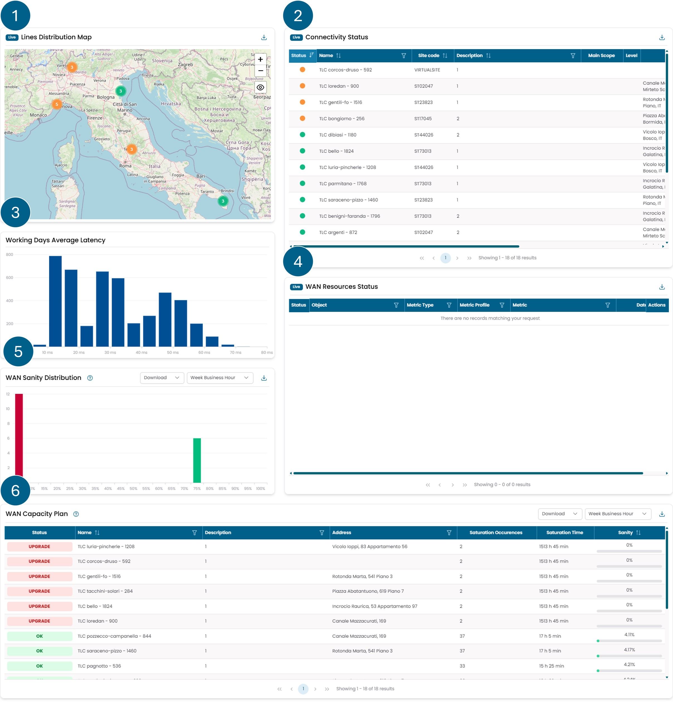

# Network

Questa pagina descrive il contenuto della dashboard **Network**.
Presenta vari widget che consentono di monitorare il funzionamento
della rete, dallo stato degli oggetti alla loro gestione
da parte dei sistemi automatizzati.

/// caption
Fig.1 - Dashboard Network
///

I widget disponibili in questa dashboard sono i seguenti:

1. [Lines Distribution Map](../widgets/network.md#lines-distribution-map)
2. [Connectivity Status](../widgets/network.md#connectivity-status)
3. [Working Days Average Latency](../widgets/network.md#working-days-average-latency)
4. [WAN Resources Status](../widgets/network.md#wan-resources-status)
5. [WAN Sanity Distribution](../widgets/network_analytics.md#wan-sanity-distribution)
6. [WAN Capacity Plan](../widgets/network_analytics.md#wan-capacity-plan)
