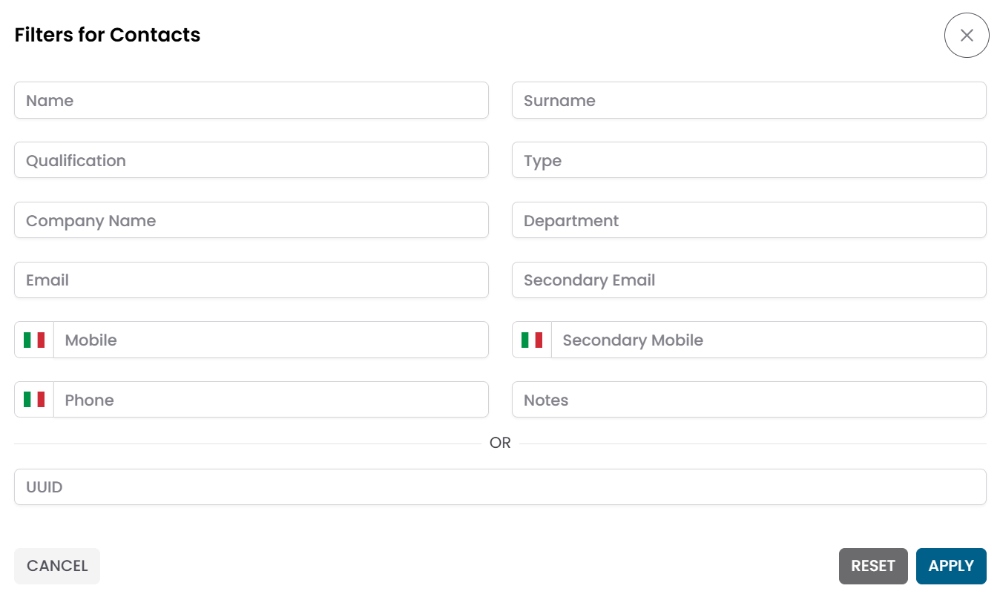
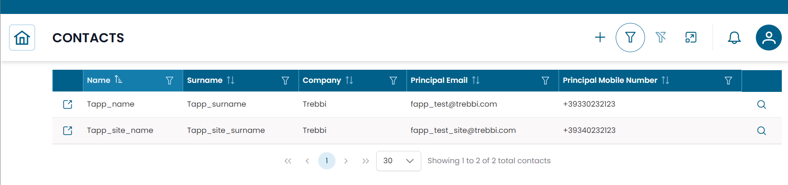
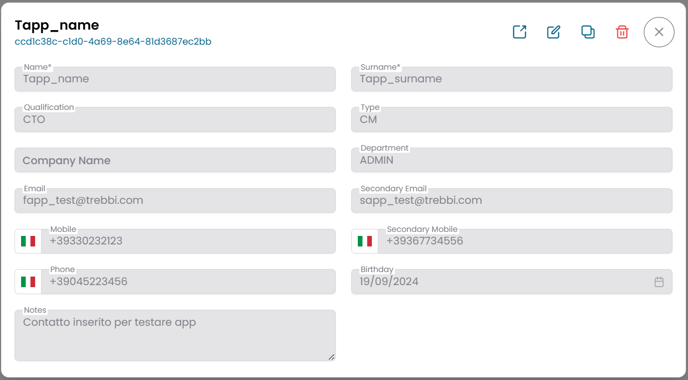
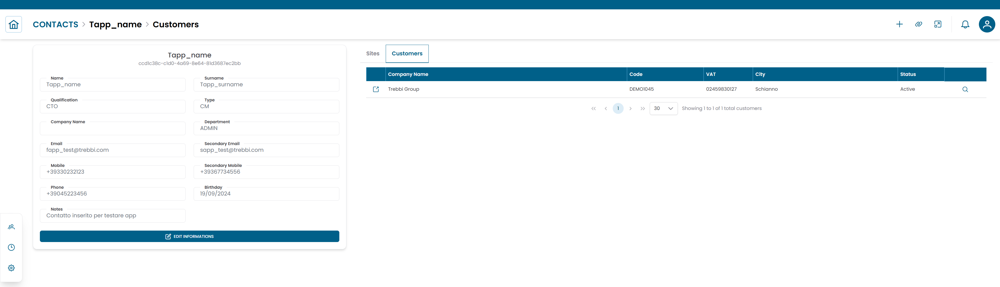

# Contacts

La sezione **Contacts** gestisce le persone associate ai clienti e alle sedi monitorate da XAUTOMATA.
Usala per mantenere una rubrica di contatti tecnici, operativi e amministrativi per ciascuna organizzazione.

---

## Aprire la Sezione Contacts

Dal menu di navigazione principale, vai su **Customers → Client Repository → Contacts**.

L'interfaccia si apre con un **dialog di pre-filter**. Compila uno o più campi per restringere la ricerca, poi clicca **APPLY**.

| Campo filtro | Descrizione |
|---|---|
| Name | Nome o cognome del contatto |
| Surname | Cognome |
| Company | Organizzazione a cui appartiene il contatto |
| Email | Indirizzo email primario o secondario |
| Status | Active o Disabled |

Lascia tutti i campi vuoti e clicca **APPLY** per caricare tutti i contatti disponibili.

/// caption
Fig.1 - Dialog di pre-filter Contacts
///

---

## Tabella Contacts

Dopo aver applicato il filtro, i risultati appaiono in una tabella dove ogni riga rappresenta un contatto.

Le colonne tipiche includono:

- Name e Surname
- Company
- Email
- Phone
- Status

/// caption
Fig.2 - Tabella dei risultati Contacts
///

---

## Dettagli del Contatto

Clicca sull'**icona di ricerca (🔍)** su qualsiasi riga per aprire il record del contatto.

Il dialog CRUD mostra il set completo di informazioni del contatto:

| Campo | Descrizione |
|---|---|
| Name | Nome |
| Surname | Cognome |
| Qualification | Ruolo o qualifica professionale |
| Company | Organizzazione |
| Department | Dipartimento o team interno |
| Email | Indirizzo email primario |
| Email 2 | Indirizzo email secondario |
| Mobile | Numero di cellulare |
| Phone | Numero di telefono ufficio |
| Status | Active o Disabled |
| Notes | Note facoltative |

Da questo dialog puoi:

- modificare le informazioni del contatto
- duplicare il record
- eliminare il record

/// caption
Fig.3 - Dialog dettaglio contatto
///

---

## Creare un Nuovo Contatto

Per aggiungere un nuovo contatto, clicca **NEW** nell'area in alto a destra della tabella dei contatti.

Compila i campi nel dialog CRUD, poi clicca **SAVE CHANGES**.

!!! note
    Come minimo, compila **Name**, **Surname** e **Status**.
    I campi email e telefono sono facoltativi ma consigliati per rendere il contatto utile a fini operativi.

---

## Connections View

Clicca sull'**icona link (🔗)** su qualsiasi riga per aprire la **Connections View** per quel contatto.

Questa vista mostra le entità a cui il contatto è collegato, organizzate in tab:

| Tab | Descrizione |
|---|---|
| Customers | Organizzazioni a cui questo contatto è associato |
| Sites | Sedi di cui questo contatto è responsabile |

/// caption
Fig.4 - Connections view del contatto
///

### Collegare un Contatto a un Cliente o una Sede

1. Apri la **Connections View** per il contatto.
2. Seleziona la tab **Customers** o **Sites**.
3. Clicca **ADD** per creare un nuovo collegamento.
4. Seleziona l'entità target dall'elenco.
5. Specifica il **tipo di relazione** per descrivere il ruolo del contatto (ad esempio: Technical Manager, Service Contact, Escalation Contact).
6. Clicca **SAVE CHANGES**.

### Rimuovere un Collegamento

Per rimuovere un'associazione esistente, seleziona la riga nella tab connections e clicca **DELETE**.

!!! warning
    Rimuovere un collegamento non elimina il record del contatto — rimuove solo l'associazione con quel cliente o sede.

---

!!! note
    I contatti possono essere collegati anche dal lato cliente o sede.
    Consulta [Customers](customers.md) e [Sites](sites.md) per i dettagli.
