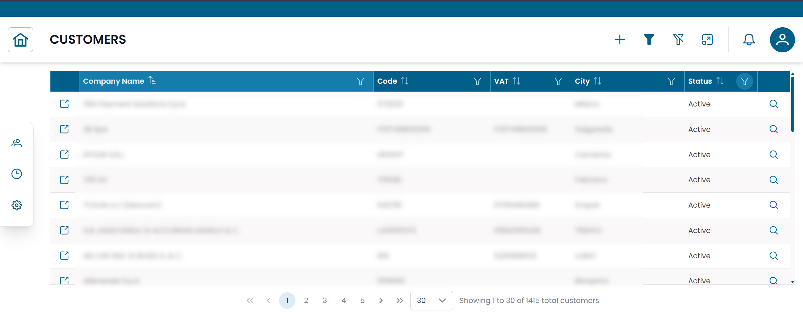
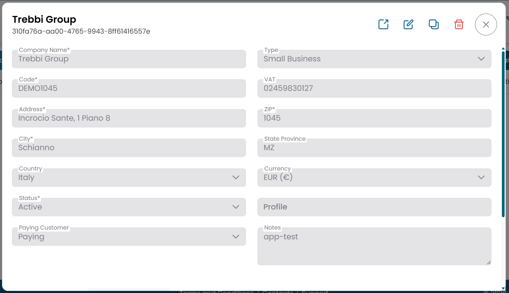
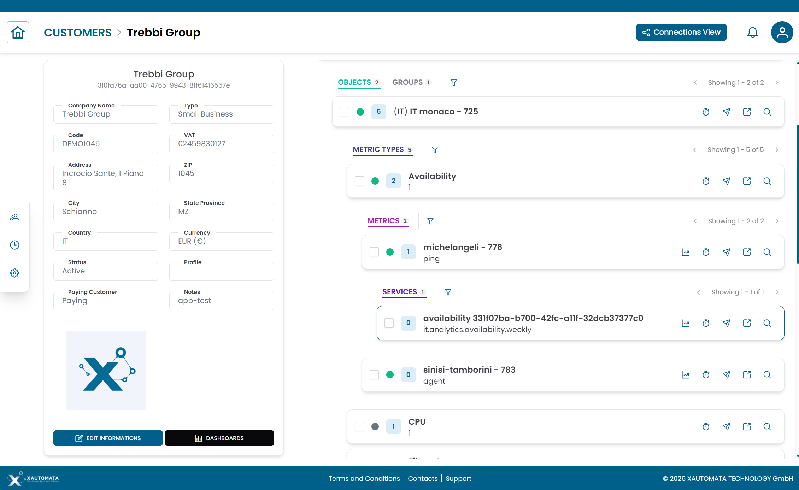
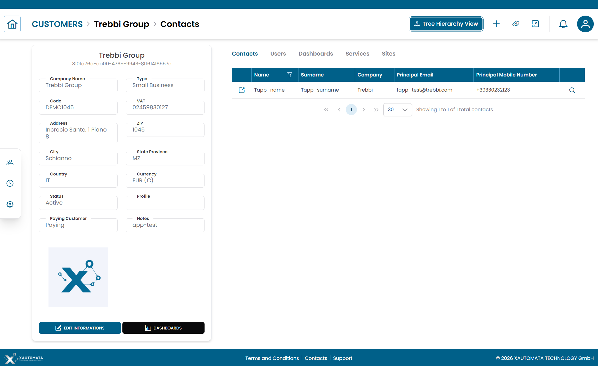

# Customers

La sezione **Customers** elenca le organizzazioni monitorate e gestite tramite XAUTOMATA.
Ogni cliente è la radice della struttura operativa che raggruppa sedi, contatti e oggetti infrastrutturali.

!!! info
    I clienti vengono configurati durante l'onboarding dal team di delivery XAUTOMATA.
    Questa sezione è principalmente consultiva — normalmente non creerai né eliminerai record cliente dall'interfaccia.

---

## Aprire la Sezione Customers

Dal menu di navigazione principale, vai su **Customers → Client Repository → Customers**.

L'interfaccia si apre direttamente con la **tabella dei risultati**, senza un passaggio di pre-filter.

/// caption
Fig.1 - Tabella Customers
///

Ogni riga rappresenta un cliente. Usa la barra di ricerca nella parte superiore della tabella per filtrare i record per nome o codice.

---

## Dettagli del Cliente

Clicca sull'**icona di ricerca (🔍)** su qualsiasi riga per aprire il record del cliente.

La vista dettaglio mostra le informazioni principali associate al cliente:

| Campo | Descrizione |
|---|---|
| Code | Identificatore univoco del cliente |
| Description | Nome completo o etichetta dell'organizzazione |
| Status | Active o Disabled |

/// caption
Fig.2 - Dialog dettaglio cliente
///

---

## Vista Struttura Cliente

Clicca sull'**icona link (🔗)** su una riga cliente per aprire la **Customer Structure View**.

Questa è la principale vista operativa per un cliente. La pagina è divisa in due aree:

- un **pannello informazioni cliente** a sinistra
- un'**area di navigazione gerarchica** a destra

L'area gerarchica ha due tab.

### Tab Sites

Mostra la gerarchia dell'infrastruttura sotto il cliente, organizzata per sede.

La struttura scende attraverso:

1. Sites
2. Groups
3. Objects
4. Metric Types
5. Metrics

Usa questa tab per navigare l'infrastruttura monitorata associata al cliente.

Per una spiegazione dettagliata di come navigare questa vista, consulta [Tree Hierarchy View](../tree_hierarchy_view.md).

/// caption
Fig.3 - Vista struttura cliente, tab Sites
///

### Tab Service Profiles

Mostra la gerarchia di servizi e profili di servizio associati al cliente.

Usa questa tab per navigare l'organizzazione logica dei servizi.

---

## Connections View

Dalla Customer Structure View, clicca **Connections** per passare alla **Connections View**.

Questa vista mostra le entità collegate al cliente:

| Tab | Descrizione |
|---|---|
| Contacts | Persone associate a questo cliente |
| Users | Utenti della piattaforma che hanno accesso a questo cliente |
| Dashboards | Dashboard associate a questo cliente |
| Services | Servizi monitorati sotto questo cliente |
| Sites | Sedi appartenenti a questo cliente |

Usa questa vista per verificare quali utenti e dashboard sono associati al cliente, o per collegare nuove entità.

/// caption
Fig.4 - Connections view del cliente
///

---

!!! note
    Per gestire le persone associate a un cliente, consulta [Contacts](contacts.md).
    Per gestire le sedi fisiche o logiche, consulta [Sites](sites.md).
