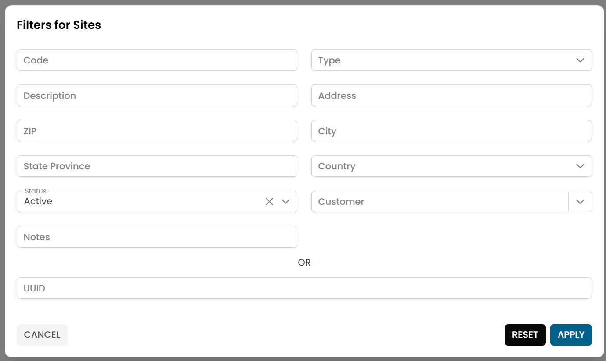
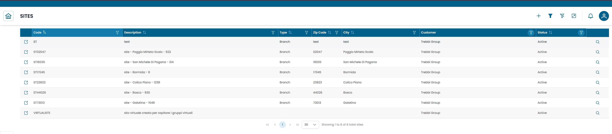
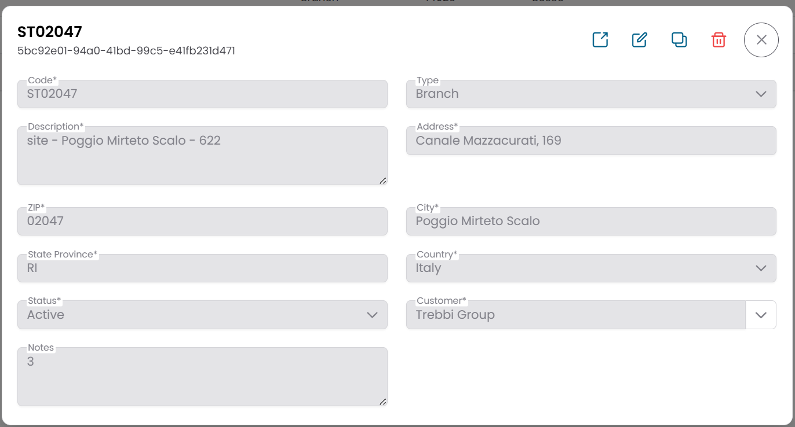
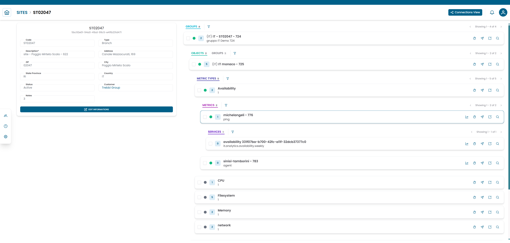
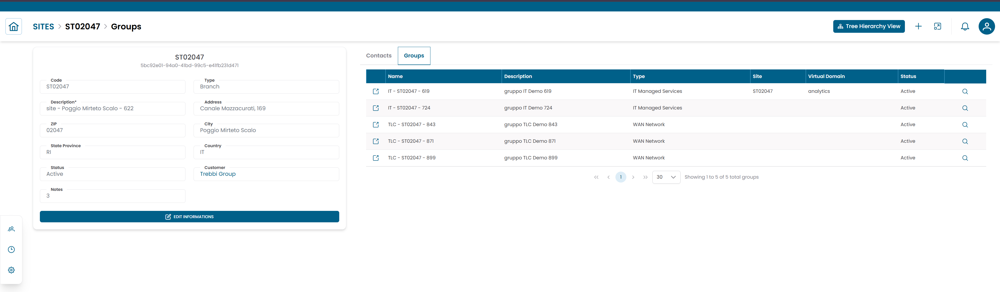

# Sites

La sezione **Sites** gestisce le sedi fisiche o logiche associate a un cliente.
Usala per organizzare l'infrastruttura monitorata per sede e per associare gruppi e contatti a ciascuna sede.

---

## Aprire la Sezione Sites

Dal menu di navigazione principale, vai su **Customers → Client Repository → Sites**.

L'interfaccia si apre con un **dialog di pre-filter**. Compila uno o più campi per restringere la ricerca, poi clicca **APPLY**.

| Campo filtro | Descrizione |
|---|---|
| Code | Identificatore univoco della sede |
| Type | Classificazione della sede (ad esempio Branch, Data Center) |
| Description | Nome o etichetta della sede |
| Address | Indirizzo stradale |
| ZIP | Codice postale |
| City | Città |
| State Province | Stato o provincia |
| Country | Paese |
| Customer | Organizzazione a cui appartiene la sede |
| Status | Active o Disabled |
| Notes | Note facoltative |

Lascia tutti i campi vuoti e clicca **APPLY** per caricare tutte le sedi disponibili.

/// caption
Fig.1 - Dialog di pre-filter Sites
///

---

## Tabella Sites

Dopo aver applicato il filtro, i risultati appaiono in una tabella dove ogni riga rappresenta una sede.

Le colonne tipiche includono:

- Code
- Description
- ZIP
- City
- Status

/// caption
Fig.2 - Tabella dei risultati Sites
///

---

## Dettagli della Sede

Clicca sull'**icona di ricerca (🔍)** su qualsiasi riga per aprire il record della sede.

Il dialog CRUD mostra le informazioni complete della sede:

| Campo | Descrizione |
|---|---|
| Code | Identificatore univoco della sede |
| Type | Classificazione (ad esempio Branch, Data Center) |
| Description | Nome o etichetta della sede |
| Address | Indirizzo stradale |
| ZIP | Codice postale |
| City | Città |
| State Province | Stato o provincia |
| Country | Paese |
| Customer | Organizzazione a cui appartiene la sede |
| Status | Active o Disabled |
| Notes | Note facoltative |

Da questo dialog puoi:

- modificare le informazioni della sede
- duplicare il record
- eliminare il record

/// caption
Fig.3 - Dialog dettaglio sede
///

---

## Vista Struttura Sede

Clicca sull'**icona link (🔗)** su qualsiasi riga per aprire la **Site Structure View**.

La pagina è divisa in due aree:

- un **pannello informazioni sede** a sinistra
- un'**area di navigazione gerarchica** a destra

La gerarchia mostra le entità infrastrutturali associate alla sede, scendendo attraverso:

1. Groups
2. Objects
3. Metric Types
4. Metrics

Usa questa vista per navigare l'infrastruttura monitorata organizzata sotto la sede selezionata.

Per una spiegazione dettagliata di come usare questa vista, consulta [Tree Hierarchy View](../tree_hierarchy_view.md).

/// caption
Fig.4 - Vista struttura sede
///

---

## Connections View

Dalla Site Structure View, clicca **Connections** per passare alla **Connections View**.

Questa vista mostra le entità collegate alla sede:

| Tab | Descrizione |
|---|---|
| Groups | Gruppi infrastrutturali situati in questa sede |
| Contacts | Persone associate a questa sede |

### Collegare un Gruppo o un Contatto a una Sede

1. Apri la **Connections View** per la sede.
2. Seleziona la tab **Groups** o **Contacts**.
3. Clicca **ADD**.
4. Seleziona l'entità dall'elenco.
5. Clicca **SAVE CHANGES**.

### Rimuovere un Collegamento

Per rimuovere un'associazione esistente, seleziona la riga e clicca **DELETE**.

!!! warning
    Rimuovere un collegamento non elimina il record del gruppo o del contatto — rimuove solo l'associazione con questa sede.

/// caption
Fig.5 - Connections view della sede
///

---

!!! note
    Per gestire i contatti associati a una sede, consulta [Contacts](contacts.md).
    Per navigare la gerarchia dell'infrastruttura in dettaglio, consulta [Tree Hierarchy View](../tree_hierarchy_view.md).
