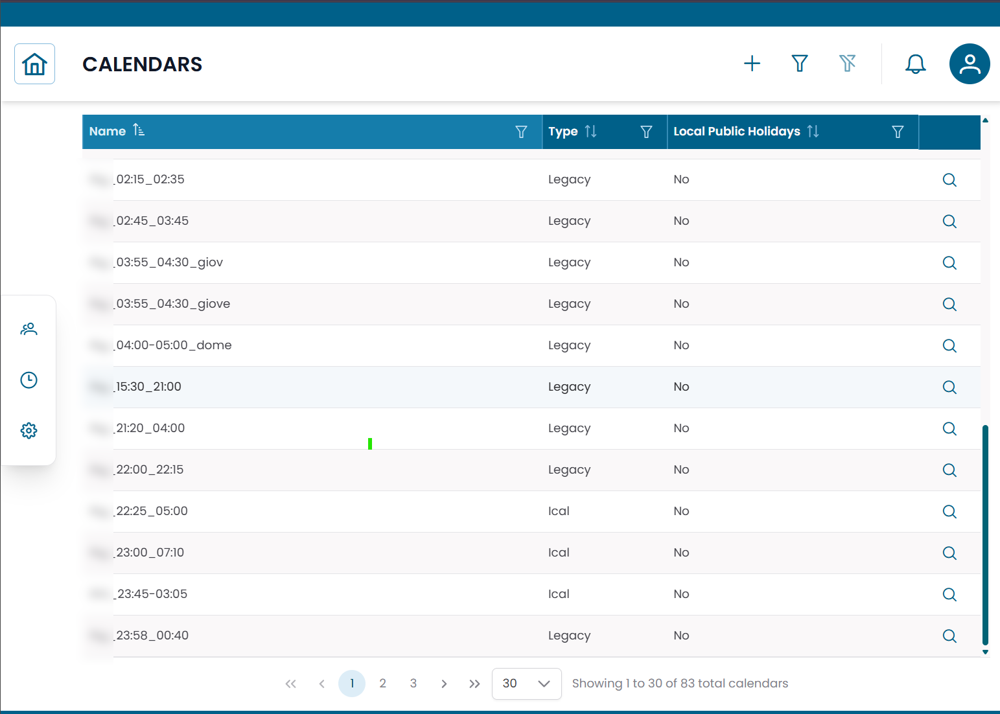
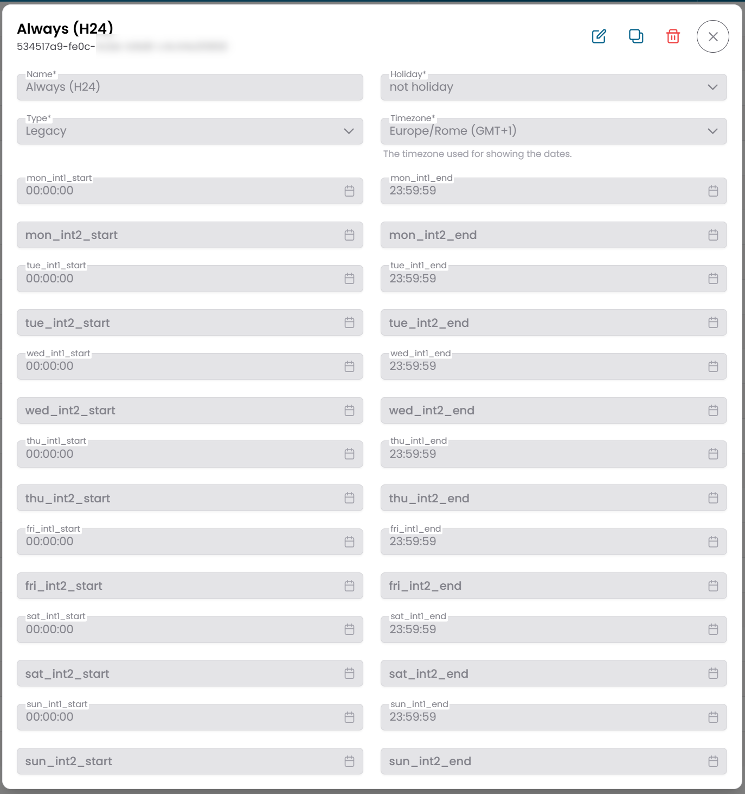

# Calendars

La sezione **Calendars** definisce i programmi temporali utilizzati per controllare quando le operazioni di monitoraggio e le azioni di automazione sono attive.
I calendari rappresentano orari lavorativi, finestre di manutenzione o qualsiasi altro vincolo temporale che la piattaforma deve rispettare quando attiva alert e azioni automatiche.

!!! info
    I calendari non agiscono da soli — vengono referenziati da **Downtimes** e **Dispatchers** per determinare quando quelle regole devono essere attive o sospese.

---

## Aprire la Sezione Calendars

Dal menu di navigazione principale, vai su **Tracking → Calendars**.

A differenza della maggior parte delle sezioni, Calendars si apre **direttamente in una vista tabella** — non è presente un dialog di pre-filter.
L'elenco completo dei calendari disponibili viene visualizzato immediatamente.

/// caption
Fig.1 - Tabella Calendars
///

---

## Tipi di Calendario

XAUTOMATA supporta due tipi di calendario:

| Tipo | Descrizione |
|---|---|
| Legacy | Programma settimanale definito manualmente con fino a due intervalli orari per giorno |
| ICAL | Programma importato da una sorgente iCalendar (.ics) esterna |

Usa **Legacy** quando devi definire un programma settimanale fisso direttamente nella piattaforma.
Usa **ICAL** quando la tua organizzazione gestisce già un calendario in un sistema esterno e vuoi sincronizzarlo.

---

## Creare o Modificare un Calendario

Clicca **NEW** per creare un calendario, oppure clicca sull'**icona di modifica** su una riga esistente per modificarlo.

Il form del calendario include i seguenti campi:

| Campo | Descrizione |
|---|---|
| Name | Nome univoco del calendario |
| Type | Legacy o ICAL |
| Timezone | Fuso orario utilizzato per interpretare il programma |
| Local Public Holidays | Se le festività locali devono essere trattate come giorni non lavorativi |

### Programma Legacy

Per i calendari Legacy, definisci fino a due intervalli orari per ogni giorno della settimana.

Ogni giorno supporta:

| Campo | Descrizione |
|---|---|
| Interval 1 Start | Ora di inizio del primo intervallo lavorativo (es. 09:00) |
| Interval 1 End | Ora di fine del primo intervallo lavorativo (es. 13:00) |
| Interval 2 Start | Ora di inizio del secondo intervallo lavorativo (es. 14:00) |
| Interval 2 End | Ora di fine del secondo intervallo lavorativo (es. 18:00) |

Lascia entrambi gli intervalli vuoti per un giorno per contrassegnarlo come non lavorativo.

### Programma ICAL

Per i calendari ICAL, fornisci l'URL o il contenuto della sorgente iCalendar per importare il programma.

/// caption
Fig.2 - Form di modifica calendario — tipo Legacy
///

---

!!! note
    Per vedere come vengono utilizzati i calendari in pratica, consulta [Downtimes](downtimes.md) e [Dispatchers](dispatchers.md).
