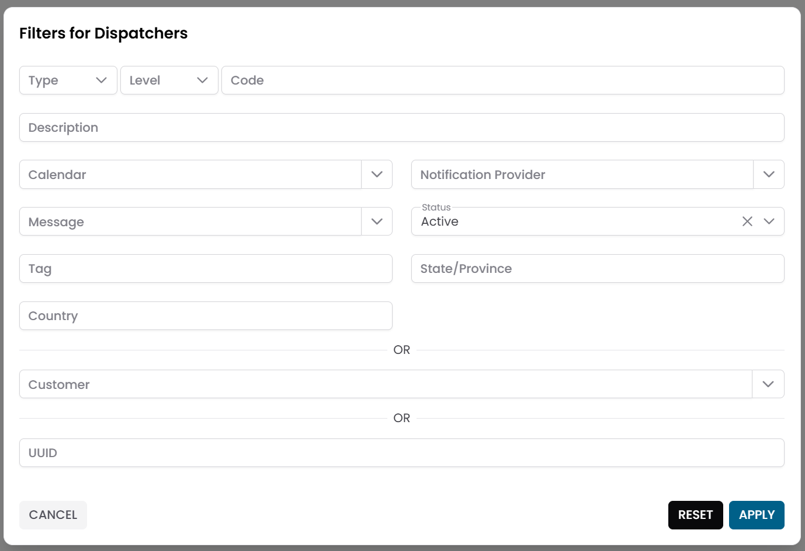
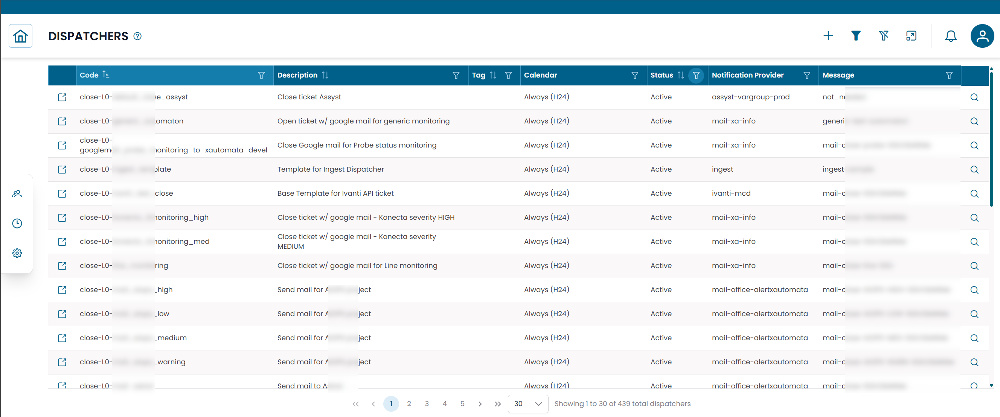
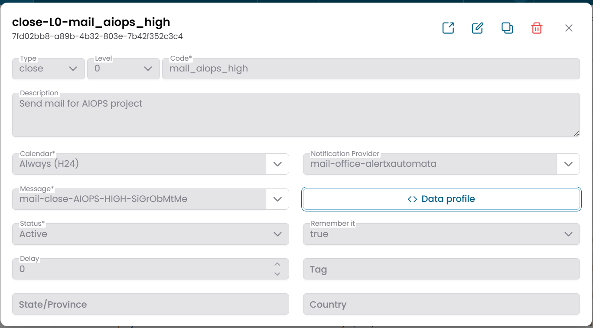

# Dispatchers

La sezione **Dispatchers** configura le azioni automatiche attivate dagli eventi di monitoraggio.
Quando si verifica una condizione su una metrica o una transizione di stato nella piattaforma, un dispatcher determina cosa accade dopo — inviare una notifica, aprire un ticket, chiamare un'API esterna o attivare uno script di automazione.

!!! info
    I dispatcher sono il livello di automazione di XAUTOMATA. Collegano gli eventi di monitoraggio a vere azioni operative, consentendo alla piattaforma di reagire automaticamente senza intervento manuale.

---

## Dove Gestire i Dispatcher

I dispatcher possono essere gestiti in due modi:

- **Dalla sezione Tracking** — per una vista centralizzata di tutti i dispatcher attivi sull'infrastruttura.
- **Direttamente dalla gerarchia** — cliccando il pulsante di azione **Dispatcher** su qualsiasi elemento nella [Tree Hierarchy View](../tree_hierarchy_view.md) (gruppi, oggetti, metric type, metriche, servizi).

Entrambi i percorsi aprono lo stesso modal **Active Dispatchers** per l'entità selezionata.

---

## Aprire la Sezione Dispatchers

Dal menu di navigazione principale, vai su **Tracking → Dispatchers**.

L'interfaccia si apre con un **dialog di pre-filter**. Compila uno o più campi per restringere la ricerca, poi clicca **APPLY**.

I campi filtro tipici includono:

| Campo filtro | Descrizione |
|---|---|
| Name | Nome della regola dispatcher |
| Entity type | Tipo di entità a cui è collegato il dispatcher |
| Status | Active o Disabled |

/// caption
Fig.1 - Dialog di pre-filter Dispatchers
///

---

## Tabella Dispatchers

Dopo aver applicato il filtro, i risultati appaiono in una tabella dove ogni riga rappresenta una regola dispatcher.

/// caption
Fig.2 - Tabella dei risultati Dispatchers
///

---

## Creare un Dispatcher

Il modo più comune per creare un dispatcher è direttamente dalla gerarchia dell'infrastruttura:

1. Naviga all'entità che vuoi monitorare — un gruppo, oggetto, metric type, metrica o servizio — usando la [Tree Hierarchy View](../tree_hierarchy_view.md).
2. Clicca il pulsante di azione **Dispatcher** sulla riga target.
3. Nel modal **Active Dispatchers**, clicca **NEW**.
4. Compila i dettagli del dispatcher (vedi campi di seguito).
5. Clicca **SAVE CHANGES**.

### Campi del Dispatcher

| Campo | Descrizione |
|---|---|
| Name | Nome della regola dispatcher |
| Notification Provider | Il canale utilizzato per consegnare l'azione (email, webhook, sistema di ticketing, ecc.) |
| Message | Il template di messaggio utilizzato per generare il contenuto della notifica |
| Calendar | Calendario facoltativo per limitare il dispatcher a finestre temporali specifiche |
| Status | Active o Disabled |
| Notes | Note facoltative |

/// caption
Fig.3 - Dialog di modifica dispatcher
///

!!! note
    **Notification Providers** e **Messages** vengono configurati nella sezione Administration.
    Consulta [Notification Providers](../../administration/notification_providers.md) e [Messages](../../administration/messages.md) per i dettagli.

---

## Come Funzionano i Dispatcher

Quando una condizione di monitoraggio viene soddisfatta, la piattaforma valuta le regole dispatcher associate all'entità interessata.

Se un dispatcher corrispondente è attivo:

1. genera un messaggio usando il template **Message** configurato
2. lo consegna tramite il **Notification Provider** configurato
3. rispetta il programma del **Calendar**, se ne è associato uno

Questo meccanismo consente alla piattaforma di inviare diversi tipi di notifiche — email, ticket, webhook — per diverse entità e condizioni, tutto senza intervento manuale.

---

## Casi d'Uso Tipici

| Scenario | Azione |
|---|---|
| Server va in stato critico | Invia email al team operativo |
| Servizio degradato | Apre un ticket nel sistema ITSM |
| Dispositivo di rete non raggiungibile | Attiva un webhook su uno strumento di automazione esterno |
| Soglia metrica superata | Invia un payload JSON strutturato a un'API |

---

## Dispatcher Massivo

Per applicare una regola dispatcher a più entità contemporaneamente, selezionale in qualsiasi gerarchia o vista tabella e usa **Massive Dispatcher**.

Questo collega la stessa regola dispatcher a tutti gli elementi selezionati simultaneamente.

---

!!! note
    Per sopprimere gli alert durante la manutenzione invece di attivare azioni, consulta [Downtimes](downtimes.md).
    Per limitare un dispatcher a orari specifici, associalo a un [Calendar](calendars.md).
