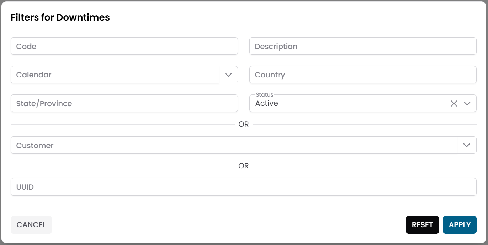
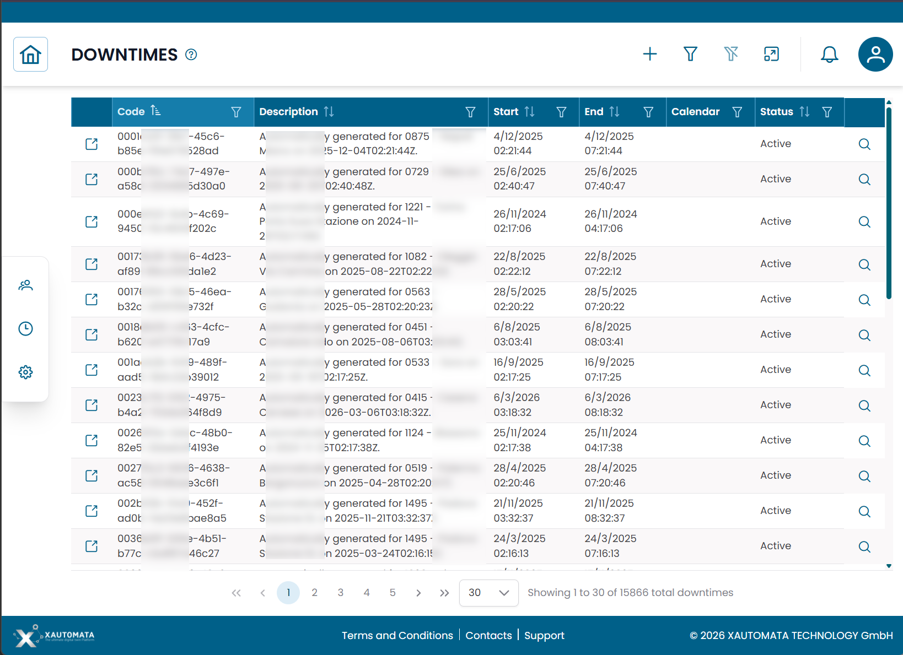
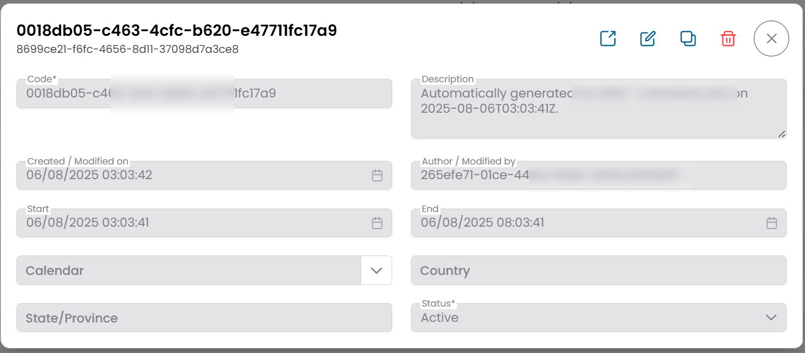

# Downtimes

The **Downtimes** section allows you to temporarily suspend monitoring alerts for selected infrastructure elements during planned activities such as maintenance, upgrades, or network reconfigurations.

!!! info
    During a downtime, the platform **continues to collect monitoring data** — only alert notifications are suppressed.
    This means you can still review metric history after the maintenance window closes.

---

## Where to Manage Downtimes

Downtimes can be managed in two ways:

- **From the Tracking section** — for a centralized view of all active and scheduled downtimes across the infrastructure.
- **Directly from the hierarchy** — by clicking the **Downtime** action button on any element in the [Tree Hierarchy View](../tree_hierarchy_view.md) (groups, objects, metric types, metrics).

Both paths open the same **Active Downtimes** modal for the selected entity.

---

## Opening the Downtimes Section

From the main navigation menu, go to **Tracking → Downtimes**.

The interface opens with a **pre-filter dialog**. Fill in one or more fields to narrow the search, then click **APPLY**.

Typical filter fields include:

| Filter field | Description |
|---|---|
| Name | Name of the downtime rule |
| Entity type | Type of entity the downtime applies to (Group, Object, Metric Type, Metric) |
| Status | Active or Disabled |

/// caption
Fig.1 - Downtimes pre-filter dialog
///

---

## Downtimes Table

After applying the filter, the results appear in a table where each row represents a downtime record.

/// caption
Fig.2 - Downtimes results table
///

---

## Creating a Downtime

The most common way to create a downtime is directly from the infrastructure hierarchy:

1. Navigate to the entity you want to silence — a group, object, metric type, or metric — using the [Tree Hierarchy View](../tree_hierarchy_view.md).
2. Click the **Downtime** action button on the target row.
3. In the **Active Downtimes** modal, click **NEW**.
4. Fill in the downtime details (see fields below).
5. Click **SAVE CHANGES**.

!!! note
    Applying a downtime to a **group** or **object** silences alerts for all descendant elements in the hierarchy. Use this to suppress an entire section of the infrastructure at once.

### Downtime fields

| Field | Description |
|---|---|
| Name | Name of the downtime rule |
| Start | Date and time when the downtime begins |
| End | Date and time when the downtime ends |
| Calendar | Optional calendar to restrict the downtime to specific time windows |
| Status | Active or Disabled |
| Notes | Optional notes |

/// caption
Fig.3 - Downtime edit dialog
///

---

## Typical Use Cases

| Scenario | Recommended level |
|---|---|
| Server maintenance | Object |
| Network device upgrade | Object or Group |
| Site-wide planned outage | Group (top-level) |
| Single metric anomaly (known noise) | Metric or Metric Type |

---

## Mass Downtime

To apply a downtime to multiple entities at once, select them in any hierarchy or table view and use **Massive Downtime**.

This creates a single downtime rule applied to all selected elements simultaneously, saving time during large maintenance windows.

---

!!! note
    To control **when** a downtime is active using a time schedule, associate it with a [Calendar](calendars.md).
    To automate operational responses when alerts fire, see [Dispatchers](dispatchers.md).
