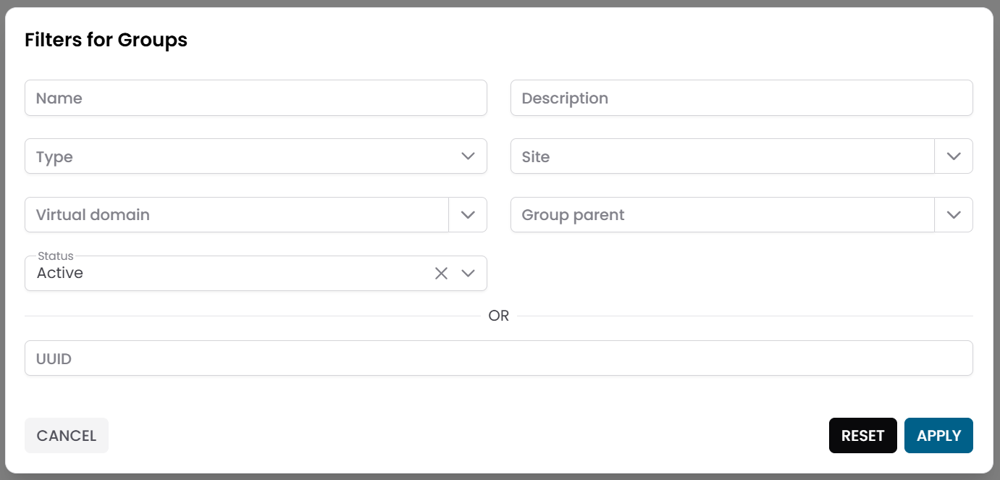
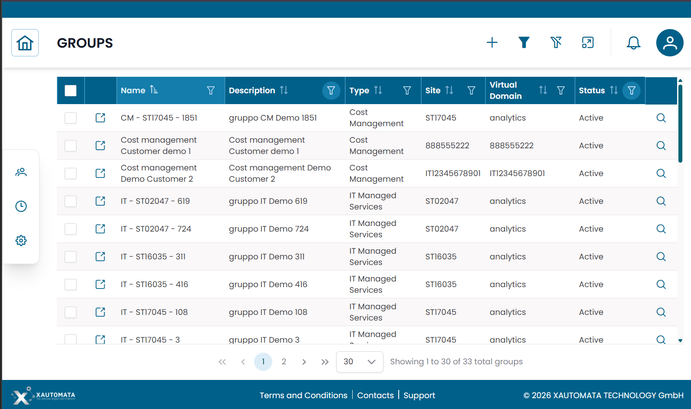
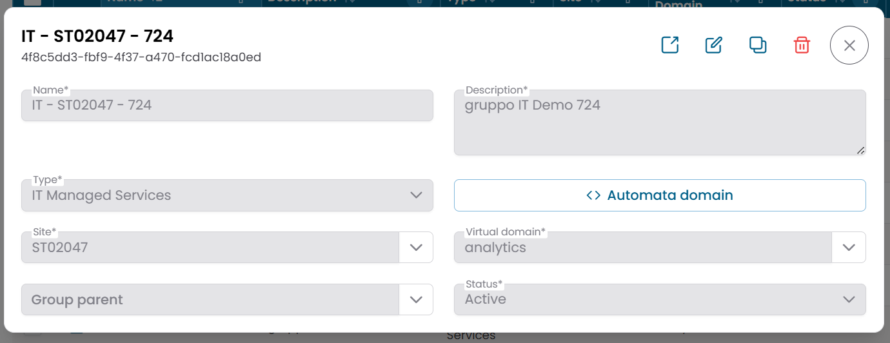
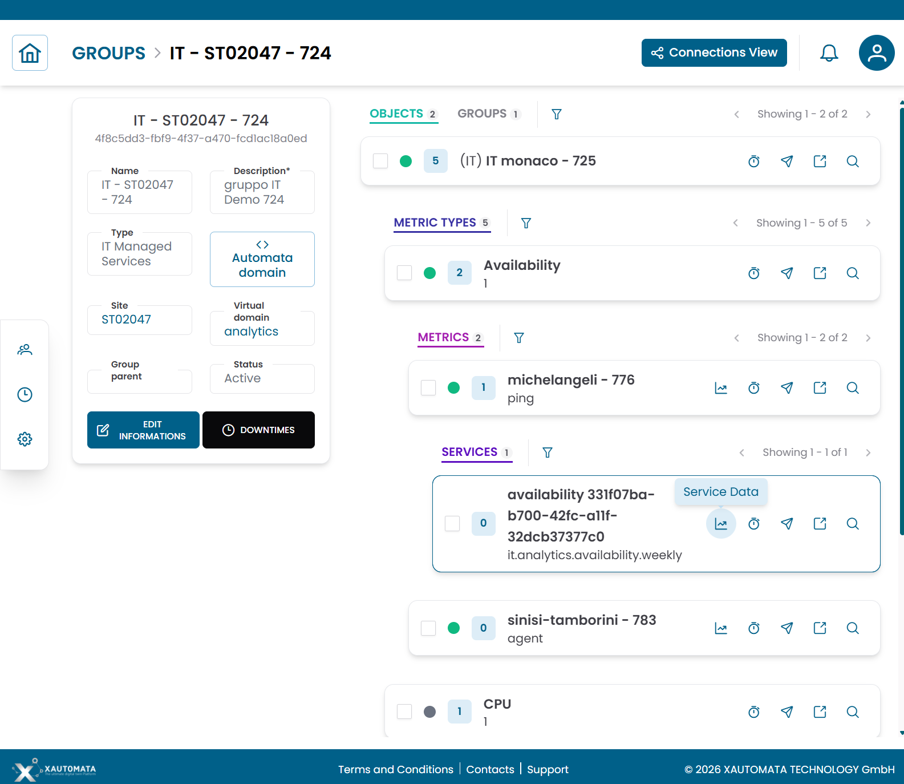
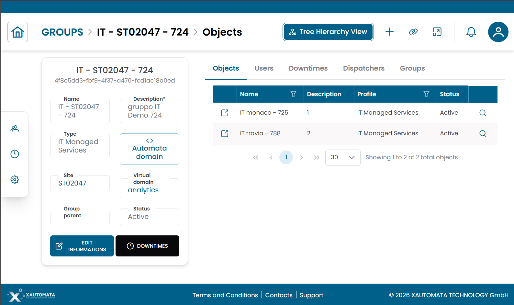

# Groups

La sezione **Groups** organizza le risorse monitorate in unità logiche associate a una sede.
Un gruppo può contenere oggetti e altri gruppi figlio, formando la gerarchia infrastrutturale che alimenta dashboard e operazioni di monitoraggio.

---

## Aprire la Sezione Groups

Dal menu di navigazione principale, vai su **Customers → Objects Repository → Groups**.

L'interfaccia si apre con un **dialog di pre-filter**. Compila uno o più campi per restringere la ricerca, poi clicca **APPLY**.

| Campo filtro | Descrizione |
|---|---|
| Name | Nome del gruppo |
| Description | Descrizione facoltativa |
| Type | Dominio operativo (vedi [Tipi di Gruppo](#tipi-di-gruppo) di seguito) |
| Site | Sede a cui appartiene il gruppo |
| Virtual Domain | Dominio amministrativo in cui rientra il gruppo |
| Status | Active o Disabled |

Per impostazione predefinita, il pre-filter è configurato per mostrare solo i gruppi **attivi**. Lascia gli altri campi vuoti e clicca **APPLY** per caricare tutti i gruppi attivi.

/// caption
Fig.1 - Dialog di pre-filter Groups
///

---

## Tabella Groups

Dopo aver applicato il filtro, i risultati appaiono in una tabella dove ogni riga rappresenta un gruppo.

Le colonne tipiche includono:

- Name
- Description
- Type
- Site
- Virtual Domain
- Status

/// caption
Fig.2 - Tabella dei risultati Groups
///

---

## Tipi di Gruppo

Ogni gruppo è classificato da un **Type** che ne identifica il dominio operativo:

| Tipo | Descrizione |
|---|---|
| IT Managed Services | Gruppi relativi a infrastrutture server e applicative |
| WAN Network | Gruppi relativi a dispositivi di rete e connettività |
| Cost Management | Gruppi utilizzati per il monitoraggio dei costi cloud o infrastrutturali |
| Real Estate Info | Gruppi relativi a sedi fisiche e strutture |
| Physical Security | Gruppi relativi a sistemi di sicurezza fisica |

Il tipo determina come il gruppo si inserisce nel modello infrastrutturale complessivo e quali tipi di oggetti contiene tipicamente.

---

## Dettagli del Gruppo

Clicca sull'**icona di ricerca (🔍)** su qualsiasi riga per aprire il record del gruppo.

Il dialog CRUD mostra la configurazione completa del gruppo:

| Campo | Descrizione |
|---|---|
| Name | Nome del gruppo |
| Description | Descrizione facoltativa |
| Type | Classificazione del dominio operativo |
| Site | Sede a cui appartiene il gruppo |
| Virtual Domain | Dominio amministrativo |
| Group Parent | Gruppo padre, se si tratta di un gruppo figlio |
| Automata Domain | Ambito di automazione |
| Status | Active o Disabled |

Da questo dialog puoi:

- modificare le informazioni del gruppo
- duplicare il record
- eliminare il record

!!! note
    Il campo **Group Parent** viene utilizzato quando un gruppo è annidato all'interno di un altro gruppo.
    Questo consente di modellare gerarchie infrastrutturali a più livelli.

/// caption
Fig.3 - Dialog dettaglio gruppo
///

---

## Vista Struttura Gruppo

Clicca sull'**icona link (🔗)** su qualsiasi riga per aprire la **Group Structure View**.

La pagina è divisa in due aree:

- un **pannello informazioni gruppo** a sinistra
- un'**area di navigazione gerarchica** a destra

La gerarchia mostra le entità che discendono dal gruppo selezionato:

1. Gruppi figlio (se presenti)
2. Objects
3. Metric Types
4. Metrics

Usa questa vista per navigare la struttura di monitoraggio completa sotto il gruppo selezionato, ispezionare le metriche e applicare azioni operative.

Per una spiegazione dettagliata di come usare questa vista, consulta [Tree Hierarchy View](../tree_hierarchy_view.md).

/// caption
Fig.4 - Vista struttura gruppo
///

### Azioni Operative

Dalla vista gerarchica puoi applicare le seguenti azioni a qualsiasi elemento dell'albero:

| Azione | Descrizione |
|---|---|
| Downtime | Sospende temporaneamente gli alert di monitoraggio per l'elemento selezionato |
| Dispatcher | Configura una risposta automatica attivata da un evento di monitoraggio |

I gruppi supportano anche **operazioni massive** — seleziona più elementi nell'albero e applica una singola azione a tutti in una volta:

- **Massive Downtime**
- **Massive Dispatcher**

---

## Connections View

Dalla Group Structure View, clicca **Connections** per passare alla **Connections View**.

Questa vista mostra le entità collegate al gruppo:

| Tab | Descrizione |
|---|---|
| Objects | Risorse monitorate assegnate a questo gruppo |
| Groups | Gruppi figlio annidati in questo gruppo |
| Users | Utenti associati a questo gruppo |
| Downtimes | Record di downtime attivi collegati a questo gruppo |
| Dispatchers | Dispatcher attivi collegati a questo gruppo |

/// caption
Fig.5 - Connections view del gruppo
///

---

!!! note
    Per gestire le singole risorse all'interno di un gruppo, consulta [Objects](objects.md).
    Per capire come viene navigata la gerarchia, consulta [Tree Hierarchy View](../tree_hierarchy_view.md).
