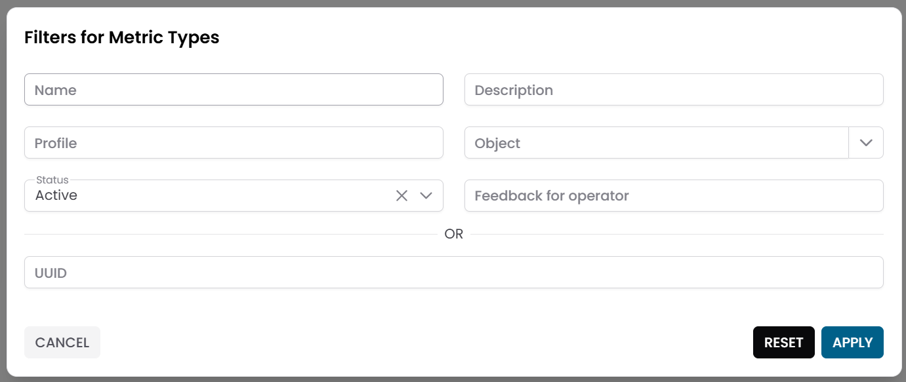
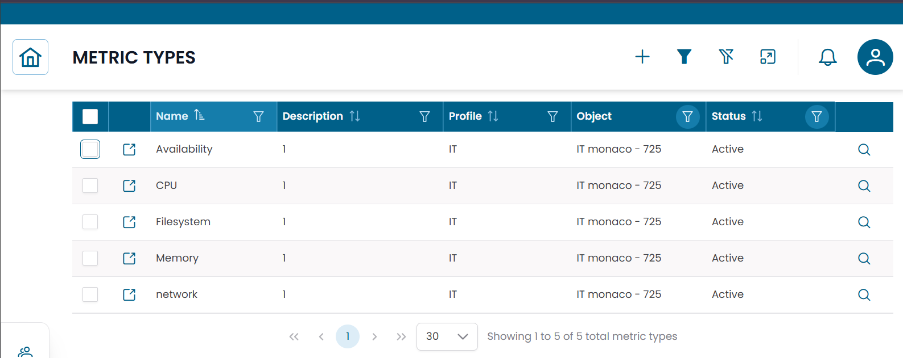
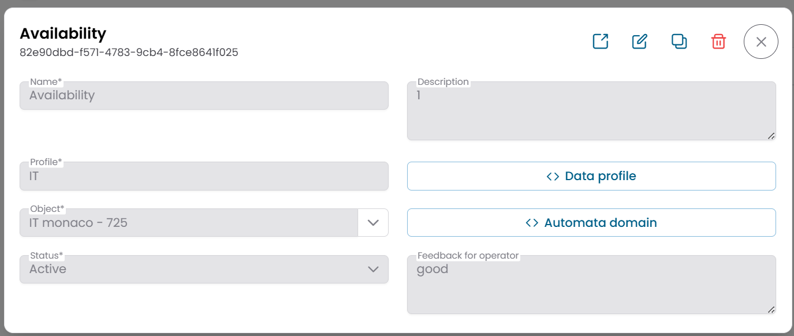
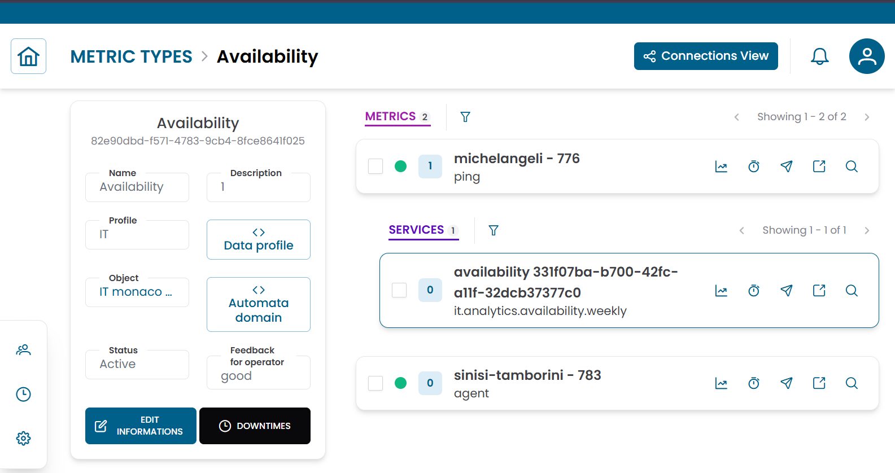
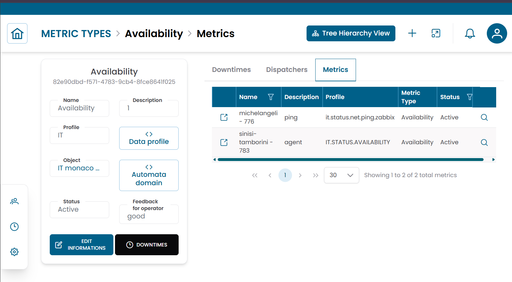

# Metric Types

The **Metric Types** section defines the measurements collected from monitored objects.
Each metric type represents a specific monitoring dimension — for example CPU usage, network latency, or service availability — and acts as the template from which actual metric values are recorded over time.

!!! info
    A metric type defines *what* is measured. The actual measured values are stored as [Metrics](metrics.md).

---

## Opening the Metric Types Section

From the main navigation menu, go to **Customers → Objects Repository → Metric Types**.

The interface opens with a **pre-filter dialog**. Fill in one or more fields to narrow the search, then click **APPLY**.

| Filter field | Description |
|---|---|
| Name | Name of the metric type |
| Description | Optional description |
| Profile | Classification of the measurement |
| Object | Object the metric type belongs to |
| Status | Active or Disabled |

By default, the pre-filter is set to show only **active** metric types. Leave other fields empty and click **APPLY** to load all active metric types.

/// caption
Fig.1 - Metric Types pre-filter dialog
///

---

## Metric Types Table

After applying the filter, the results appear in a table where each row represents a metric type.

Typical columns include:

- Name
- Description
- Profile
- Object
- Status

/// caption
Fig.2 - Metric Types results table
///

---

## Metric Type Details

Click the **search icon (🔍)** on any row to open the metric type record.

The CRUD dialog displays the full configuration:

| Field | Description |
|---|---|
| Name | Name of the metric type |
| Description | Optional description |
| Profile | Classification of the measurement |
| Object | Object this metric type is associated with |
| Data Profile | JSON configuration for the metric type |
| Automata Domain | Automation scope |
| Status | Active or Disabled |
| Feedback for Operator | Notes or guidance for the operator |

From this dialog you can:

- edit the metric type configuration
- duplicate the record
- delete the record

/// caption
Fig.3 - Metric Type detail dialog
///

---

## Metric Type Structure View

Click the **link icon (🔗)** on any row to open the **Metric Type Structure View**.

The page is divided into two areas:

- a **metric type information panel** on the left
- a **hierarchical navigation area** on the right

The hierarchy displays the metrics associated with this metric type — the actual time-series values collected from the monitored object.

Use this view to inspect individual metric records and apply operational actions directly from the hierarchy.

For a detailed explanation of how to use this view, see [Tree Hierarchy View](../tree_hierarchy_view.md).

/// caption
Fig.4 - Metric Type structure view
///

### Operational actions

From the hierarchy view you can apply the following actions to metrics:

| Action | Description |
|---|---|
| Metric Data | Open the historical chart or table for the selected metric |
| Downtime | Temporarily suspend monitoring alerts for the selected metric |
| Dispatcher | Configure an automated response triggered by a monitoring event |

Metric types also support **mass operations** — select multiple metrics in the tree and apply a single action to all of them:

- **Massive Downtime**
- **Massive Dispatcher**

---

## Connections View

From the Metric Type Structure View, click **Connections** to switch to the **Connections View**.

This view shows the entities linked to the metric type:

| Tab | Description |
|---|---|
| Metrics | Time-series records associated with this metric type |
| Downtimes | Active maintenance windows for this metric type |
| Dispatchers | Active automation rules linked to this metric type |

/// caption
Fig.5 - Metric Type connections view
///

---

!!! note
    To view the time-series values collected under a metric type, see [Metrics](metrics.md).
    To manage the object this metric type belongs to, see [Objects](objects.md).
