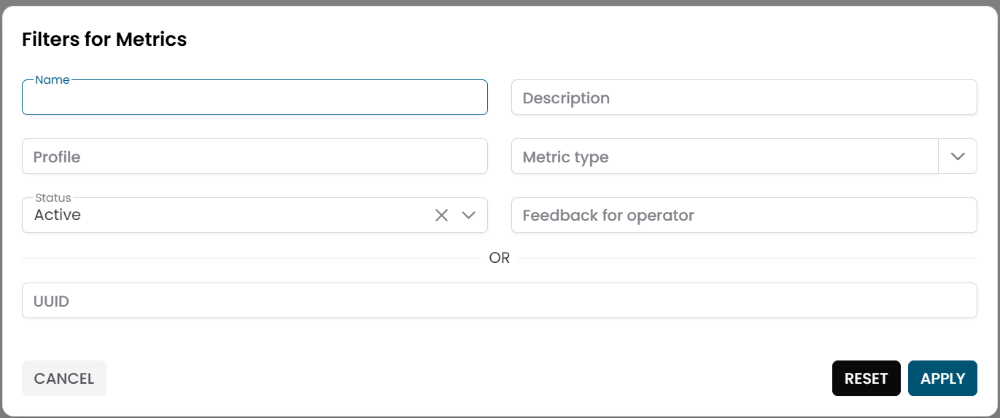
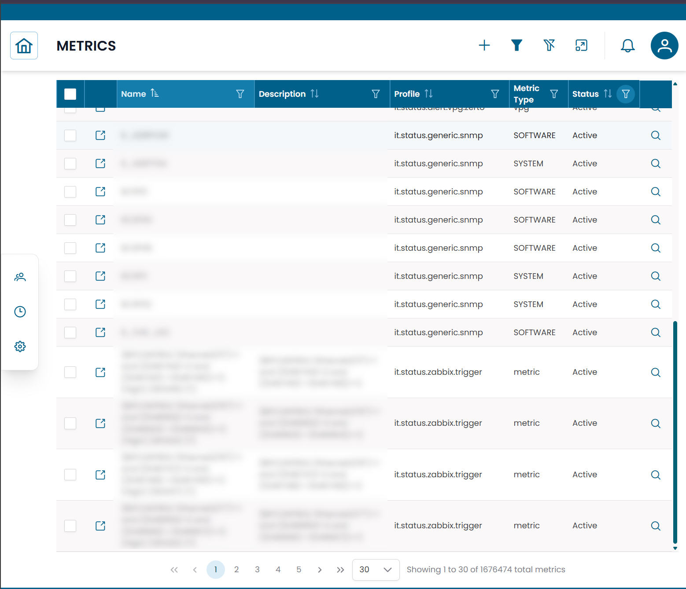
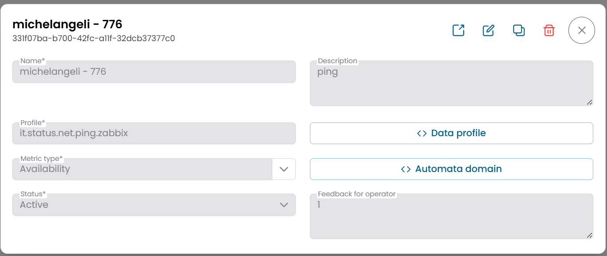
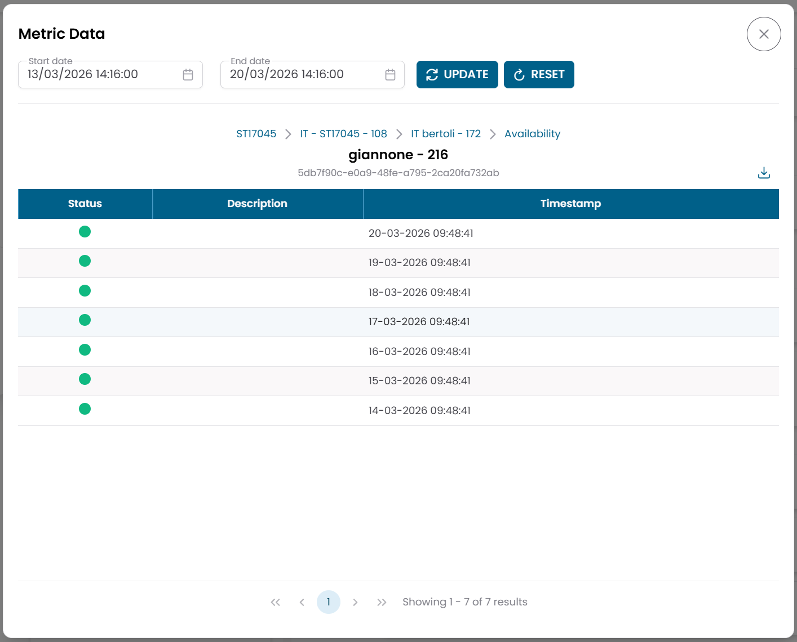
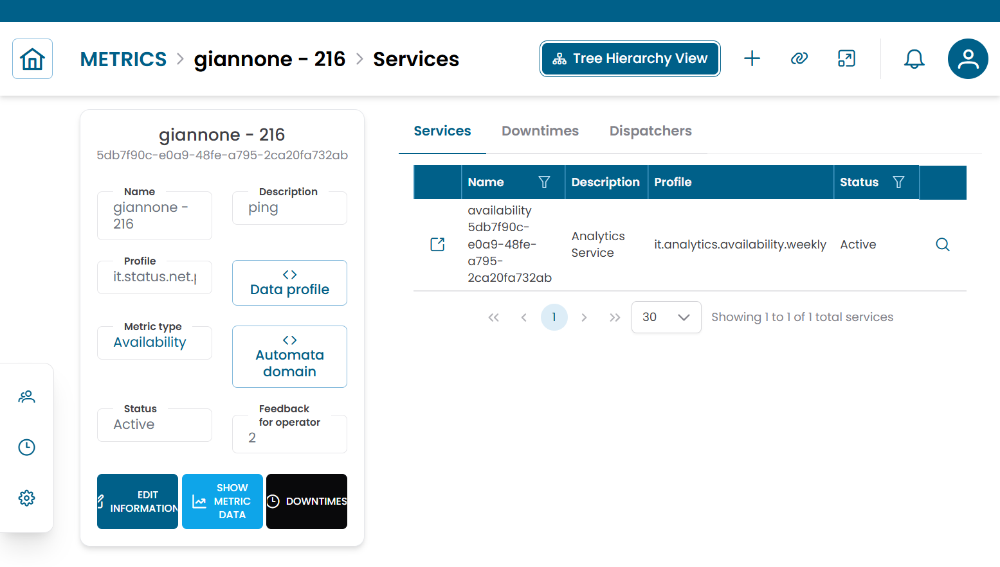

# Metrics

La sezione **Metrics** dà accesso ai dati di serie temporali raccolti dalle risorse monitorate.
Ogni record di metrica rappresenta i valori misurati effettivi prodotti da una probe per un dato metric type — ad esempio, le letture di utilizzo CPU registrate ogni cinque minuti da un server specifico.

!!! info
    Le metriche sono il livello più basso della gerarchia di monitoraggio. Vengono generate automaticamente dalle probe e non vengono create manualmente.
    Usa questa sezione per ispezionare la cronologia delle misurazioni e per applicare azioni operative come downtime e dispatcher.

---

## Aprire la Sezione Metrics

Dal menu di navigazione principale, vai su **Customers → Objects Repository → Metrics**.

L'interfaccia si apre con un **dialog di pre-filter**. Compila uno o più campi per restringere la ricerca, poi clicca **APPLY**.

| Campo filtro | Descrizione |
|---|---|
| Name | Nome della metrica |
| Description | Descrizione facoltativa |
| Profile | Classificazione della metrica |
| Metric Type | Metric type a cui appartiene la metrica |
| Status | Active o Disabled |

Per impostazione predefinita, il pre-filter è configurato per mostrare solo le metriche **attive**. Lascia gli altri campi vuoti e clicca **APPLY** per caricare tutte le metriche attive.

/// caption
Fig.1 - Dialog di pre-filter Metrics
///

---

## Tabella Metrics

Dopo aver applicato il filtro, i risultati appaiono in una tabella dove ogni riga rappresenta un record di metrica.

Le colonne tipiche includono:

- Name
- Description
- Profile
- Metric Type
- Status

/// caption
Fig.2 - Tabella dei risultati Metrics
///

---

## Dettagli della Metrica

Clicca sull'**icona di ricerca (🔍)** su qualsiasi riga per aprire il record della metrica.

Il dialog CRUD mostra la configurazione della metrica:

| Campo | Descrizione |
|---|---|
| Name | Nome della metrica |
| Description | Descrizione facoltativa |
| Profile | Classificazione della metrica |
| Metric Type | Metric type padre |
| Data Profile | Configurazione JSON per la metrica |
| Automata Domain | Ambito di automazione |
| Status | Active o Disabled |
| Feedback for Operator | Note o indicazioni per l'operatore |

/// caption
Fig.3 - Dialog dettaglio metrica
///

---

## Visualizzare i Dati della Metrica

Per ispezionare i valori storici registrati per una metrica, clicca il pulsante di azione **Metric Data** sulla riga della metrica.

Si apre un dialog che mostra la cronologia delle misurazioni per la metrica selezionata.

Il formato di visualizzazione dipende dal tipo di metrica:

| Tipo di metrica | Formato di visualizzazione |
|---|---|
| Value metric (numerica) | Grafico di serie temporali (es. CPU %, latenza, traffico) |
| Status metric (basata su stato) | Tabella con timestamp e valori di stato (es. OK / Warning / Critical) |

Usa questa vista per analizzare i trend, identificare anomalie o verificare che i dati di monitoraggio vengano raccolti correttamente.

/// caption
Fig.4 - Dialog Metric Data — vista grafico
///

---

## Azioni Operative

Dalla tabella delle metriche o dalla vista gerarchica all'interno di un metric type o di un oggetto, puoi applicare le seguenti azioni a una o più metriche:

| Azione | Descrizione |
|---|---|
| Downtime | Sospende temporaneamente gli alert di monitoraggio per la metrica selezionata |
| Dispatcher | Configura una risposta automatica attivata dalle condizioni di questa metrica |

Per applicare la stessa azione a più metriche contemporaneamente, selezionale nella tabella e usa:

- **Massive Downtime**
- **Massive Dispatcher**

---

## Connections View

Clicca sull'**icona link (🔗)** su qualsiasi riga per aprire la **Connections View** per quella metrica.

Questa vista mostra le entità collegate alla metrica:

| Tab | Descrizione |
|---|---|
| Services | Servizi a cui questa metrica è associata |
| Downtimes | Finestre di manutenzione attive per questa metrica |
| Dispatchers | Regole di automazione attive collegate a questa metrica |

/// caption
Fig.5 - Connections view della metrica
///

---

!!! note
    Le metriche vengono consultate più comunemente dalla gerarchia di un oggetto o metric type, piuttosto che direttamente da questa sezione.
    Per il contesto su dove si collocano le metriche nel modello di monitoraggio, consulta [Metric Types](metric_types.md) e [Objects](objects.md).
