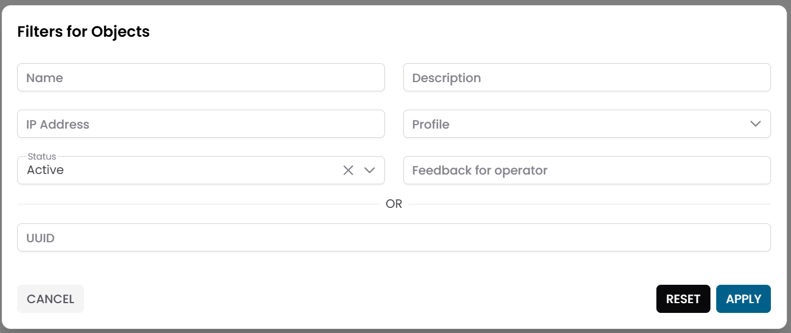
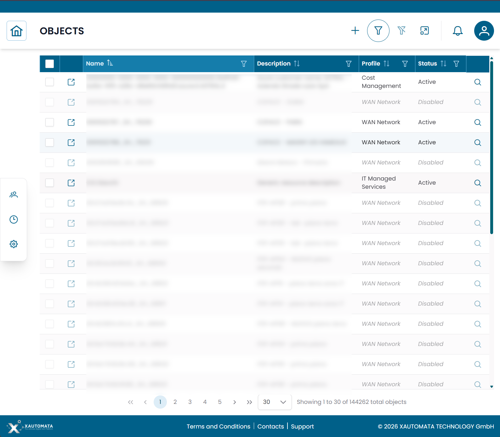
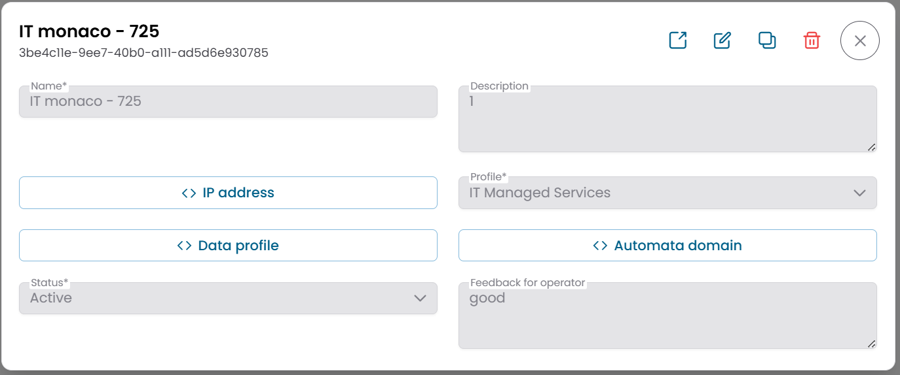
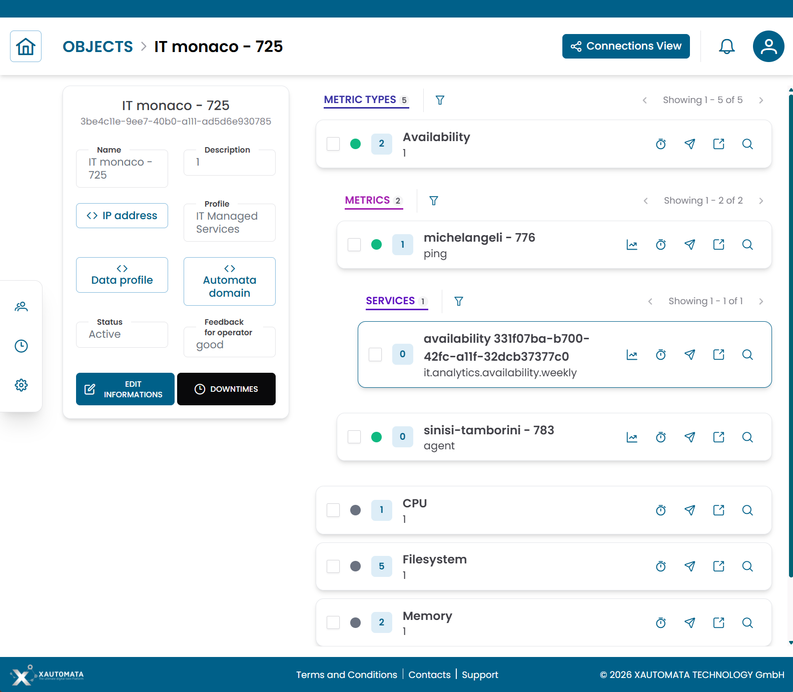
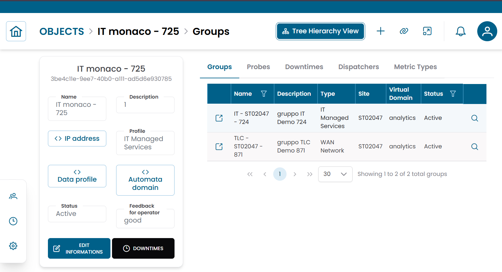

# Objects

La sezione **Objects** gestisce le singole risorse monitorate da XAUTOMATA, come server, macchine virtuali, dispositivi di rete e applicazioni.
Gli oggetti sono le entità di monitoraggio centrali della piattaforma — le metriche vengono raccolte da loro, gli alert vengono generati su di loro e le regole di automazione agiscono su di loro.

---

## Aprire la Sezione Objects

Dal menu di navigazione principale, vai su **Customers → Objects Repository → Objects**.

L'interfaccia si apre con un **dialog di pre-filter**. Compila uno o più campi per restringere la ricerca, poi clicca **APPLY**.

| Campo filtro | Descrizione |
|---|---|
| Name | Nome dell'oggetto |
| Description | Descrizione facoltativa |
| IP Address | Indirizzo IP della risorsa monitorata |
| Profile | Classificazione dell'oggetto (vedi [Profili Oggetto](#profili-oggetto) di seguito) |
| Status | Active, Disabled o Maintenance |

Per impostazione predefinita, il pre-filter è configurato per mostrare solo gli oggetti **attivi**. Lascia gli altri campi vuoti e clicca **APPLY** per caricare tutti gli oggetti attivi.

/// caption
Fig.1 - Dialog di pre-filter Objects
///

---

## Tabella Objects

Dopo aver applicato il filtro, i risultati appaiono in una tabella dove ogni riga rappresenta una risorsa monitorata.

Le colonne tipiche includono:

- Name
- Description
- IP Address
- Profile
- Status

/// caption
Fig.2 - Tabella dei risultati Objects
///

---

## Profili Oggetto

Ogni oggetto è classificato da un **Profile** che identifica il tipo di risorsa infrastrutturale che rappresenta:

| Profilo | Descrizione |
|---|---|
| Host | Server fisico o virtuale |
| Virtual Machine | VM gestita da un hypervisor |
| Cluster | Gruppo di nodi gestiti come singola risorsa |
| Virtual Center | Piattaforma di gestione della virtualizzazione |
| Resource Pool | Unità logica di allocazione delle risorse |
| IT Managed Services | Risorsa generica di managed service |
| WAN Network | Dispositivo di rete o componente WAN |
| Cost Management | Risorsa utilizzata per il monitoraggio dei costi |
| Process Flow | Componente di processo o workflow |
| Real Estate / Physical Security | Asset di struttura o sicurezza fisica |

Il profilo determina come l'oggetto si inserisce nel modello di monitoraggio e quali tipi di metriche e regole di automazione possono applicarsi.

---

## Dettagli dell'Oggetto

Clicca sull'**icona di ricerca (🔍)** su qualsiasi riga per aprire il record dell'oggetto.

Il dialog CRUD mostra la configurazione completa dell'oggetto:

| Campo | Descrizione |
|---|---|
| Name | Nome della risorsa monitorata |
| Description | Descrizione facoltativa |
| IP Address | Indirizzo di rete della risorsa |
| Profile | Classificazione dell'oggetto |
| Data Profile | Configurazione JSON per l'oggetto |
| Automata Domain | Ambito di automazione |
| Status | Active, Disabled o Maintenance |
| Feedback for Operator | Note o indicazioni per l'operatore |

Da questo dialog puoi:

- modificare la configurazione dell'oggetto
- duplicare il record
- eliminare il record

!!! note
    Imposta **Status** su **Maintenance** quando la risorsa è sottoposta a lavori pianificati.
    Questo sospende gli alert senza disabilitare completamente l'oggetto.

/// caption
Fig.3 - Dialog dettaglio oggetto
///

---

## Vista Struttura Oggetto

Clicca sull'**icona link (🔗)** su qualsiasi riga per aprire la **Object Structure View**.

La pagina è divisa in due aree:

- un **pannello informazioni oggetto** a sinistra
- un'**area di navigazione gerarchica** a destra

La gerarchia mostra le entità di monitoraggio associate all'oggetto:

1. Metric Types
2. Metrics

Usa questa vista per ispezionare i dati di monitoraggio raccolti dall'oggetto e per applicare azioni operative a qualsiasi livello della gerarchia.

Per una spiegazione dettagliata di come usare questa vista, consulta [Tree Hierarchy View](../tree_hierarchy_view.md).

/// caption
Fig.4 - Vista struttura oggetto
///

### Azioni Operative

Dalla vista gerarchica puoi applicare le seguenti azioni a qualsiasi elemento dell'albero:

| Azione | Descrizione |
|---|---|
| Metric Data | Apre il grafico storico o la tabella per la metrica selezionata |
| Downtime | Sospende temporaneamente gli alert di monitoraggio per l'elemento selezionato |
| Dispatcher | Configura una risposta automatica attivata da un evento di monitoraggio |

Gli oggetti supportano anche **operazioni massive** — seleziona più elementi e applica una singola azione a tutti in una volta:

- **Massive Downtime**
- **Massive Dispatcher**

---

## Connections View

Dalla Object Structure View, clicca **Connections** per passare alla **Connections View**.

Questa vista mostra le entità collegate all'oggetto:

| Tab | Descrizione |
|---|---|
| Groups | Gruppi a cui appartiene questo oggetto |
| Probes | Agenti di monitoraggio che raccolgono dati da questo oggetto |
| Metric Types | Definizioni di misura associate a questo oggetto |
| Downtimes | Finestre di manutenzione attive per questo oggetto |
| Dispatchers | Regole di automazione attive collegate a questo oggetto |

/// caption
Fig.5 - Connections view dell'oggetto
///

---

!!! note
    Per gestire le misure raccolte da un oggetto, consulta [Metric Types](metric_types.md) e [Metrics](metrics.md).
    Per gestire gli agenti di monitoraggio associati a un oggetto, consulta [Probes](../../administration/probes.md).
