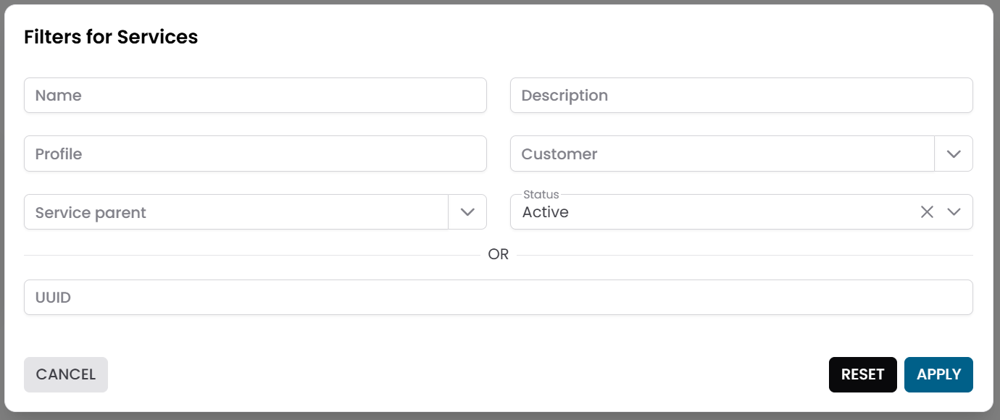
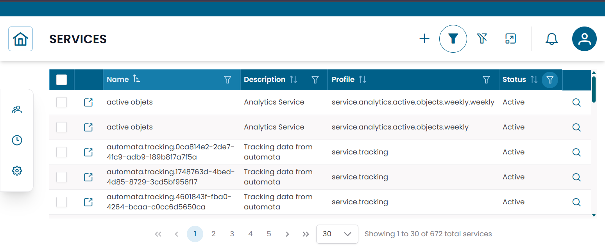
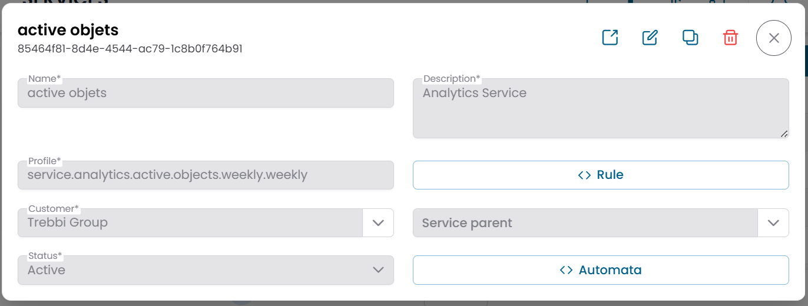
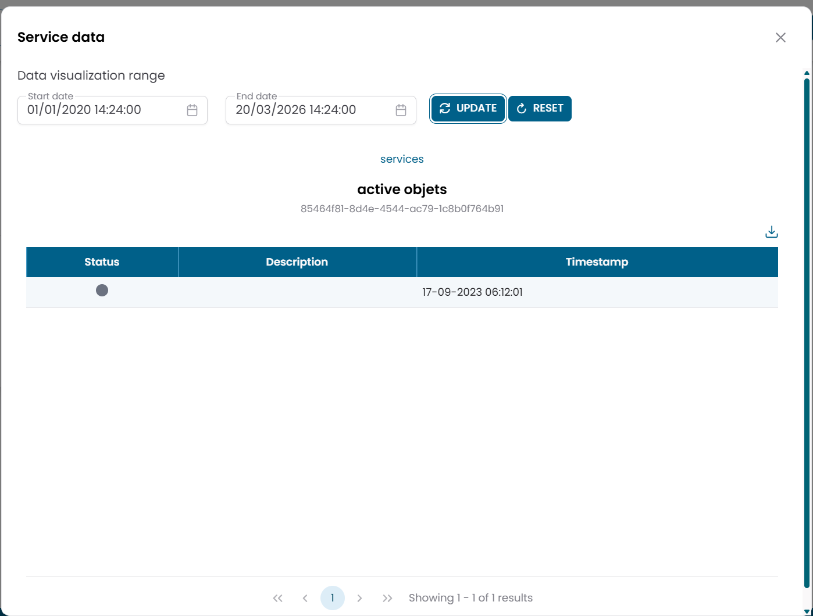
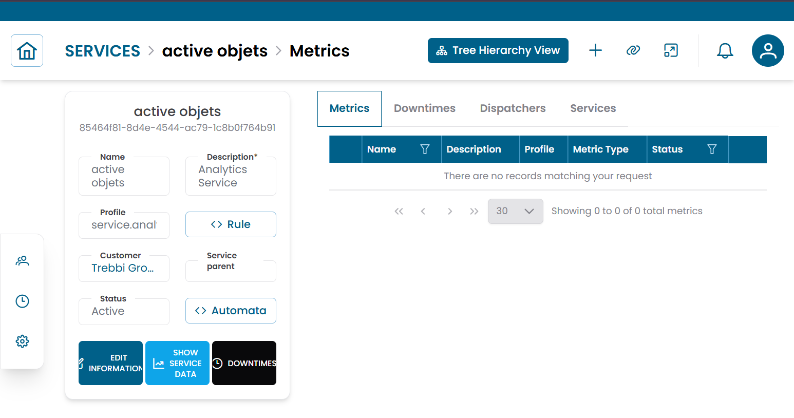

# Services

The **Services** section manages logical service definitions used to represent and monitor business or operational services within XAUTOMATA.
Services sit above the infrastructure layer — they aggregate metrics from objects and provide a service-level view of monitoring data.

!!! info
    Services represent a logical monitoring layer. Unlike objects, they do not correspond directly to a physical resource — they group and interpret monitoring data in terms of a service or business function.

---

## Opening the Services Section

From the main navigation menu, go to **Customers → Objects Repository → Services**.

The interface opens with a **pre-filter dialog**. Fill in one or more fields to narrow the search, then click **APPLY**.

| Filter field | Description |
|---|---|
| Name | Name of the service |
| Description | Optional description |
| Profile | Service classification |
| Customer | Customer the service belongs to |
| Service Parent | Parent service, for hierarchical services |
| Status | Active, Disabled, or Maintenance |

By default, the pre-filter is set to show only **active** services. Leave other fields empty and click **APPLY** to load all active services.

/// caption
Fig.1 - Services pre-filter dialog
///

---

## Services Table

After applying the filter, the results appear in a table where each row represents a service.

Typical columns include:

- Name
- Description
- Profile
- Status

The table supports multi-selection, which enables mass operations on multiple services at once.

/// caption
Fig.2 - Services results table
///

---

## Service Details

Click the **search icon (🔍)** on any row to open the service record.

The CRUD dialog displays the full configuration of the service:

| Field | Description |
|---|---|
| Name | Name of the service |
| Description | Optional description |
| Profile | Service classification |
| Customer | Customer the service is associated with |
| Service Parent | Parent service, if this is a child service |
| Status | Active, Disabled, or Maintenance |
| Rule | JSON configuration used by the service logic |
| Automata | JSON configuration related to service automation |

From this dialog you can:

- edit the service configuration
- duplicate the record
- delete the record

!!! note
    The **Rule** and **Automata** fields contain JSON-based configurations managed by the XAUTOMATA delivery team. Do not edit them unless instructed.

/// caption
Fig.3 - Service detail dialog
///

---

## Service Data

To inspect the monitoring data associated with a service, click **Show Service Data** on the service row.

This opens a dedicated view showing service-level analytics for the selected service.

When multiple services are selected in the table, use **Multi-services data** to compare data across services side by side.

/// caption
Fig.4 - Service Data view
///

---

## Connections View

Click the **link icon (🔗)** on any row to open the **Connections View** for that service.

This is the main structural page for a service. It shows an information panel on the left and a tabbed area on the right with the following tabs:

| Tab | Description |
|---|---|
| Metrics | Metrics associated with this service |
| Services | Child services nested under this service |
| Downtimes | Active maintenance windows for this service |
| Dispatchers | Active automation rules linked to this service |

### Metrics tab

Shows the metrics linked to the service. For each metric you can open **Metric Data** directly from this context to inspect the historical values.

### Services tab

Shows child services nested under this service. You can create new child services directly from this tab — the parent relation is pre-filled automatically.

/// caption
Fig.5 - Service connections view
///

---

## Service Hierarchy View

From the Connections View, click **Tree Hierarchy** to switch to the **Service Hierarchy View**.

This view shows the selected service expanded through its child services, allowing you to navigate multi-level service structures.

!!! note
    Unlike the infrastructure hierarchy (Group → Object → Metric Type → Metric), the service hierarchy expands through **child services** only, not through objects or metrics directly.

For more details on the Tree Hierarchy View, see [Tree Hierarchy View](../tree_hierarchy_view.md).

---

## Operational Actions

From the services table or the hierarchy view you can apply the following actions:

| Action | Description |
|---|---|
| Show Service Data | Open the service-level analytics view |
| Downtime | Temporarily suspend monitoring alerts for this service |
| Dispatcher | Configure an automated response triggered by this service's conditions |

For multiple services, use the mass operations:

- **Massive Downtime**
- **Massive Dispatcher**
- **Multi-services data**

---

!!! note
    To link metrics to a service, use the **Metrics** tab in the Connections View.
    To manage the underlying infrastructure objects, see [Objects](objects.md) and [Metrics](metrics.md).
