# Tree Hierarchy View

La **Tree Hierarchy View** ti consente di navigare l'infrastruttura monitorata come una gerarchia strutturata, espandendo progressivamente i livelli da un'entità radice fino alle singole metriche e ai servizi.

---

## Accedere alla Vista

La Tree Hierarchy View è disponibile per **Objects**, **Groups** e **Customers**.

- Per gli **Objects**: cliccando sull'**icona link** su una riga della tabella si apre direttamente la Tree Hierarchy View.
- Per **Groups** e **Customers**: apri la Connections view, poi usa il **selettore** nella barra superiore per passare alla Tree Hierarchy View.

Dalla Tree Hierarchy View, usa il pulsante **Connections View** nella barra superiore per tornare indietro.

---

## Layout della Pagina

La pagina è divisa in due pannelli:

- **Pannello sinistro** — dettagli in sola lettura dell'entità radice selezionata, con pulsanti di azione come **EDIT INFORMATIONS** e **DOWNTIMES**
- **Pannello destro** — la gerarchia espandibile delle entità correlate

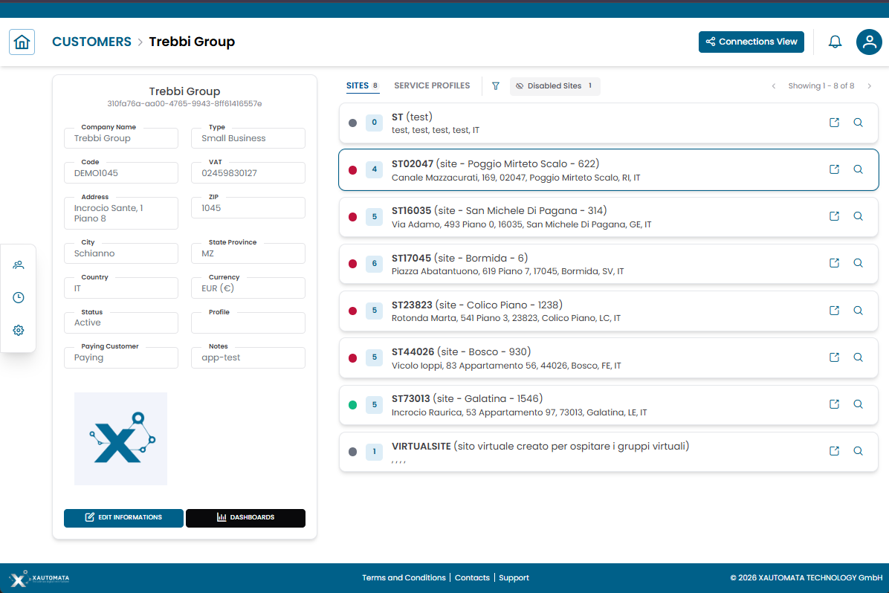
/// caption
Fig.1 — Tree Hierarchy View — dettagli entità a sinistra, gerarchia espandibile a destra
///

---

## Struttura della Gerarchia

Il pannello destro mostra l'infrastruttura come sezioni espandibili. Clicca su una riga per espanderla e visualizzare il livello successivo.

Un percorso di navigazione tipico da un Customer è:

1. **Customer**
2. **Sites**
3. **Groups**
4. **Objects**
5. **Metric Types**
6. **Metrics / Services**

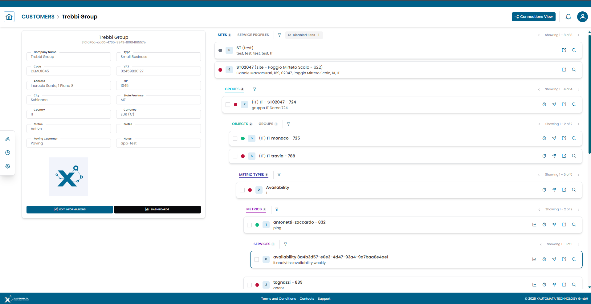
/// caption
Fig.2 — Espansione progressiva dei livelli della gerarchia da Customer a Metrics
///

!!! note
    I livelli disponibili dipendono dal tipo di entità e dalla sua configurazione. Non tutti i percorsi portano alla stessa profondità.

---

## Tab della Gerarchia

Alcune entità offrono più prospettive gerarchiche accessibili tramite tab nella parte superiore del pannello destro.

Ad esempio, un **Customer** può esporre:

- **Sites** — il raggruppamento geografico e logico degli oggetti
- **Service Profiles** — la vista orientata ai servizi della stessa infrastruttura

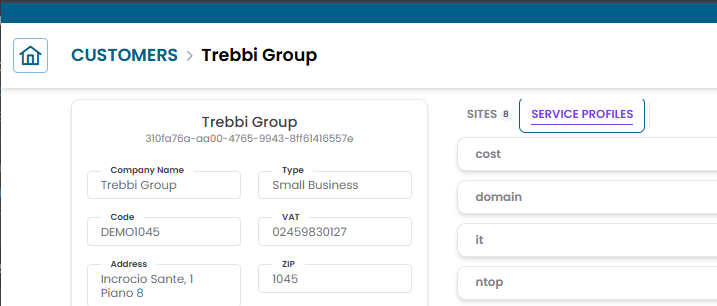
/// caption
Fig.3 — Tab della gerarchia su un Customer — Sites e Service Profiles
///

---

## Filtrare la Gerarchia

Accanto alle tab della gerarchia, un'**icona filtro** ti consente di restringere le righe visualizzate nel pannello destro.

Sono disponibili due modalità di filtro:

| Filtro | Descrizione |
|---|---|
| **Filtro per nome o codice** | Digita una stringa per mostrare solo le righe il cui nome o codice contiene il testo inserito |
| **Severity** | Seleziona uno o più valori di stato (verde, rosso, giallo, viola, grigio) per mostrare solo le righe con quello stato |

Il filtro si applica al livello attualmente visibile. Cancella il filtro per ripristinare l'elenco completo.

Quando si visualizza una gerarchia **Customer**, è disponibile un ulteriore toggle **Disabled sites** accanto all'icona del filtro. I siti disabilitati sono nascosti per impostazione predefinita — abilita il toggle per includerli nella gerarchia.

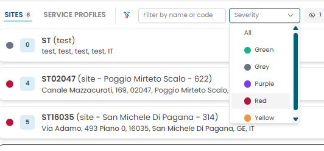
/// caption
Fig.4 — Filtro della gerarchia — ricerca per nome/codice e selettore di severità
///

---

## Righe delle Entità

Ogni riga nella gerarchia mostra:

- Un **indicatore di stato** (punto colorato)
- Il **nome** e l'identificatore dell'entità
- **Contatori dei figli** opzionali
- **Icone di azione** sul lato destro

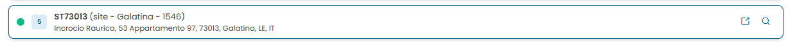
/// caption
Fig.5 — Riga entità con indicatore di stato e icone di azione contestuali
///

---

## Azioni sulle Righe

Ogni riga espone icone di azione contestuali a seconda del tipo di entità.

### Visualizzare i Dati della Metrica

Clicca sull'**icona del grafico** per aprire il modal dei dati della metrica.

Il modal mostra la serie temporale storica per la metrica selezionata, con:

- Selettori **Start date** e **End date** per impostare l'intervallo temporale
- Pulsante **UPDATE** per aggiornare il grafico con l'intervallo selezionato
- Pulsante **RESET** per ripristinare l'intervallo predefinito
- Scorciatoie **Zoom range**: 1h, 3h, 6h, 12h, 24h
- Un breadcrumb nella parte superiore che mostra il percorso completo della metrica nella gerarchia

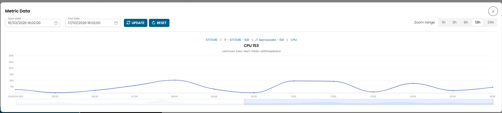
/// caption
Fig.6 — Modal dei dati della metrica — grafico della serie temporale con controlli dell'intervallo di date
///

!!! info
    Usa il selettore dell'intervallo di date per concentrare l'analisi su un periodo specifico. Ogni metrica viene visualizzata come grafico separato se il modal viene aperto da una selezione multipla (vedi [Multi-Metrics Data](#multi-metrics-data)).

---

### Gestire i Downtime

Clicca sull'**icona dell'orologio** per aprire il modal **Active Downtimes**.

Dal modal puoi:

- Visualizzare i periodi di downtime pianificati
- Aggiungere un nuovo downtime

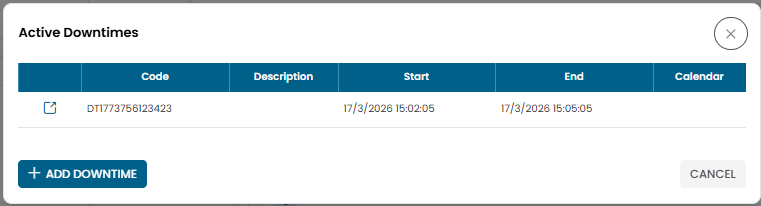
/// caption
Fig.7 — Modal Active Downtimes
///

!!! warning
    I downtime sospendono gli alert di monitoraggio. Applicali solo durante le finestre di manutenzione pianificata.

---

### Aprire i Dispatcher

Clicca sull'**icona dell'aeroplano di carta** per accedere ai dispatcher associati all'entità.

I dispatcher definiscono le azioni automatiche attivate dagli eventi di monitoraggio.

---

### Aprire la Struttura dell'Entità

Clicca sull'**icona di link esterno** per aprire la pagina della struttura completa dell'entità selezionata.

Da lì puoi passare tra la Tree Hierarchy View e la Connections View.

---

### Aprire i Dettagli dell'Entità

Clicca sull'**icona della lente** per aprire il dialog CRUD dell'entità.

Dal dialog puoi visualizzare, modificare, duplicare o eliminare il record.

---

## Servizi

Alcuni rami espongono **Services** invece di metriche. Un servizio rappresenta un'aggregazione di livello superiore dei dati di monitoraggio (ad esempio `cost.analytics.forecast.monthly`).

Aprendo una riga di servizio vengono mostrati i dati temporali nello stesso formato del modal dei dati della metrica.

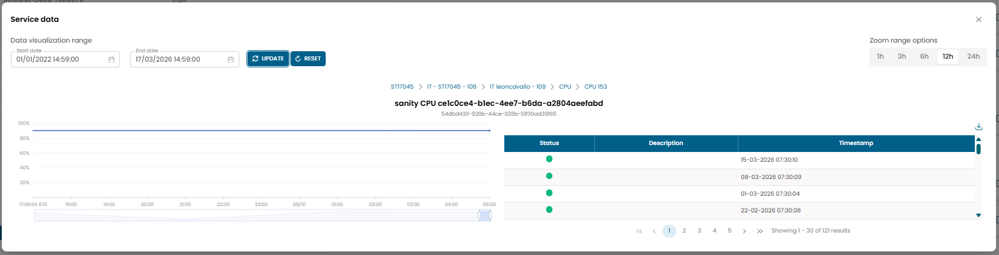
/// caption
Fig.8 — Modal dei dati del servizio — esempio: forecast cost monthly
///

---

## Selezione Multipla e Azioni Bulk

Groups, Objects, Metric Types e Metrics mostrano ciascuno una **checkbox** sul lato sinistro delle righe.
Selezionando una checkbox si seleziona quell'entità e si attiva una toolbar per le azioni bulk nella parte superiore del pannello della gerarchia.

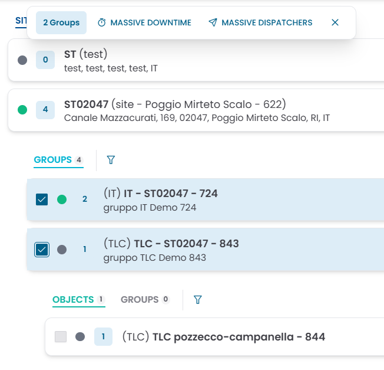
/// caption
Fig.9 — Due gruppi selezionati — la toolbar mostra Massive Downtime e Massive Dispatchers
///

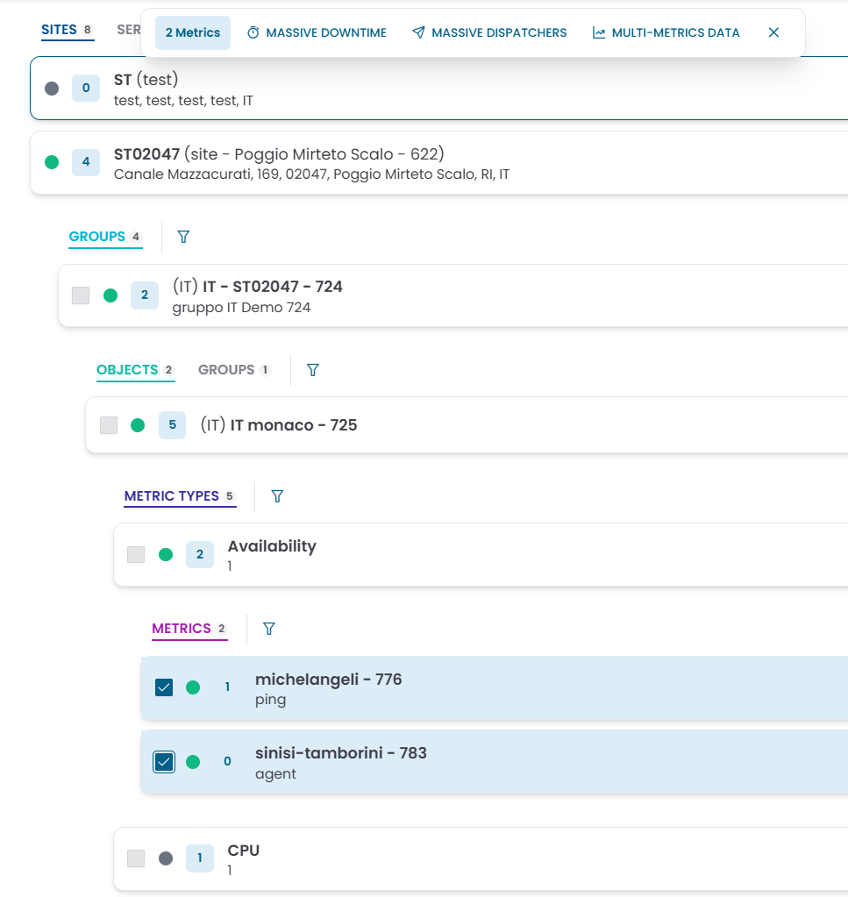
/// caption
Fig.10 — Due metriche selezionate — la toolbar aggiunge Multi-Metrics Data
///

### Regole di Selezione

La selezione è **vincolata al tipo**: puoi selezionare solo entità dello stesso tipo in una singola operazione.

- La prima checkbox che selezioni determina il tipo di entità per quella selezione (ad esempio: Metric).
- Le checkbox a tutti gli altri livelli della gerarchia vengono automaticamente disabilitate fino a quando la selezione non viene cancellata.
- Per iniziare una nuova selezione di un tipo diverso, cancella la selezione corrente usando il pulsante **✕** nella toolbar.

### Azioni Bulk

La toolbar che appare quando le entità sono selezionate espone le seguenti azioni:

| Azione | Disponibile per | Descrizione |
|---|---|---|
| **Massive Downtime** | Groups, Objects, Metric Types, Metrics | Applica un downtime a tutte le entità selezionate in una sola volta |
| **Massive Dispatchers** | Groups, Objects, Metric Types, Metrics | Applica una regola dispatcher a tutte le entità selezionate in una sola volta |
| **Multi-Metrics Data** | Solo Metrics | Apre una vista grafico unica con le serie temporali di tutte le metriche selezionate sovrapposte |

### Multi-Metrics Data

Quando sono selezionate due o più **Metrics**, l'azione **Multi-Metrics Data** apre una vista grafico combinata.

Ogni metrica selezionata viene mostrata come grafico separato, disposto verticalmente, condividendo lo stesso asse temporale e i controlli di zoom.

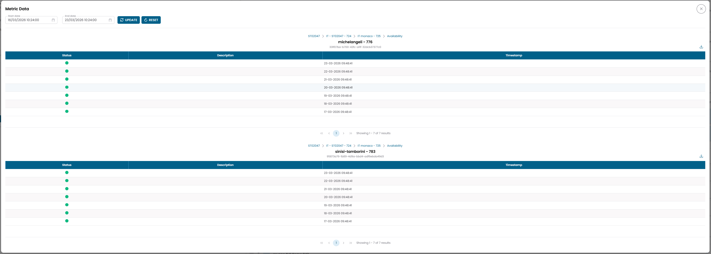
/// caption
Fig.11 — Multi-Metrics Data — due metriche CPU visualizzate su un asse temporale condiviso
///

Usa i campi **Start date** e **End date** nella parte superiore per impostare l'intervallo temporale, poi clicca **UPDATE** per aggiornare tutti i grafici. Le scorciatoie **Zoom range** (1h, 3h, 6h, 12h, 24h) regolano la finestra visibile su tutti i grafici simultaneamente.

---

## Dialog Downtime e Dispatcher

### Aggiungere un Nuovo Downtime

Cliccando sull'azione downtime (su una singola riga o tramite Massive Downtime) si apre il dialog **Add new downtime**.

/// caption
Fig.12 — Dialog Add new downtime
///

| Campo | Descrizione |
|---|---|
| Code | Identificatore generato automaticamente (modificabile) |
| Description | Descrizione facoltativa |
| Start | Data e ora di inizio della finestra di downtime |
| End | Data e ora di fine della finestra di downtime |
| Calendar | Alternativa alle date fisse — usa un calendario per definire la finestra di downtime |
| Country | Filtro geografico facoltativo |
| State/Province | Filtro geografico facoltativo |
| Status | Active o Disabled |

!!! warning
    Devi fornire **Start + End date** oppure un **Calendar**. Il dialog non salva senza almeno uno dei due.

### Aggiungere un Nuovo Dispatcher

Cliccando sull'azione dispatcher si apre il dialog **Add new dispatcher**.

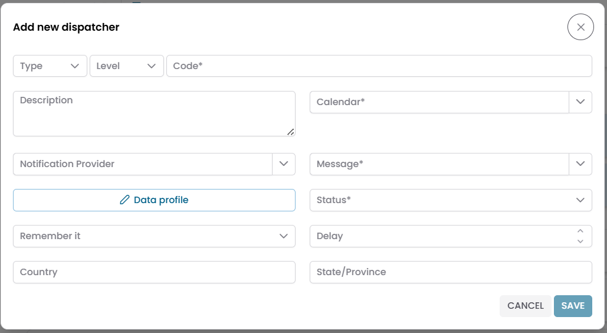
/// caption
Fig.13 — Dialog Add new dispatcher
///

| Campo | Descrizione |
|---|---|
| Type | Tipo di dispatcher |
| Level | Livello di severità che attiva il dispatcher |
| Code | Identificatore univoco |
| Description | Descrizione facoltativa |
| Calendar | Calendario che controlla quando il dispatcher è attivo |
| Notification Provider | Canale di consegna per la notifica |
| Message | Template di messaggio da utilizzare |
| Data profile | Configurazione aggiuntiva del profilo dati |
| Status | Active o Disabled |
| Remember it | Impostazione del comportamento di ripetizione |
| Delay | Ritardo prima che il dispatcher si attivi |
| Country / State Province | Filtri geografici facoltativi |

---

## Tree Hierarchy View vs Connections View

| | Tree Hierarchy View | Connections View |
|---|---|---|
| **Scopo** | Navigare la gerarchia strutturale di un'entità | Esplorare le relazioni tra entità |
| **Layout** | Livelli espandibili, dall'alto verso il basso | Due pannelli, a tab |
| **Uso tipico** | Capire dove si trova un oggetto e raggiungere le sue metriche | Collegare o scollegare record correlati |

Usa la **Tree Hierarchy View** per scendere da un cliente o sito fino alle singole metriche.
Usa la **Connections View** per gestire le associazioni tra entità.
