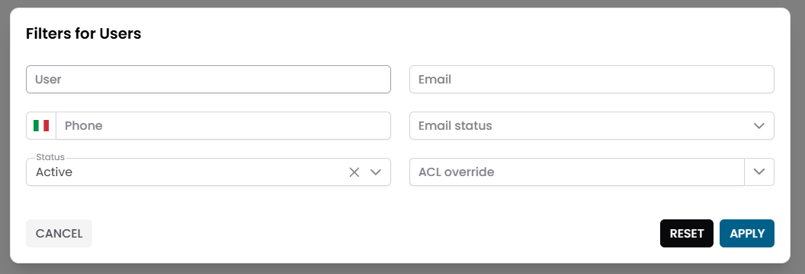
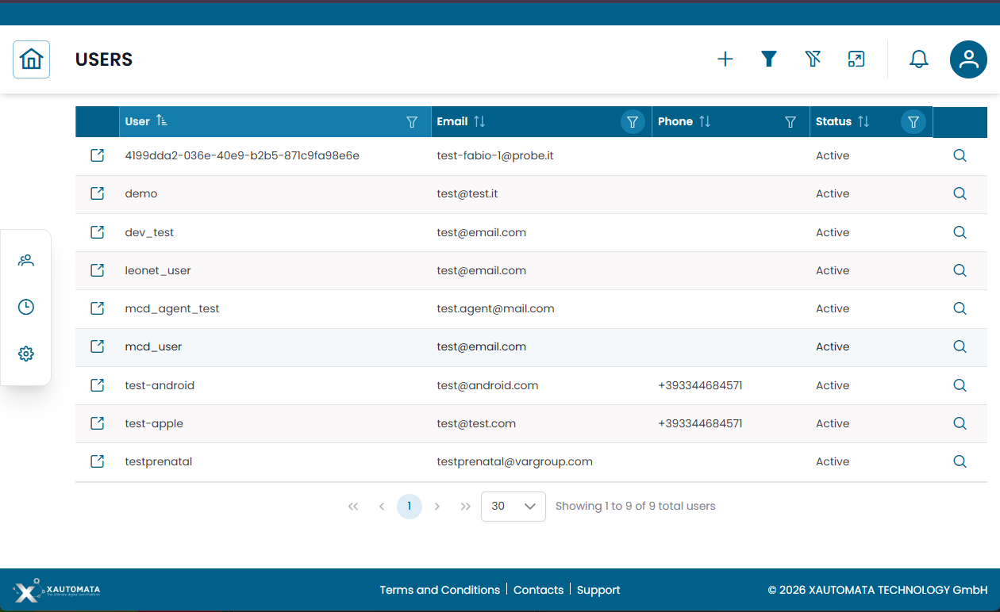
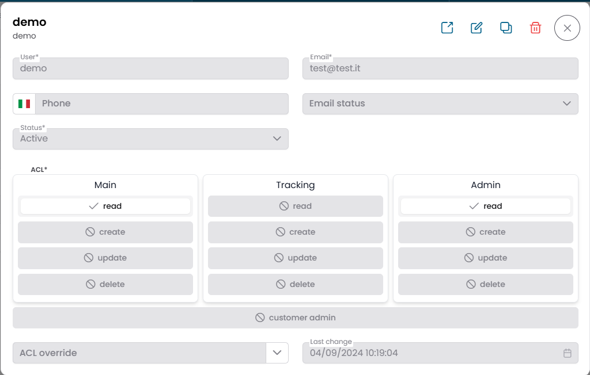
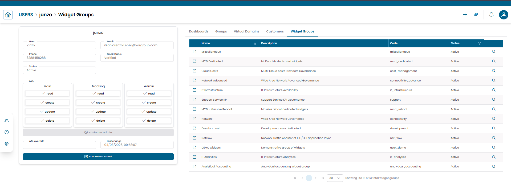
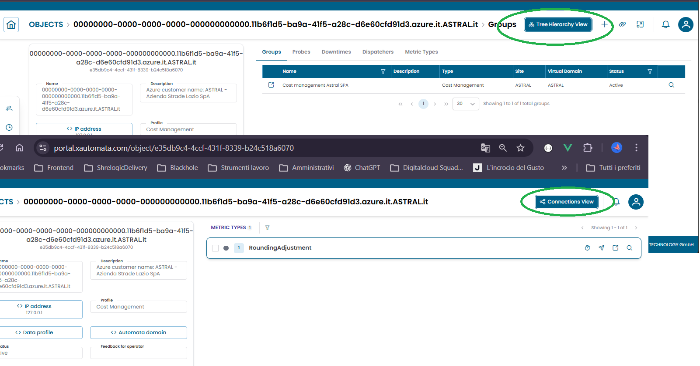

# Lavorare con le Entità

La maggior parte delle sezioni del Data Manager condivide un modello di interazione comune. Capire questo modello una volta sola ti permette di lavorare con qualsiasi entità — Users, Sites, Contacts, Groups, Objects e altre — sempre nello stesso modo.

---

## Flusso di Interazione

Ogni volta che apri una sezione entità dal menu di navigazione, segui la stessa sequenza:

1. **Pre-filter** — restringe i record da caricare
2. **Tabella dei risultati** — sfoglia e seleziona i record
3. **Dialog CRUD** — visualizza, modifica, copia o elimina un record
4. **Connections view** — esplora e gestisci le relazioni con altre entità

---

## Passo 1 — Pre-filter

Quando apri una sezione entità, la piattaforma mostra un **dialog di pre-filter** prima di caricare i record.

Usa questo dialog per definire i criteri di ricerca e limitare il set di risultati. I campi disponibili variano in base al tipo di entità.

Sono disponibili tre pulsanti:

| Pulsante | Azione |
|---|---|
| **CANCEL** | Chiude il dialog senza caricare i record |
| **RESET** | Azzera tutti i campi del filtro |
| **APPLY** | Carica i record corrispondenti ai criteri |

/// caption
Fig.1 — Dialog di pre-filter (esempio: Users) — imposta i criteri prima di caricare i record
///

---

## Passo 2 — Tabella dei Risultati

I record corrispondenti vengono mostrati in una **tabella**. Ogni riga rappresenta un record entità.

La tabella supporta ordinamento, filtraggio per colonna e paginazione.

/// caption
Fig.2 — Tabella dei risultati — ogni riga ha icone di azione a sinistra (link) e a destra (dettaglio)
///

Ogni riga espone due icone di azione:

| Icona | Posizione | Azione |
|---|---|---|
| **Icona link** | Lato sinistro della riga | Apre la **Connections view** per quel record |
| **Icona lente** | Lato destro della riga | Apre il **dialog CRUD** per quel record |

---

## Passo 3 — Dialog CRUD

Clicca sull'**icona della lente** su qualsiasi riga per aprire il **dialog CRUD**.

/// caption
Fig.3 — Dialog CRUD — vista dettaglio con pulsanti di azione nella toolbar
///

La toolbar nella parte superiore del dialog contiene pulsanti con icone, da sinistra a destra:

| Icona | Azione |
|---|---|
| ↗ **Link** | Apre la Connections view per questo record |
| ✏️ **Edit** | Passa alla modalità di modifica e consente di modificare i campi del record |
| ⧉ **Copy** | Duplica il record come nuova voce |
| 🗑 **Delete** | Elimina definitivamente il record |
| ✕ **Close** | Chiude il dialog e torna alla tabella |

!!! warning
    L'eliminazione è immediata e non può essere annullata. Conferma l'azione solo quando sei sicuro.

---

## Passo 4 — Connections View

La **Connections view** ti consente di esplorare e gestire le relazioni di un record con altre entità nella piattaforma.

Puoi raggiungerla in due modi:

- Clicca sull'**icona link** sul lato sinistro di una riga della tabella
- Clicca sull'icona ↗ **Link** nella toolbar del dialog CRUD

/// caption
Fig.4 — Connections view — layout a due pannelli con i dettagli del record a sinistra e le tab delle relazioni a destra
///

La vista è divisa in due pannelli:

**Pannello sinistro — riepilogo del record**

Mostra il record selezionato in modalità di sola lettura. In fondo al pannello, clicca **EDIT INFORMATIONS** per aprire il dialog CRUD completo per quel record.

**Pannello destro — relazioni**

Mostra le relazioni dell'entità organizzate in tab (es. Dashboards, Groups, Virtual Domains, Customers, Widget Groups). Seleziona una tab per sfogliare i record correlati di quel tipo.

Un **breadcrumb** nella parte superiore della vista mostra la tua posizione corrente, ad esempio: `USERS > janzo > Dashboards`.

Le tab disponibili dipendono dal tipo di entità.

---

## Tree Hierarchy View (Objects, Groups, Customers)

Alcune entità — **Objects**, **Groups** e **Customers** — supportano una **Tree hierarchy view** alternativa che mostra la struttura padre-figlio invece di un elenco piatto.

/// caption
Fig.5 — Connections view con il selettore della Tree hierarchy view visibile (Objects, Groups, Customers)
///

**Come accedere alla tree view:**

- Per gli **Objects**: cliccando sull'**icona link** su una riga della tabella si arriva direttamente sulla **Tree hierarchy view**. Il pannello destro mostra le sezioni correlate dell'entità (es. Metric Types, Metrics) invece delle tab. Il pannello sinistro può esporre pulsanti di azione aggiuntivi come **EDIT INFORMATIONS** e **DOWNTIMES**. Usa il pulsante **Connections View** nell'area in alto a destra per tornare alla Connections view standard.
- Per **Groups** e **Customers**: la Connections view mostra un **selettore** nella barra superiore che ti consente di alternare tra la Connections view piatta e la Tree hierarchy view.

Per una spiegazione dettagliata della struttura ad albero e di come navigarla, consulta [Tree Hierarchy View](tree_hierarchy_view.md).
