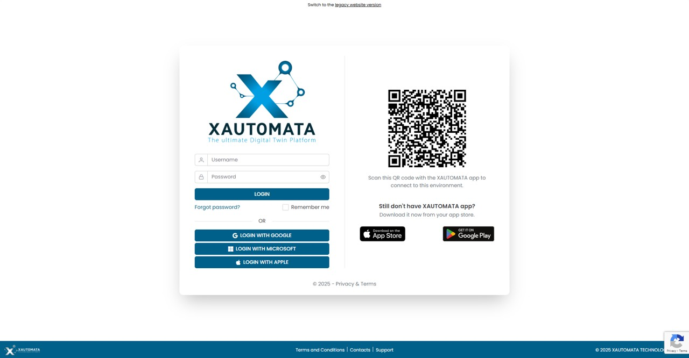

# Accesso

La pagina di login di XAUTOMATA è illustrata nella Fig. 1 qui sotto.  
La pagina è divisa in due sezioni: sul lato sinistro si trova l'interfaccia di login tradizionale,  
mentre sul lato destro vengono mostrati un QR code e l'opzione per scaricare l'app.

/// caption
Fig.1 - Pagina di Login
///

## Log-IN

L'accesso è possibile tramite username e password. In alternativa, puoi accedere  
tramite SSO con account **Google**, **Microsoft** e **Apple**.

In caso di password dimenticata, utilizza il pulsante *Forgot password?*  
per avviare il processo di recupero.

## QR Code

XAUTOMATA ha diverse installazioni. Quando utilizzi l'app per connetterti a XAUTOMATA,  
l'interfaccia di login mostra il portale principale. Se vuoi accedere a un portale XAUTOMATA  
secondario tramite l'app, devi scansionare il QR code generato dal portale dall'interno dell'app.  
In questo modo, l'app aggiornerà l'interfaccia di login al nuovo indirizzo desiderato.
