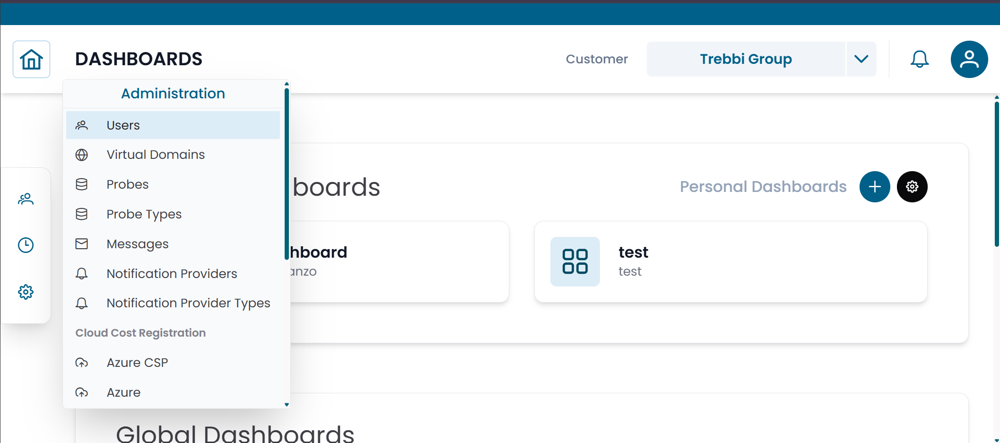
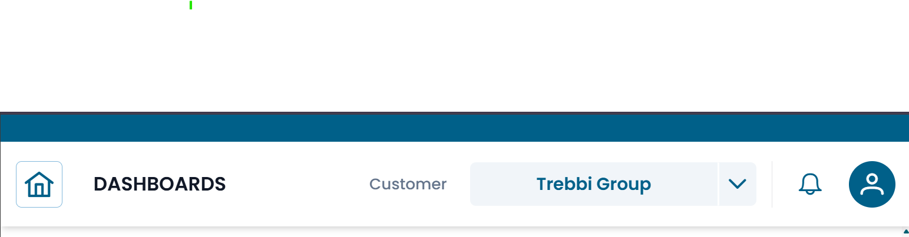
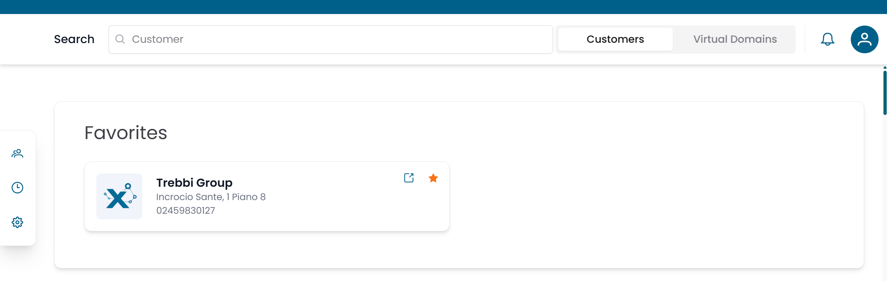

# Navigation

This page describes how the XAUTOMATA interface is organized and how to move between its main sections.

---

## Interface Layout

The interface is composed of three elements:

- a **top bar** — always visible, with navigation controls and user settings
- a **left sidebar** — with the main section menu
- a **content area** — where pages and dashboards are displayed

/// caption
Fig.1 - Main interface layout (screenshot pending)
///

---

## Top Bar

The top bar is always visible at the top of the screen.

/// caption
Fig.2 - Top bar
///

| Element | Position | Description |
|---|---|---|
| **Home** (⌂) | Left | Returns to the home screen from anywhere in the platform |
| **Back** (←) | Left | Navigates back to the previous page |
| **Notifications** (🔔) | Right | Shows system notifications |
| **User** (👤) | Right | Access your profile and log out |

---

## Home Screen

Clicking **Home** brings you to the home screen, which acts as the starting point for customer navigation.

/// caption
Fig.3 - Home screen with customer search (screenshot pending)
///

The home screen displays:

- a **Search** bar — type a customer name to filter the list
- a **Customers / Virtual Domains** switch — toggle between browsing by customer or by virtual domain
- a **Favorites** list — customers you have starred for quick access

Click any customer in the list to open their structure and navigate their infrastructure.

---

## Left Sidebar

The left sidebar is the main navigation menu. Click any section to expand it.

### Customers

The **Customers** section contains the repositories used to model organizations and their monitored infrastructure.

| Subsection | Contents |
|---|---|
| **Client Repository** | Customers, Sites, Contacts |
| **Objects Repository** | Groups, Objects, Metric Types, Metrics, Services |

Use this section to browse the monitored infrastructure, inspect metric data, and manage organizational entities.

### Tracking

The **Tracking** section provides tools to manage operational events and planned activities.

| Page | Purpose |
|---|---|
| Calendars | Define time schedules for monitoring operations |
| Downtimes | Schedule maintenance windows to suppress alerts |
| Dispatchers | Configure automated actions triggered by monitoring events |

### Administration

The **Administration** section contains platform-level configuration tools.

| Page | Purpose |
|---|---|
| Users | Manage user accounts and permissions |
| Virtual Domains | Organize users, groups, and probes into scopes |
| Probes | Manage monitoring agents |
| Probe Types | View available monitoring integration types |
| Messages | Configure notification content templates |
| Notification Providers | Configure external delivery channels |
| Notification Provider Types | View available notification integration types |

!!! note
    Administration pages are only visible to users with the appropriate permissions.
    Super Admin tools are visible only to Super Admin users.

### Sidebar Footer

At the bottom of the sidebar you will find links to **Terms and Conditions**, **Contacts**, and **Support**.

---

## How to Navigate

The typical workflow in the platform follows this pattern:

1. Open the **home screen** to select a customer, or use the **left sidebar** to go directly to a section.
2. Within any section, use the **pre-filter** to search for records, then open them from the results table.
3. Access **dashboards** from the left sidebar under the relevant customer context.

For a detailed explanation of how entity sections work (pre-filter, table, CRUD dialog, connections), see [Working with Entities](../data_manager/working_with_entities.md).

---

## Visibility and Permissions

What you see in the interface depends on your account configuration:

- sections and menu items you do not have access to are hidden or disabled
- dashboards are only shown if your account has visibility over at least one widget they contain
- records within sections are scoped to the customers and groups linked to your account

If you cannot find a section or a dashboard you expect to see, contact your administrator to review your account permissions.
