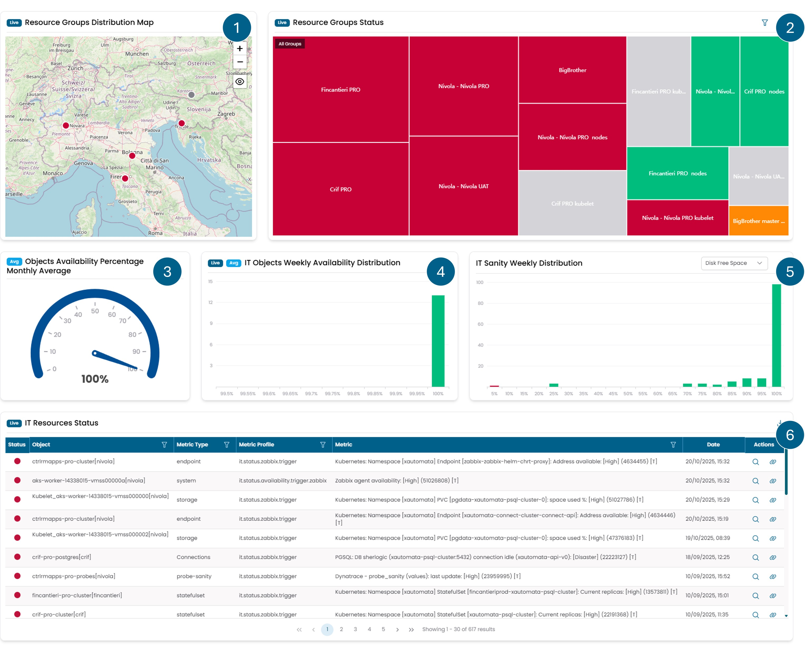

# IT Infrastructure

This page details the content of the **IT Infrastructure** Dashboard. 
It features various widgets that allow users to monitor the functioning 
of the IT infrastructure, from the status of objects to their management 
by automated systems.

[//]: # (link to [login]&#40;Login.md#qr-code&#41;)

/// caption
Fig.1 - IT Infrastructure Dashboard
///