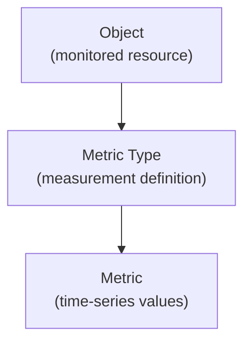

# Metrics

A **Metric** represents the actual monitoring data collected from a monitored resource.

Metrics are time-series measurements associated with a **Metric Type** and produced by monitoring probes.

They represent the real values observed in the system over time.

---

## Relationship with Metric Types

Metrics are always associated with a **Metric Type**, which defines the structure and meaning of the measurement.

The relationship between the entities is therefore:



While **Metric Types** define *what can be measured*, **Metrics** represent *the values that have been measured*.

For example:

| Object | Metric Type | Metric Value |
|------|-------------|--------------|
| Server A | CPU Usage | 62% |
| Server A | CPU Usage | 58% |
| Server A | CPU Usage | 71% |

For a conceptual explanation of this model, see  
[Metrics and Metric Types](metrics_model.md).

---

## Time-Series Data

Metrics are stored as **time-series data**.

Each measurement includes:

- a timestamp
- a value or status
- the metric it belongs to

Example sequence:

```

14:00 → 55%
14:05 → 62%
14:10 → 58%
14:15 → 61%

```

These time-series measurements allow the platform to analyze trends and detect anomalies.

Metrics can represent two main data types:

### Value Metrics

Numerical measurements such as:

- CPU utilization
- network traffic
- latency
- bandwidth usage

These metrics are typically visualized as **time-series charts**.

### Status Metrics

State measurements representing the condition of a service or component.

Examples include:

- service status (OK / Warning / Critical)
- connectivity state
- operational state

These metrics are typically displayed as **tables or status indicators**.

---

## Viewing Metric Data

Metric values can be accessed from the **Tree Hierarchy View**.

Each metric node includes an action button:

**Metric Data**

Selecting this action opens a dialog displaying the historical data for the metric.

Depending on the metric type, the interface shows:

- a **chart** for numerical metrics
- a **table** for status metrics

This dialog allows users to analyze the behavior of the metric over time.

---

## Operational Actions

Metrics support several operational actions that allow administrators to control monitoring behavior.

These include:

- **Downtimes** – temporarily suspend alerts related to the metric
- **Dispatchers** – configure automated responses triggered by metric conditions

The interface also supports **mass operations**, allowing the same configuration to be applied to multiple metrics:

- Massive Downtime
- Massive Dispatcher

These operations are available when multiple metrics are selected.

---

## Connections

Metrics can be linked to additional operational entities through the **Connections View**.

Supported connections include:

- **Services** – associate the metric with a monitored service
- **Downtimes** – schedule maintenance windows
- **Dispatchers** – configure automated actions triggered by metric conditions

These relationships allow metrics to participate in the operational monitoring and automation workflows of the platform.

---

## Role of Metrics in the Platform

Metrics are the fundamental data produced by the monitoring system.

They provide the raw information used to:

- visualize infrastructure performance
- detect anomalies
- monitor service health
- trigger automated actions
- feed dashboards and widgets

All analytical and operational views in the platform ultimately rely on metric data collected from monitored objects.