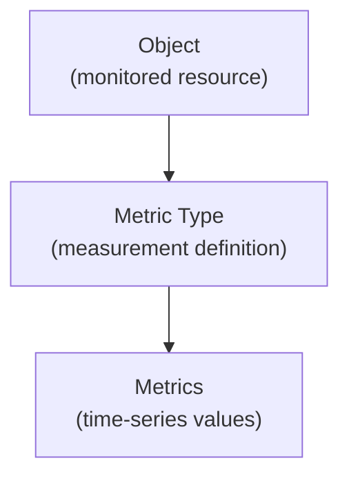

# Metrics and Metric Types

Monitoring in XAUTOMATA is based on a structured model that separates **metric definitions** from **metric values**.

This distinction allows the platform to organize monitoring data consistently across different infrastructure components.

Understanding this structure helps clarify how monitoring data is collected, stored, and visualized in dashboards.

---

## The Monitoring Data Model

Monitoring data follows a hierarchical structure:

Each level of this hierarchy represents a different concept.

### Object

An **Object** represents a monitored infrastructure resource, such as:

- a server
- a network device
- an application service
- a virtual machine

Objects are the entities from which monitoring data is collected.

---

### Metric Type

A **Metric Type** defines a category of measurement associated with an object.

It describes **what kind of data can be collected** from the object.

Examples include:

- CPU usage
- memory consumption
- network latency
- service availability
- traffic volume

An object may have multiple metric types, each representing a different monitoring dimension.

---

### Metrics

A **Metric** represents the actual monitoring data collected over time.

Metrics are **time-series measurements** produced by probes and stored by the platform.

Examples of metric values include:

- CPU usage at 14:05 → 62%
- latency at 14:05 → 12 ms
- service status at 14:05 → OK

These values are continuously collected and stored to allow historical analysis.

---

## How Monitoring Data Is Used

The monitoring data collected through metrics is used throughout the platform.

Typical uses include:

- infrastructure monitoring dashboards
- anomaly detection
- performance analytics
- service availability tracking
- automated actions triggered by dispatchers

Widgets and dashboards visualize the metric data in various formats such as charts, tables, and alerts.

---

## Relationship with the User Interface

In the user interface, the monitoring model appears through several sections:

- **Objects** represent monitored infrastructure resources
- **Metric Types** define the measurements associated with those resources
- **Metrics** represent the collected time-series data

These entities are managed in the **Data Manager** section of the platform.

The collected metrics then feed the **Dashboards** and **Widgets** used for operational monitoring and analysis.

---

## Summary

The monitoring system separates **metric structure** from **metric data**:

| Concept | Description |
|-------|-------------|
| Object | The monitored resource |
| Metric Type | The type of measurement |
| Metric | The actual time-series data |

This structure allows XAUTOMATA to organize monitoring data efficiently and support advanced analytics and automation.