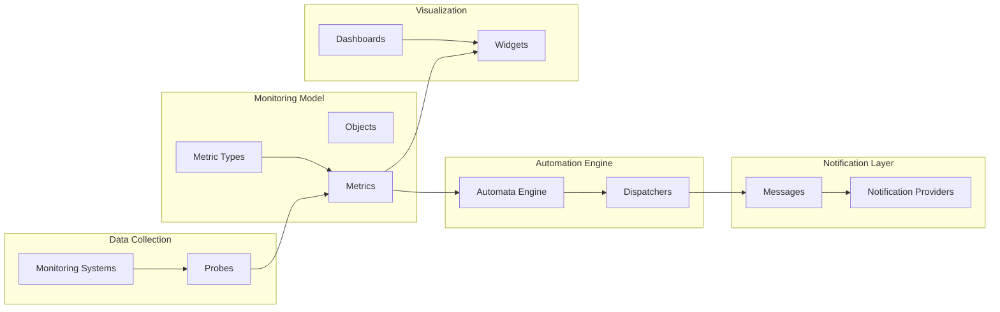

# Monitoring Architecture

The XAUTOMATA monitoring architecture is designed to collect operational data, analyze events, evaluate automation logic, and trigger automated actions.

The platform integrates infrastructure monitoring systems with an automation engine capable of reacting to operational conditions in real time.

The architecture is composed of several logical layers:

- **Data Collection**
- **Monitoring Model**
- **Automation Engine**
- **Action Delivery**
- **Visualization**

---

## Architecture Overview

This architecture separates the responsibilities of monitoring, automation, and visualization.

---

# Data Collection Layer

Monitoring data originates from infrastructure systems.

These may include external monitoring platforms such as:

* Zabbix
* Nagios
* CheckMK
* custom monitoring agents

These systems generate events and measurements describing infrastructure behavior.

### Probes

**Probes** are the agents responsible for collecting monitoring data.

A probe:

* executes monitoring logic defined by a **Probe Type**
* collects measurements from infrastructure resources
* sends the collected metrics to the platform

Probes therefore act as the bridge between the monitored infrastructure and the platform.

---

# Monitoring Model

Once collected, monitoring data is stored and organized according to the platform data model.

The monitoring model is built around several entities.

### Objects

Objects represent monitored resources such as:

* servers
* applications
* network devices
* infrastructure components

Objects are organized in hierarchical structures within the infrastructure model.

### Metric Types

Metric Types define the structure and meaning of monitoring measurements.

Examples include:

* CPU usage
* memory consumption
* response time
* network throughput

### Metrics

Metrics store the actual **time-series measurements** collected by probes.

Each metric is associated with:

* an object
* a metric type
* a timestamped value

These metrics represent the primary operational data of the platform.

---

# Automation Engine

The **automation engine** is the core component that differentiates XAUTOMATA from traditional monitoring platforms.

Instead of simply visualizing alerts, the platform evaluates events using **finite state machines (automata)**.

### Automata

Automata define operational logic using:

* states
* transitions
* triggering conditions

This allows the platform to react not only to isolated alerts but also to patterns of events over time.

When a transition occurs, the system can trigger automated operational responses.

### Dispatchers

**Dispatchers** connect automata transitions to operational actions.

A dispatcher defines:

* when an action should be triggered
* which message template should be used
* which notification provider should deliver the message
* the calendar controlling the action

Dispatchers therefore act as the **routing layer** between automation logic and external communication.

---

# Notification Layer

Once a dispatcher is triggered, the platform generates a notification or action.

### Messages

Messages define the **content template** used when sending notifications or interacting with external systems.

Messages can be written in different formats:

* HTML
* JSON
* plain text

They may include dynamic variables extracted from the monitoring context.

### Notification Providers

Notification Providers define the delivery mechanism used to send messages.

These providers may integrate with:

* email systems
* messaging platforms
* ticketing systems
* automation scripts
* external APIs

This layer enables the platform to interact with external operational systems.

---

# Visualization Layer

The final layer of the architecture provides operational visibility through the user interface.

### Widgets

Widgets are individual visualization components that display monitoring information such as:

* charts
* tables
* anomaly reports
* cost breakdowns

### Dashboards

Dashboards aggregate multiple widgets into operational views.

They allow users to monitor infrastructure health, detect incidents, and analyze trends.

---

# Architectural Principles

The monitoring architecture of XAUTOMATA is built around several key principles.

### Separation of Concerns

The platform separates:

* monitoring data collection
* automation logic
* action delivery
* visualization

This allows each layer to evolve independently.

### Event-Driven Automation

Operational logic is driven by events rather than static alerts.

Automata evaluate system state and determine the appropriate operational response.

### Integration with External Systems

The platform is designed to integrate with existing monitoring tools and operational systems rather than replacing them.

This makes XAUTOMATA suitable for complex environments where multiple monitoring solutions are already in place.

---

# Summary

The XAUTOMATA architecture transforms monitoring data into automated operational actions.

Raw infrastructure data flows through a pipeline that includes:

* monitoring collection
* data modeling
* automation logic
* action delivery
* visualization

This architecture allows organizations to move beyond passive monitoring and toward **automated operational management**.