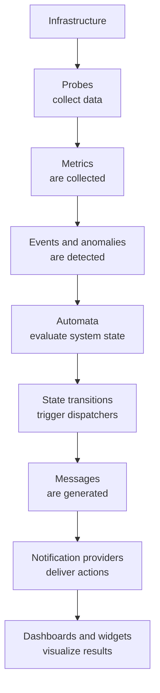

# Monitoring Lifecycle

XAUTOMATA continuously collects, processes, and analyzes monitoring data in order to provide operational visibility and automation capabilities.

Understanding how monitoring data flows through the platform helps users interpret dashboards, alerts, and automated actions.

---

## Monitoring Flow

The monitoring system follows a structured lifecycle.

Each stage of this process contributes to transforming raw infrastructure data into operational insights and automated operational responses.

---

## Metrics Collection

Monitoring begins with **Probes**, which collect measurements from infrastructure components such as servers, applications, and network devices.

These measurements are stored as **Metrics**, which represent time-series data associated with specific infrastructure objects.

Metric Types define the meaning and structure of these measurements.

Examples include:

* CPU usage
* network latency
* service availability
* traffic volume

---

## Event Detection

As metrics are collected, the platform continuously analyzes the incoming data.

This analysis can identify:

* anomalies
* threshold violations
* abnormal patterns
* operational incidents

These conditions generate monitoring events that may require attention.

---

## Automata Evaluation

Monitoring events are processed by the **XAUTOMATA automation engine**, which is based on **finite state machines**.

Automata define operational logic through:

* states
* transitions
* triggering conditions
* automation actions

Instead of reacting to isolated alerts, the platform evaluates events within the context of the current automaton state.

This allows the system to detect complex operational situations and respond consistently.

---

## Dispatchers and Actions

When an automaton transition occurs, the platform can trigger automated actions through **Dispatchers**.

Dispatchers connect events and state transitions to operational actions.

Typical actions include:

* sending notifications
* opening tickets in external ITSM systems
* triggering automation scripts
* invoking external APIs

---

## Message Generation

Dispatchers use **Message templates** to generate the content of notifications or external requests.

Messages are dynamic templates that may include contextual variables from the monitored environment.

These templates can be formatted as:

* HTML
* JSON
* Text

The generated messages are then delivered by **Notification Providers**.

---

## Downtimes

During planned maintenance or infrastructure changes, administrators may temporarily suspend monitoring alerts using **Downtimes**.

Downtimes prevent alerts from being triggered during known operational activities, such as upgrades or maintenance windows.

Monitoring data continues to be collected even while alerts are suppressed.

---

## Visualization

The processed monitoring data and automation results are presented through:

* **Dashboards**
* **Widgets**
* **Reports**

These visual components allow users to monitor infrastructure health, detect issues, and analyze historical trends.

---

## Operational Insight

By combining monitoring data, automation logic, and operational integrations, XAUTOMATA transforms infrastructure events into actionable operations.

This lifecycle allows organizations not only to observe infrastructure behavior but also to **automatically react to operational conditions in real time**.