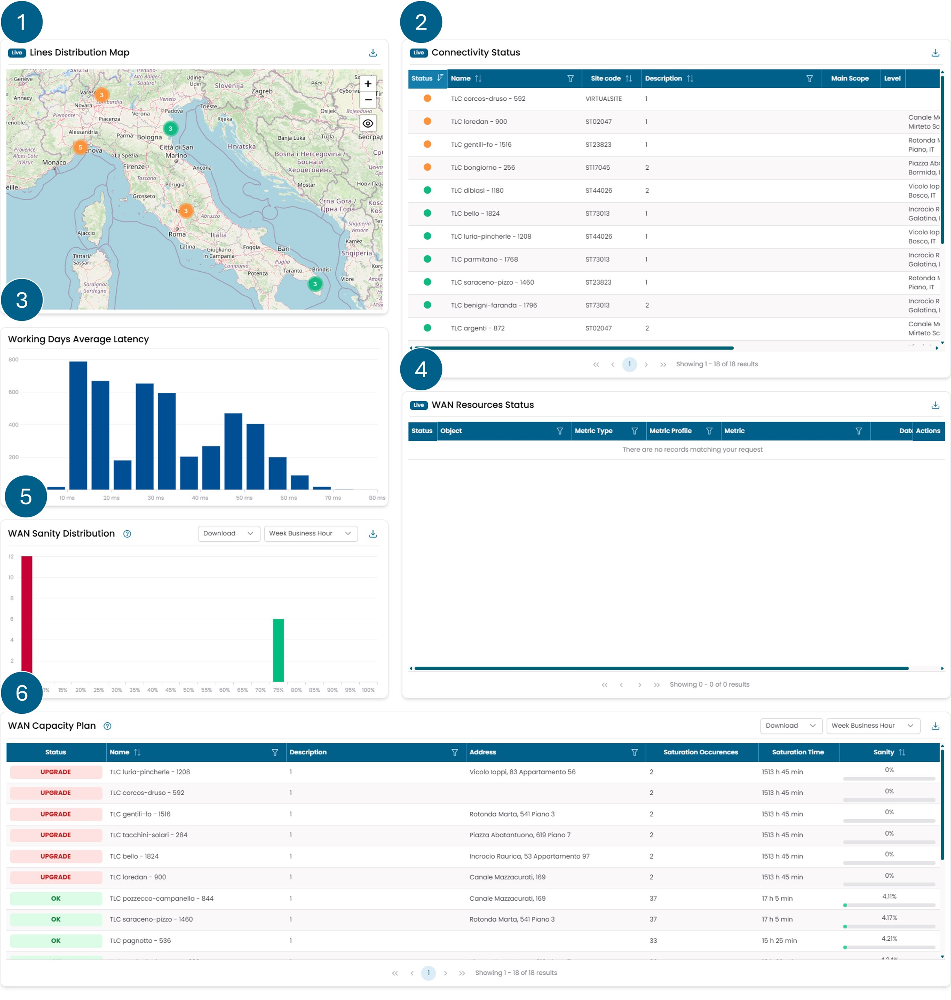

# Network

This page details the content of the **Network** Dashboard. 
It features various widgets that allow users to monitor the functioning 
of the network, from the status of objects to their management 
by automated systems.

/// caption
Fig.1 - Network Dashboard
///

The widgets available on this dashboard are as follows:

1. [Lines Distribution Map](widget_network.md#lines-distribution-map)
2. [Connectivity Status](widget_network.md#connectivity-status)
3. [Working Days Average Latency](widget_network.md#working-days-average-latency)
4. [WAN Resources Status](widget_network.md#wan-resources-status)
5. [WAN Sanity Distribution](widget_network_analytics.md#wan-sanity-distribution)
6. [WAN Capacity Plan](widget_network_analytics.md#wan-capacity-plan)
