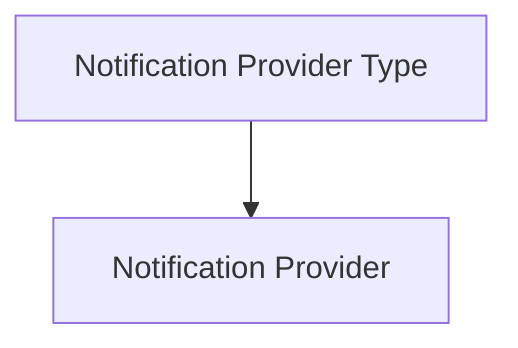
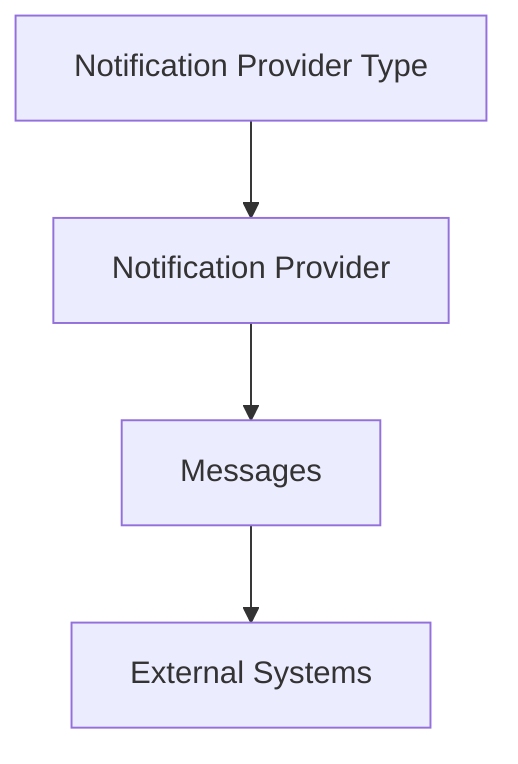

# Notification Provider Types

The **Notification Provider Types** entity defines the available types of notification integrations supported by the platform.

A notification provider type describes **how a notification system can be configured** and defines the structure of the configuration required to connect to external systems.

Examples of notification provider types may include:

- email
- webhook
- ticketing systems
- messaging platforms
- custom automation endpoints

---

## Accessing the Notification Provider Types Section

Notification provider types can be managed from:

---

## Provider Type Definition

Each notification provider type includes two main elements.

| Field           | Description                                                                    |
| --------------- | ------------------------------------------------------------------------------ |
| **Code**        | Unique identifier of the provider type                                         |
| **JSON Schema** | Defines the structure of the configuration required for providers of this type |

The **JSON schema** describes the parameters required to configure a notification provider.

These parameters may include:

* server addresses
* authentication credentials
* API endpoints
* tokens or keys
* configuration options specific to the external system

This mechanism allows the platform to support different types of integrations in a flexible and extensible way.

---

## Relationship with Notification Providers

Notification provider types act as **templates** for notification providers.

Each provider is created using a specific provider type.

A provider type defines the configuration structure, while individual providers store the actual configuration values.

---

## Role in the Notification Architecture

Notification providers are used by the automation system to send messages to external systems.

The overall relationship can be summarized as:

In this architecture:

* **Notification Provider Types** define the configuration schema.
* **Notification Providers** store concrete connection configurations.
* **Messages** define the notification content.
* **External Systems** receive the final notification or automation action.

---

Notification provider types therefore provide the **extensibility layer** of the notification system, enabling the platform to integrate with different communication channels and external services.