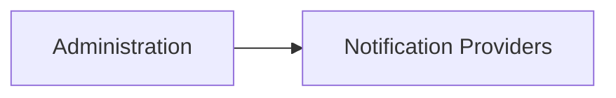
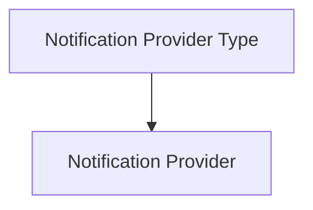
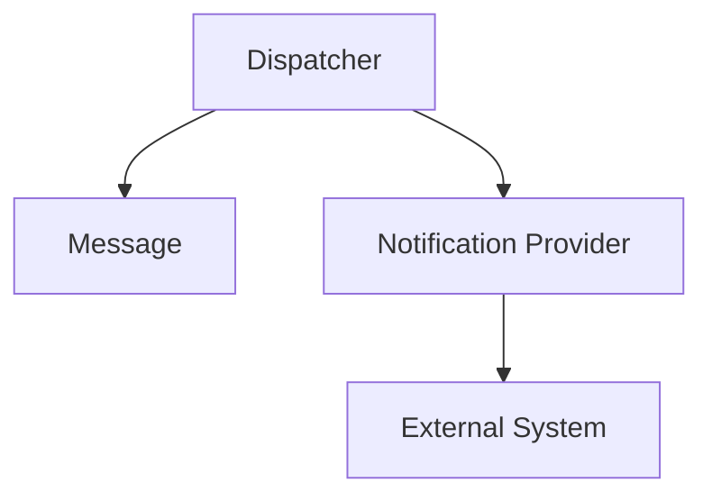

# Notification Providers

The **Notification Providers** entity represents the concrete communication channels used by XAUTOMATA to deliver notifications and external actions.

A notification provider stores the actual configuration required to connect the platform to an external system.

Typical examples may include:

- email gateways
- webhook endpoints
- ticketing platforms
- messaging systems
- custom API integrations

While **Notification Provider Types** define the structure of a provider configuration, **Notification Providers** store the actual connection details.

---

## Accessing the Notification Providers Section

Notification providers can be managed from:

---

## Provider Configuration

Each notification provider includes the following main fields.

| Field                          | Description                                             |
| ------------------------------ | ------------------------------------------------------- |
| **Application Name**           | Human-readable name of the provider                     |
| **Endpoint**                   | JSON configuration containing the connection parameters |
| **Notification Provider Type** | The provider type used as configuration template        |

The **endpoint** field contains the actual configuration data needed to communicate with the external system.

Depending on the provider type, this may include:

* server addresses
* API URLs
* authentication credentials
* tokens
* integration-specific configuration

---

## Relationship with Notification Provider Types

Each notification provider is based on a **Notification Provider Type**.

The type defines the expected configuration schema, while the provider stores the actual values.

This allows the platform to support multiple concrete providers based on the same integration model.

For example:

* multiple email providers
* multiple webhook endpoints
* multiple ticketing integrations

---

## Relationship with Dispatchers

Notification providers are connected to **Dispatchers**.

A dispatcher uses a provider to deliver the message generated by the automation system.

In this model:

* the **dispatcher** defines when the action should happen
* the **message** defines the content
* the **notification provider** defines how and where the content is delivered

---

## Connections View

The **Connections View** for a notification provider shows the **Dispatchers** associated with it.

This allows administrators to inspect which automation rules are using the selected provider.

When creating a dispatcher from this context, the provider reference is pre-filled automatically.

This makes it easier to configure dispatchers starting from the communication channel they should use.

---

## Role in the Platform

Notification providers are the delivery layer of the XAUTOMATA automation system.

They enable the platform to transform internal automation results into real external actions, such as:

* sending emails
* opening tickets
* calling APIs
* forwarding alerts to external platforms

Together with **Messages**, **Dispatchers**, and **Notification Provider Types**, they form the communication and action layer of the platform.