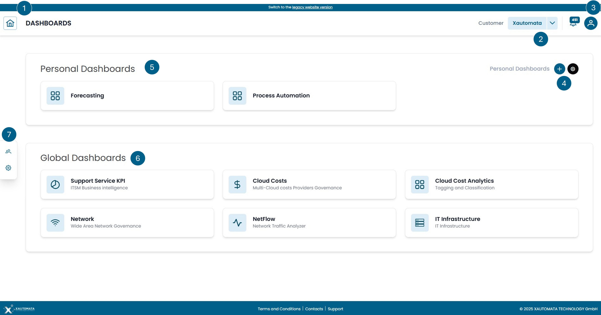

# Overview

Figure 1 shows the page that appears immediately after logging in. This page features a series of menus for interaction:

1. Home menu to return to this screen while navigating the portal.
2. By clicking on the customer's name, you can access a view dedicated to the customer's assets and how they are logically organized within Xautomata.
3. User profile.
4. Create new empty private dashboards to be filled with selected widgets.
5. List of Private Dashboards. By Clicking on one of the Dashboards on this list you access the specific Dashboard.
6. List of Default Dashboards. By Clicking on one of the Default Dashboards you access one of the Dashboard among:

      1. **Suport Service KPI**: Dashboard dedicated to the visualization and management of tickets for the various ITSM integrated into the service.
      2. **Cloud Costs**: Dashboard dedicated to visualizing cloud costs for the major cloud providers.
      3. **Cloud Cost Analytics**: Dashboard dedicated to analytical accounting, where it is possible to organize cloud costs according to their tags.
      4. **Network**: Dashboard dedicated to visualizing information about internet networks.
      5. **NetFlow**: Dashboard dedicated to visualizing NetFlow information of a network, with detailed traffic management data.
      6. **IT Infrastructure**: Dashboard dedicated to visualizing information about the IT infrastructure.

7. Customer/Administrator/Dispatcher menu.

> **NOTE** Not all dashboards are always visible; it depends on whether the user logged into the portal has visibility of the
> widgets contained within a dashboard. If none of the widgets in a dashboard are visible to that user, 
> the dashboard itself will not be displayed on the interface. The visibility of widgets depends on the type 
> of data collected by XAUTOMATA to manage digitized processes and the type of contract in place.

/// caption
Fig.1 - Dashboard Navigation
///