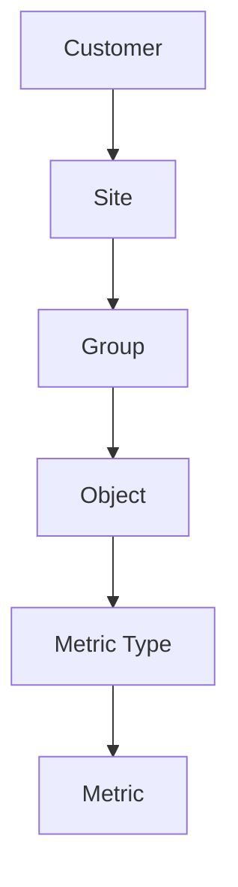
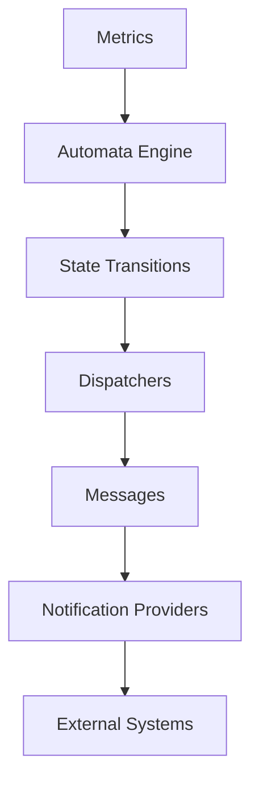
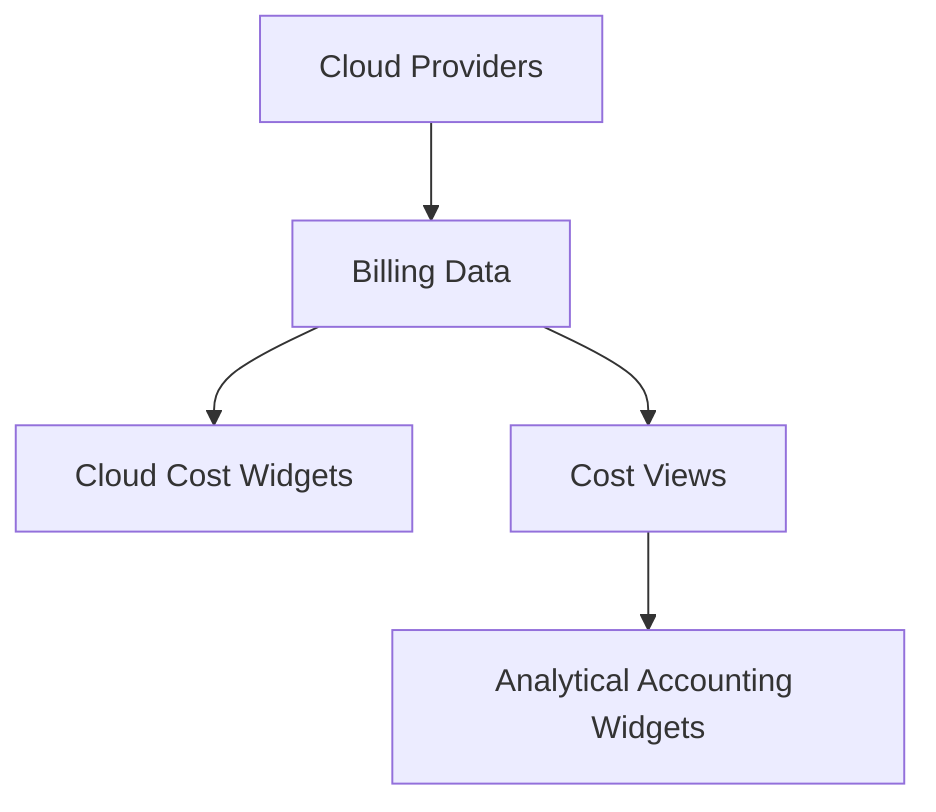

# Platform Models

XAUTOMATA organizes its functionality around a set of conceptual models that describe how the platform represents infrastructure, processes monitoring data, and executes automated actions.

Understanding these models helps interpret the structure of the platform and the role of the various entities exposed in the user interface.

The platform can be understood through three main models:

- **Infrastructure Model**
- **Automation Model**
- **Cost Governance Model**

Each model represents a different aspect of the system.

---

## Infrastructure Model (Digital Twin)

XAUTOMATA builds a **Digital Twin** of the monitored environment.  
This digital representation mirrors the structure of the real infrastructure and allows the platform to analyze its operational state.

The infrastructure is represented through a hierarchical set of entities.

In this structure:

* **Customers** represent monitored organizations.
* **Sites** represent locations or environments.
* **Groups** organize infrastructure components.
* **Objects** represent monitored resources such as servers, services, or devices.
* **Metric Types** define measurement structures.
* **Metrics** store the time-series data collected from monitoring systems.

This hierarchy forms the **structural model of the monitored infrastructure**.

---

## Automation Model

Once monitoring data is collected, XAUTOMATA evaluates system state using its automation engine.

The automation layer processes monitoring data and triggers actions when specific conditions are met.

In this model:

* **Metrics** provide the input data.
* The **Automata Engine** evaluates the system state.
* **State transitions** determine when automation rules are triggered.
* **Dispatchers** define when and how actions should occur.
* **Messages** define the content of the notification.
* **Notification Providers** deliver the message to external systems.

External systems may include:

* ticketing platforms
* messaging systems
* email gateways
* automation APIs
* custom integrations

---

## Cost Governance Model

XAUTOMATA also supports financial monitoring and cloud cost governance.

Cloud billing data is imported from external providers and analyzed through specialized dashboards and widgets.

In this model:

* **Cloud Providers** generate billing data.
* The platform imports and stores this data.
* **Cloud Cost widgets** analyze raw billing data.
* **Cost Views** reorganize costs according to organizational structures.
* **Analytical Accounting widgets** provide financial insights and reporting.

This enables organizations to monitor cloud spending and optimize resource usage.

---

## How the Models Work Together

These models operate together to provide a complete operational view of the monitored environment.

* The **Infrastructure Model** represents the system structure.
* The **Automation Model** reacts to operational events and executes automated actions.
* The **Cost Governance Model** provides financial visibility over cloud resources.

Together, they form the conceptual foundation of the XAUTOMATA platform.
