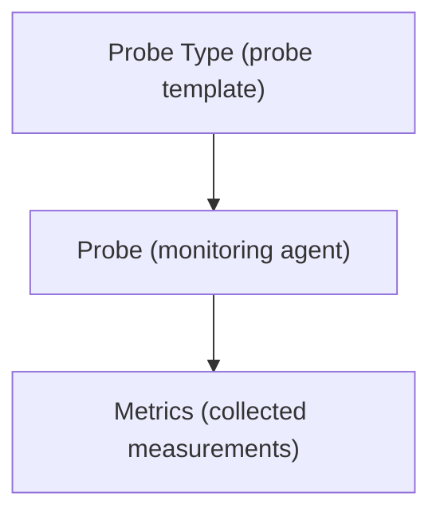

# Probe Types

A **Probe Type** defines the type of monitoring probe used to collect data from infrastructure resources.

Probe types describe the software agent or integration mechanism responsible for retrieving monitoring information.

Each probe created in the platform must belong to a probe type.

---

## Purpose of Probe Types

Probe types define **how monitoring data is collected**.

They identify the monitoring technology or integration used to retrieve metrics from infrastructure systems.

Examples of probe types may include:

- system monitoring agents
- network monitoring probes
- application monitoring collectors
- cloud monitoring integrations

By defining probe types separately from probes, the platform allows multiple probes to share the same monitoring logic.

---

## Probe Type Configuration

A probe type includes a minimal set of configuration properties.

Typical fields include:

- **Code** – short identifier of the probe type
- **Name** – descriptive name of the monitoring integration
- **Endpoint** – JSON configuration defining the communication parameters

The **endpoint** configuration contains the technical details used by the platform to interact with the probe.

---

## Relationship with Probes

Probe types act as templates for probes.

Each probe must reference a probe type that defines how it operates.

The relationship can be summarized as:

Multiple probes can use the same probe type, allowing consistent monitoring configurations across the infrastructure.

---

## Managing Probe Types

The Probe Types interface follows the standard entity interaction model described in  
[Working with Entities](working_with_entities.md).

Users can:

- view the list of probe types
- edit their configuration
- inspect related probes

The **Connections View** shows all probes that use the selected probe type.

---

## Role of Probe Types in the Platform

Probe types represent the monitoring technologies supported by the platform.

They define the mechanism through which infrastructure data is collected and transformed into metrics.

Together with probes, metric types, and metrics, probe types form the foundation of the monitoring architecture used by XAUTOMATA.