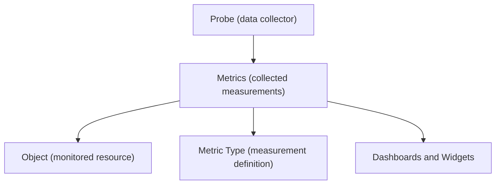

# Probes

A **Probe** is the component responsible for collecting monitoring data from infrastructure resources.

Probes act as the interface between the monitored environment and the XAUTOMATA platform.

They gather measurements from systems and services and send the collected data to the platform, where it is stored as **metrics**.

---

## Role of Probes in the Monitoring Architecture

In the monitoring workflow, probes represent the source of monitoring data.

Probes continuously collect information from the monitored infrastructure and transmit the results to the platform for analysis and visualization.

---

## Probe Configuration

Each probe is associated with several configuration elements that define how it operates.

Typical probe configuration fields include:

- **Name** – identifier of the probe
- **Description** – optional description
- **Probe Type** – defines the software agent or collection method used
- **Object** – the monitored infrastructure resource
- **Virtual Domain** – the operational domain in which the probe runs
- **Data Profile** – JSON configuration describing the probe behavior
- **Status** – operational state (Active, Disabled, Maintenance)
- **Notes** – additional information

The **Data Profile** field contains the technical configuration required for the probe to operate.

---

## Probe Status and Health

The interface displays operational information that helps administrators monitor the health of probes.

Important indicators include:

- **Severity** – indicates the current operational condition
- **Last Seen** – timestamp of the most recent communication with the platform
- **Ingest Frequency** – expected interval between data updates

These values help identify probes that may be offline or experiencing issues.

---

## Probe Types

Each probe belongs to a **Probe Type**, which defines the type of monitoring performed.

Examples of probe types may include:

- system monitoring agents
- network monitoring probes
- application monitoring collectors
- cloud monitoring integrations

Probe types determine how the probe collects data and which metrics it produces.

---

## Relationship with Objects

Probes are associated with infrastructure **Objects**.

The object represents the monitored resource, while the probe represents the **data collection mechanism**.

For example:

| Object | Probe |
|------|------|
| Server A | System monitoring agent |
| Router B | Network probe |
| Application C | Application monitoring agent |

This separation allows multiple probes to collect different types of data from the same object.

---

## Connections

From the **Connections View**, probes can be linked to infrastructure objects.

This allows administrators to associate probes with the resources they monitor.

The connection interface allows users to:

- link a probe to additional objects
- remove existing associations

---

## Probe Logs

Each probe provides access to a **logs view** that records operational events and messages generated by the probe.

These logs help administrators diagnose issues such as:

- connectivity problems
- configuration errors
- data ingestion failures

The logs view provides visibility into the probe’s operational activity.

---

## Role of Probes in the Platform

Probes are the primary source of monitoring data in XAUTOMATA.

They collect measurements from infrastructure resources and transmit them to the platform, where the data is processed as metrics.

This information powers the monitoring dashboards, analytics widgets, and automation features used to manage infrastructure performance and reliability.