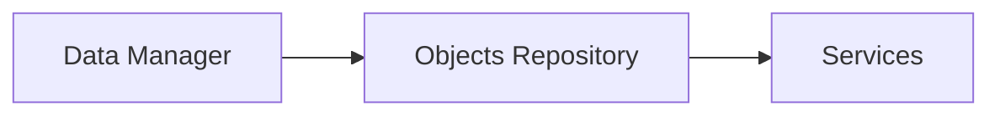

# Services

The **Services** entity represents logical service definitions used by the platform to organize monitored behavior and service-level monitoring.

Services can be associated with customers and may also be organized hierarchically through parent-child relationships.

They provide a logical layer above raw infrastructure monitoring, allowing the platform to aggregate and interpret monitoring data in terms of business or operational services.

---

## Accessing the Services Section

Services are managed from:

When opening the section, the interface displays a **pre-filter dialog** that allows users to define the records to be shown in the table.

---

## Service Filters

The filter dialog includes the following fields:

| Field          | Description                          |
| -------------- | ------------------------------------ |
| Name           | Service name                         |
| Description    | Service description                  |
| Profile        | Service profile                      |
| Customer       | Customer associated with the service |
| Service parent | Parent service in the hierarchy      |
| Status         | Service state                        |
| UUID           | Direct lookup by unique identifier   |

By default, the section shows **active** services.

---

## Services Table

After applying the filters, the system displays the matching services in a table.

Typical columns include:

| Column      | Description         |
| ----------- | ------------------- |
| Name        | Service name        |
| Description | Service description |
| Profile     | Service profile     |
| Status      | Service state       |

Additional fields such as **Customer** and **Service Parent** are available as filters and may be shown in expanded views.

Each row provides access to:

* the **Connections View** (left icon)
* the **CRUD dialog** (magnifier icon)

The table also supports multi-selection, enabling **massive operations** on multiple services.

---

## Service Details

Opening a service record shows the **CRUD dialog**.

Typical fields include:

| Field          | Description                                           |
| -------------- | ----------------------------------------------------- |
| Name           | Name of the service                                   |
| Description    | Description of the service                            |
| Profile        | Service classification                                |
| Rule           | JSON configuration used by the service                |
| Customer       | Customer associated with the service                  |
| Service parent | Parent service, if the service belongs to a hierarchy |
| Status         | Active, Disabled, or Maintenance                      |
| Automata       | JSON configuration related to service logic           |

From this dialog users can:

* edit the service
* duplicate the service
* delete the service

The fields **Rule** and **Automata** are JSON-based configuration fields used internally by the service model.

---

## Service Actions

Service records expose additional operational actions.

These include:

* **Show Service Data** – opens a detail view showing the service data
* **Downtimes** – opens the service downtime management dialog

In list and hierarchy contexts, services also support:

* **Dispatchers**
* **Massive Downtime**
* **Massive Dispatcher**
* **Multi-services data**

These actions allow services to participate directly in operational monitoring workflows. 

---

## Connections View

Selecting the **Link** icon opens the **Connections View** for the service.

This is the default structural landing page for services.

The page shows:

* an information panel on the left
* a tabbed relational area on the right

Available tabs include:

* **Metrics**
* **Downtimes**
* **Dispatchers**
* **Services**

### Metrics

The **Metrics** tab shows the metrics associated with the selected service.

Typical columns include:

* Name
* Description
* Profile
* Metric Type
* Status

This relationship allows service-level monitoring to be linked to the underlying metric data.

The metrics list also includes an action to open **Metric Data** directly from the service context. 

### Downtimes

The **Downtimes** tab shows the maintenance windows associated with the service.

These records allow administrators to suspend alerts for the service during planned operations.

### Dispatchers

The **Dispatchers** tab shows the automated actions linked to the service.

These relationships allow the platform to trigger workflows or notifications based on service behavior.

### Services

The **Services** tab shows the child services linked to the selected parent service.

This confirms that services can be organized in a hierarchy.

New child services can be created directly in this context with the parent relation pre-filled. 

---

## Tree Hierarchy View

From the service page, users can switch to the **Tree Hierarchy View**.

In this view, services are displayed as a hierarchy of child services.

This allows users to explore recursive service structures when services are organized as nested logical components.

Unlike many infrastructure entities, the service structure starts from the service itself and expands through **child services** rather than objects or metrics.

More details are available in [Tree Hierarchy View](tree_hierarchy_view.md).

---

## Service Data

Services support a dedicated **Service Data** view.

This view provides a service-oriented analytical representation of the data associated with the selected service.

From the interface, this feature is available through the **Show Service Data** button.

When multiple services are selected, the platform also supports a **multi-services data** action for comparative analysis.

---

## Role of Services in the Platform

Services provide a logical monitoring layer that sits above infrastructure objects and metrics.

They are used to:

* represent business or operational services
* aggregate monitoring information
* link metrics to service-level monitoring
* apply downtimes and dispatchers at service level
* build hierarchical service structures

This makes services especially useful when monitoring needs to reflect not only infrastructure resources, but also higher-level operational or business concepts.