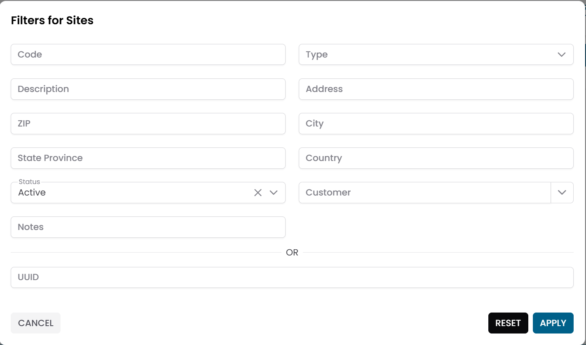
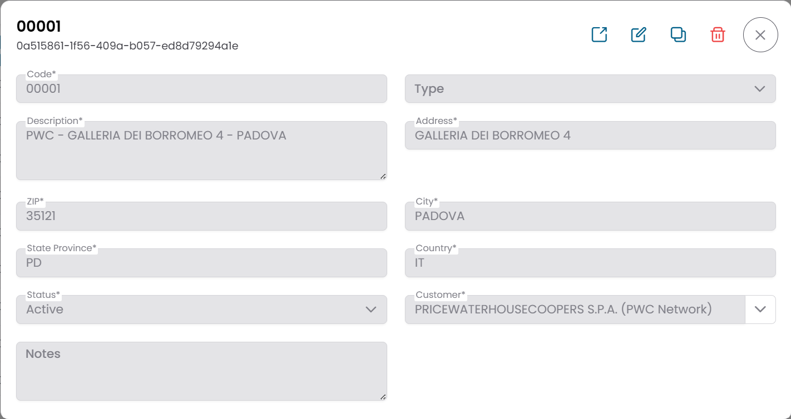

# Sites

The **Sites** entity represents physical or logical locations associated with a customer.

A site typically corresponds to a branch office, data center, or operational location where monitored infrastructure is deployed.

Sites are used to organize infrastructure components geographically and to associate monitoring data with a specific location.

---

## Entity Interaction Model

Sites follow the standard entity interaction model described in  
[Working with Entities](working_with_entities.md).

This means that the interface includes:

- a **pre-filter** used to search for records
- a **table view** displaying the matching sites
- a **CRUD dialog** for viewing and editing site details
- a **Connections View** used to explore related entities

---

## Pre-filter

When opening the **Sites** section, the interface first displays a filter dialog that allows users to define the criteria used to retrieve site records.

Typical filter fields include:

- Code
- Type
- Description
- Address
- ZIP
- City
- State Province
- Country
- Status
- Customer
- Notes
- UUID

After clicking **Apply**, the system loads the matching records into the results table.

---

## Sites Table

The results are displayed in a table where each row represents a site.

Typical columns include:

- Code
- Description
- ZIP Code
- City
- Status

Each row provides quick access to actions such as:

- opening the site details
- accessing related entities

---

## Site Details (CRUD Dialog)

Selecting a site opens the **CRUD dialog**, which displays the full set of site information.

Fields typically include:

- **Code** – unique identifier of the site
- **Type** – classification of the site (for example Branch)
- **Description** – name or description of the location
- **Address**
- **ZIP**
- **City**
- **State Province**
- **Country**
- **Status** – Active or Disabled
- **Customer** – the organization the site belongs to
- **Notes**

From this dialog users can:

- edit the site information
- duplicate the site
- delete the site

---

## Site Structure View

Selecting the **Link** icon for a site opens the site structure page.

This page contains:

- a **site information panel** on the left
- a **hierarchical navigation area** on the right

The hierarchical area displays the infrastructure entities associated with the site in a descending structure.

Typical levels include:

- Groups
- Objects
- Metric Types
- Metrics

Users can explore the hierarchy progressively to understand how the monitored infrastructure is organized under the selected site.

More details are available in [Tree Hierarchy View](tree_hierarchy_view.md).

## Connections View

From the site structure page, users can switch to the **Connections View**.

This view displays lateral relationships between the site and other entities.

Sites can be connected to:

- **Groups**
- **Contacts**

These relationships are used to associate infrastructure and organizational information with the selected site.

---

## Role of Sites in the Platform

Sites play an important role in structuring infrastructure data.

They are commonly used to:

- organize monitored objects geographically
- associate infrastructure groups with a physical location
- provide context for monitoring and operational dashboards

By structuring infrastructure by site, XAUTOMATA can provide clearer visibility into the operational status of distributed environments.