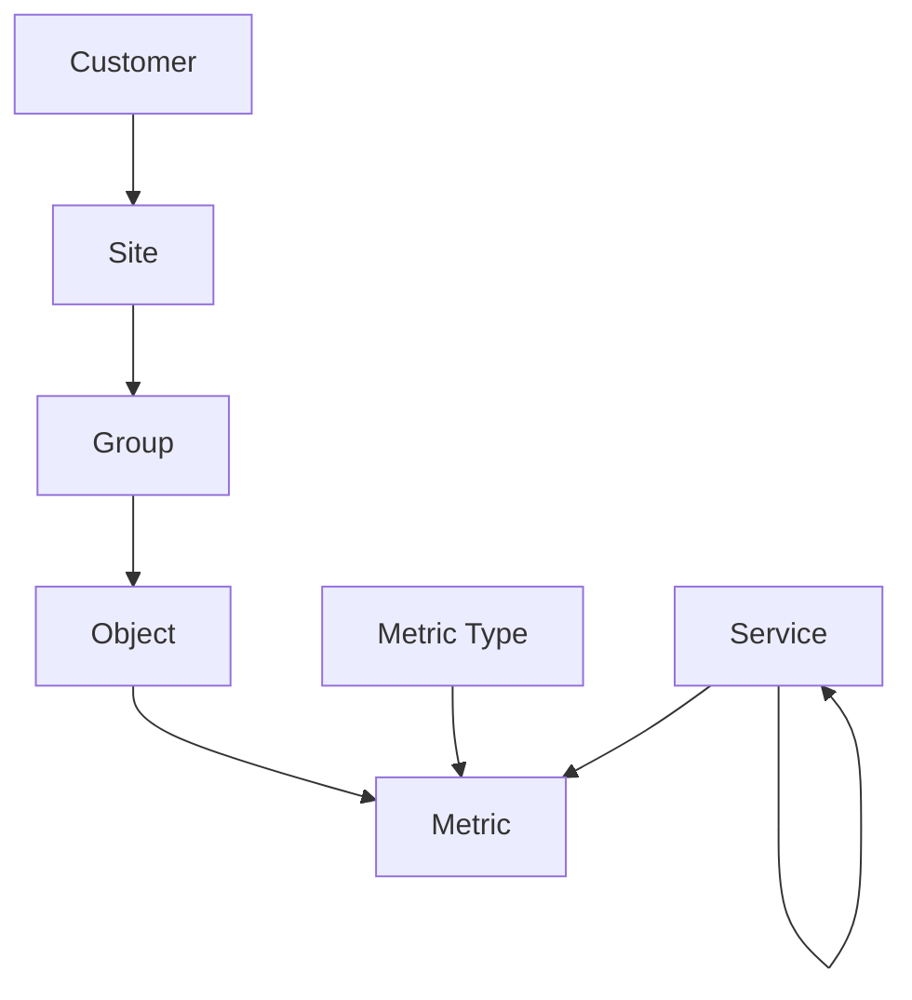
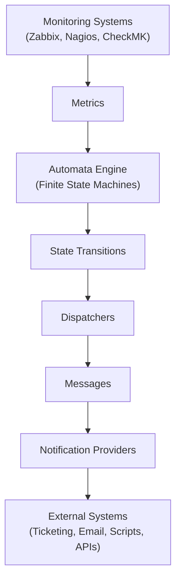
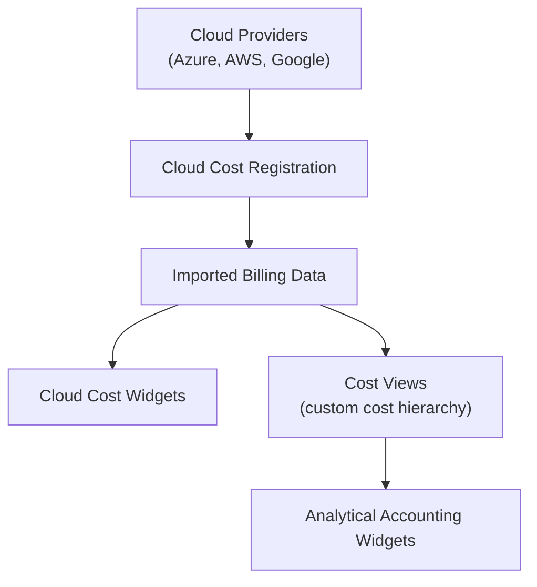
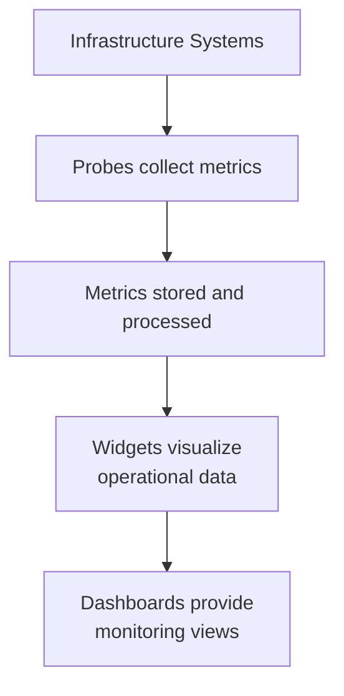
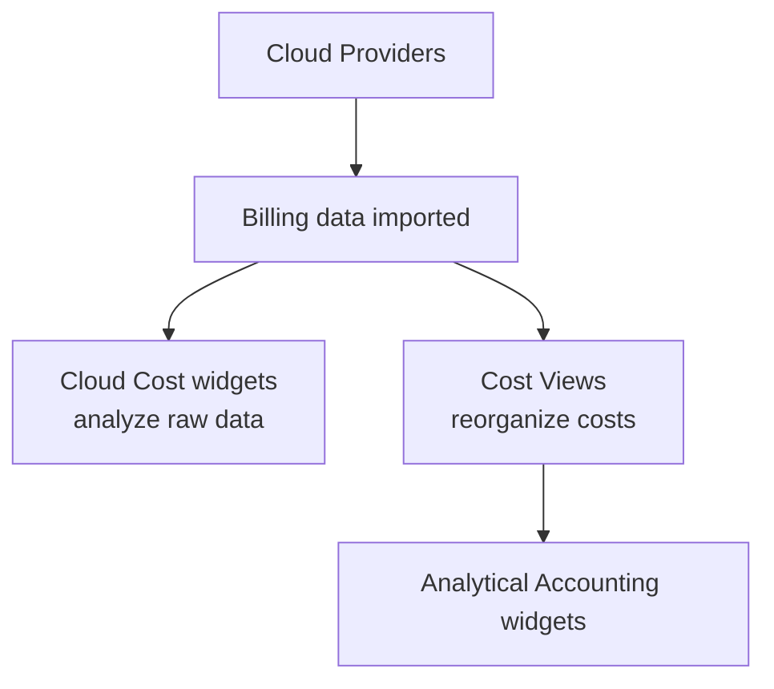

# System Overview

XAUTOMATA is a platform designed to monitor, analyze, and automate complex infrastructures and services.

The system organizes data through a set of interconnected entities that represent customers, infrastructure objects, metrics, costs, and operational configurations.

These entities feed the platform’s dashboards and widgets, which provide operational and analytical insights.

The platform models monitored infrastructures as a Digital Twin, where each entity represents a component of the real system and its operational state.

## Core Concepts

At its core, XAUTOMATA models the monitored environment as a set of hierarchical entities.

* **Customers** represent organizations monitored by the platform.
* **Sites** describe physical or logical locations.
* **Groups** organize infrastructure components.
* **Objects** represent monitored resources such as servers, services, or devices.
* **Metric Types** define the type of measurement collected from objects.
* **Metrics** represent the time-series data generated by probes.

This structure forms the **operational model** of the monitored infrastructure.

## Infrastructure Model

The entities described above form the structural model used by XAUTOMATA to represent monitored infrastructures.

This hierarchical structure allows the platform to organize monitoring data and operational information in a consistent way.

Users can explore this hierarchy through the **Tree Hierarchy View**, which allows navigation across the monitored infrastructure starting from customers, sites, or groups.

## Monitoring and Metrics

Metrics are collected by distributed **Probes** and stored in the system.

Metric Types define the structure of the data collected (for example latency, CPU usage, or traffic volume), while Metrics represent the actual measured values associated with objects.

These measurements power the analytical widgets displayed in dashboards.

## Automation and Event Processing

While XAUTOMATA collects monitoring data from external systems, its primary value lies in the **automation layer built on top of these events**.

The platform integrates with monitoring tools such as:

- Zabbix
- Nagios
- CheckMK
- other metric providers

These systems generate monitoring events and measurements.  
XAUTOMATA uses these inputs to drive an **automation engine based on finite state machines**.

This architecture allows the platform to detect conditions, evaluate transitions, and automatically trigger operational actions.

### Event Processing Pipeline

The automation pipeline can be summarized as follows:

### Automata Engine

At the core of the platform is an **automata engine** that models operational logic using **finite state machines**.

Each automaton defines:

* states
* transitions
* triggering conditions
* associated operational actions

This mechanism allows the system to react not only to single monitoring events but also to **complex event patterns over time**.

### Automated Actions

When a state transition occurs, the system can trigger different operational actions, such as:

* opening tickets in external ITSM systems
* sending notifications
* executing automation scripts
* triggering external APIs
* updating operational dashboards

These actions are executed through **Dispatchers**, which connect events to message templates and notification providers.

### Message Templates

Messages define the content used when communicating with external systems.

They are dynamic templates that can include contextual variables from the monitored environment, such as objects, customers, or infrastructure groups.

Messages are rendered and delivered through **Notification Providers**, enabling integrations with ticketing systems, messaging platforms, or automation tools.

## Cost Management

XAUTOMATA can import billing data from supported cloud providers.

* **Cloud Cost Registration** connects the platform to provider APIs.
* **Cloud Cost widgets** analyze the imported billing data directly.
* **Cost Views** allow organizations to reorganize costs according to their own accounting structure.

This enables both **operational monitoring** and **financial analysis** of cloud infrastructures.

## Dashboards and Widgets

The platform interface is built around **Dashboards**, which display collections of **Widgets**.

Widgets provide visualizations such as:

* charts
* tables
* anomaly reports
* forecasts
* cost breakdowns

Dashboards allow users to monitor infrastructure health, service performance, and cloud spending from a unified interface.

## Administration and Configuration

Several administrative entities support the platform operation, including:

* Users
* Virtual Domains
* Probes and Probe Types
* Notification Providers
* Access control configurations

These components allow administrators to manage authentication, permissions, monitoring agents, and notification channels.

## Data Flow

The entities described above form the data structure of the XAUTOMATA platform.

Operational data flows from infrastructure monitoring and cloud billing sources into the system, where it is processed and visualized through widgets and dashboards.

Cloud cost data follows a similar flow:

Together, these elements form the foundation of the XAUTOMATA platform, enabling organizations to monitor infrastructure, analyze operational metrics, and manage cloud costs from a unified environment.